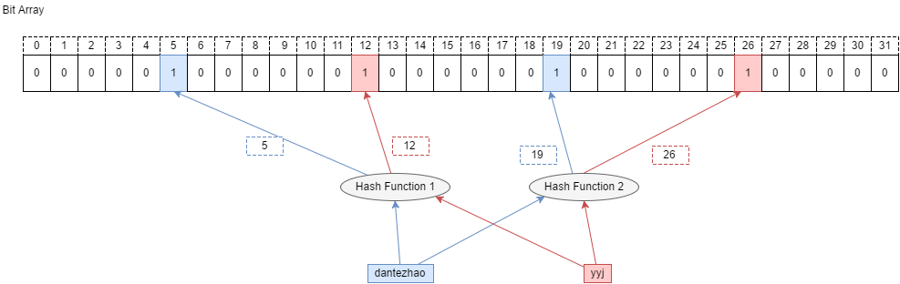
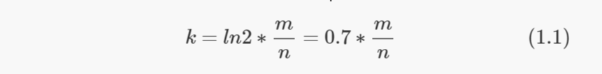
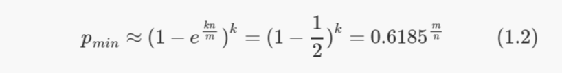
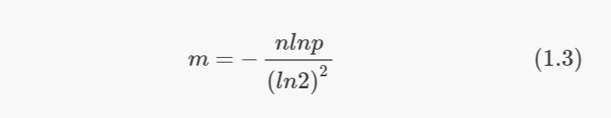
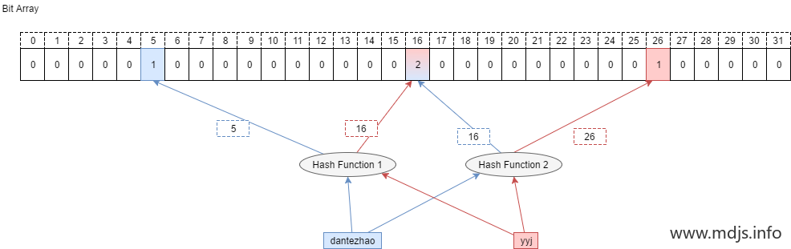

#布隆过滤器
[](https://cloud.tencent.com/developer/article/1006122)
[](https://www.jasondavies.com/bloomfilter/)
##原理
```
1.初始化一个长度为m的位数组，并将所有元素置为0；
2.对于集合 S={a1, a2,…,an} 中的任一元素a，分别使用k个哈希函数对其计算： ，并将位数组中的第 位置为1；
3.对S中所有的成员执行同样的操作。
4.如果对应位数组的位都为1，则说明存在(存在误判)。只要有任意一位为0， 则说明不存在。
```

##核心对象
集合大小n
位数组大小m
哈希函数的个数k
##key误判率
如果给定 m 和 n，当 k 取以下值时，误判率 p 的值最小：

此时误判率 p 等于：

更常见的需求是，已知集合大小n，并设定好误判率p，需要计算出该给 BF 分配多大内存合适，也就是要确认m的大小

##局限
不能对元素计数，也无法删除元素
#计数过滤器
[](https://cloud.tencent.com/developer/article/1136056)

#布谷鸟过滤器
[](http://www.lkozma.net/cuckoo_hashing_visualization/)
[](https://blog.csdn.net/wumenglu1018/article/details/78823696)
[](https://segmentfault.com/a/1190000039156246)
