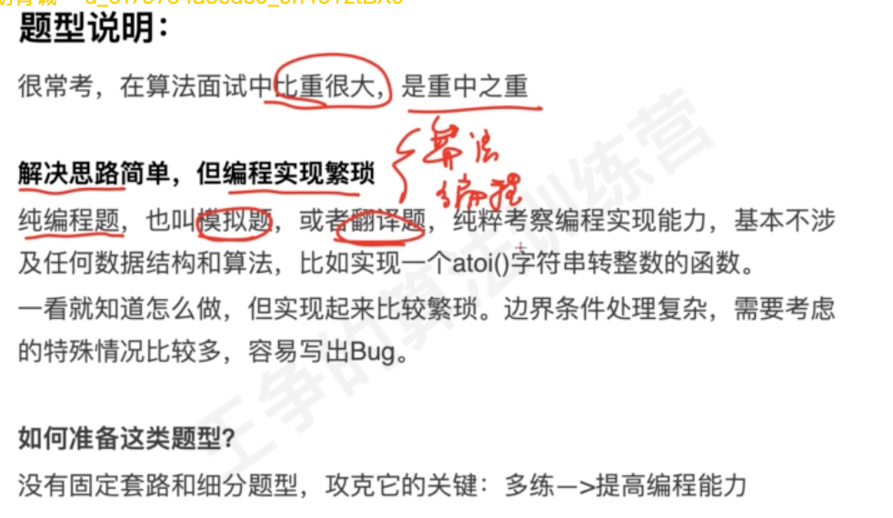
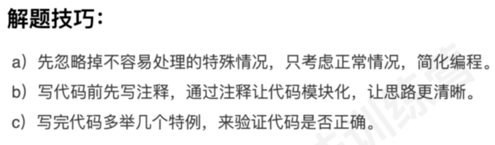
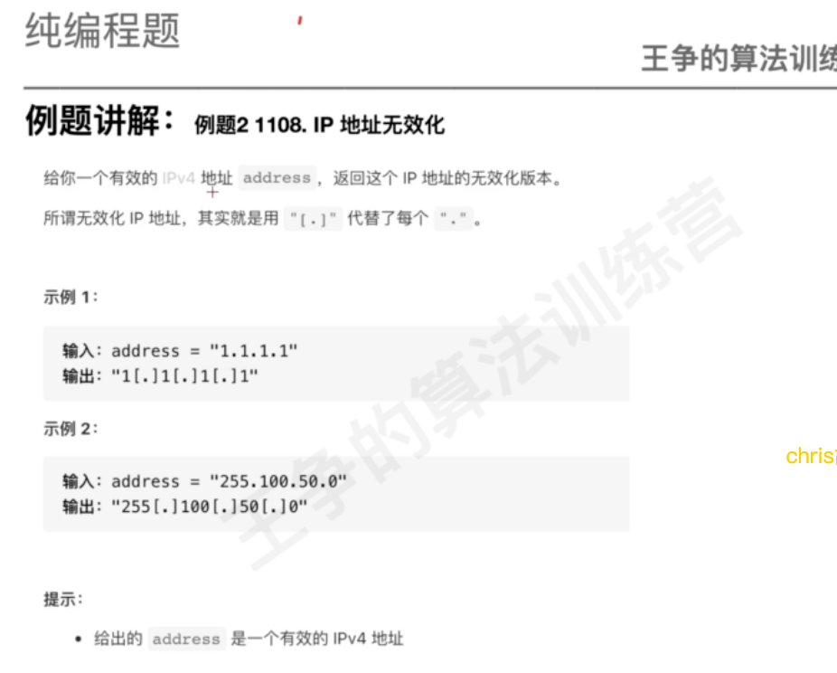

#临界知识
流程模板
注解代码
case测试
题意猜测
#特征


正常流程思路->注释->特殊case
#流程模板
问题拆分:子问题(子模块)->子模块拼接
```asp
1.举例读懂题目含义
2.列举测试用例(测试驱动开发)
3.梳理题目合法条件,实现子模块
4.第一轮写代码,写注释
5.主线流程拼接子模块
6.测试用例case验证,字符串/整型,合法条件
```
_算法限制_images/3fdcce63.png)
#边界
##溢出
加减乘除溢出
#例题
##字符串转整数(重做)
[](https://leetcode-cn.com/problems/ba-zi-fu-chuan-zhuan-huan-cheng-zheng-shu-lcof/submissions/)
###出错地方
```asp
1.少判断-123abc的case,只判断了123的case
2.最大最小整数的余数没有判断
```
##ip地址解析
_算法限制_images/17710dba.png)

归纳(合并)_边界条件_字符串判空_整型范围_业务限制(合法条件)_算法限制_images/b37d42b4.png)
##ip无效化

归纳(合并)_注释边界条件_字符串判空_整型范围_业务限制(合法条件)_算法限制_images/12ce0df7.png)
