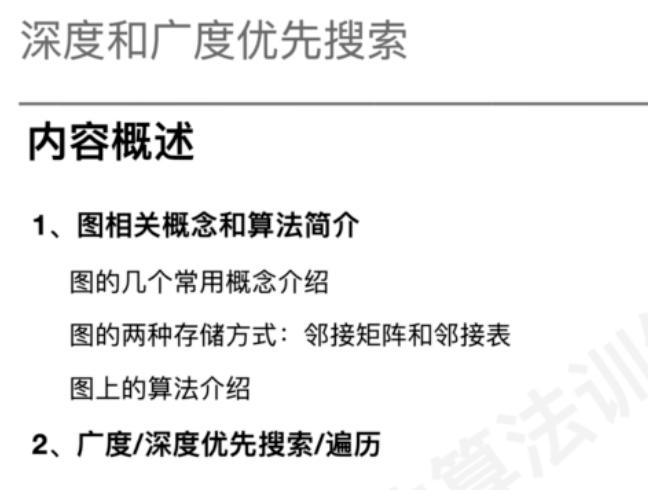
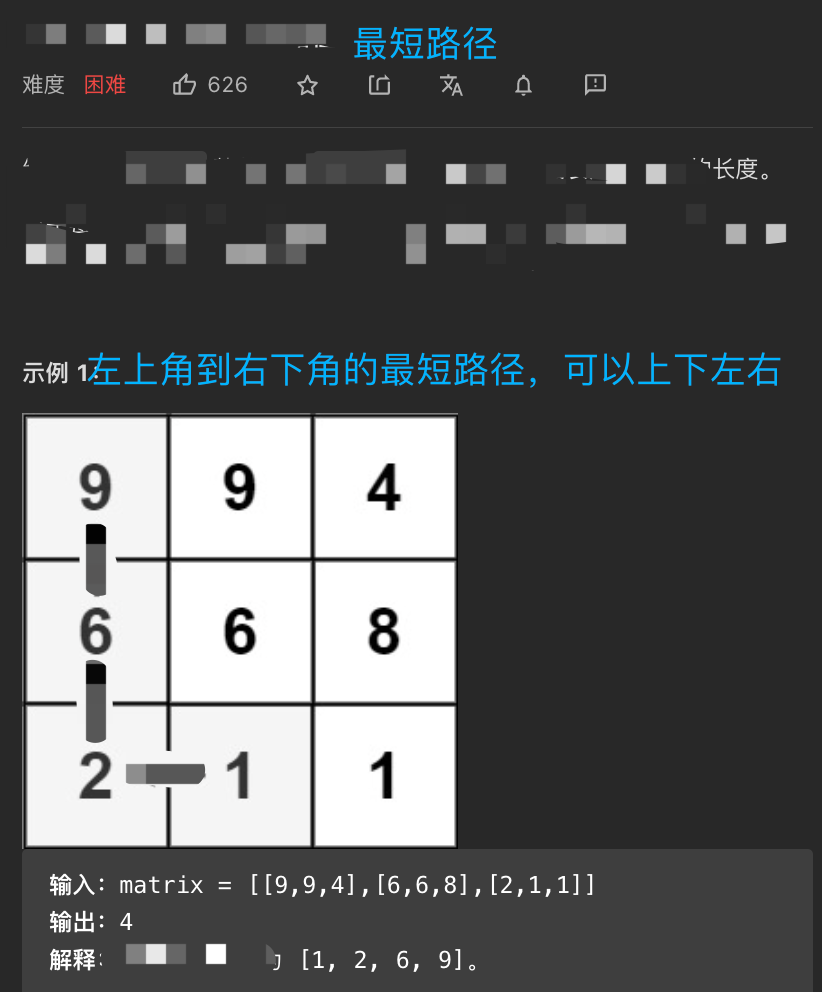

#概述
1.for循环外部process，还是for循环内部process处理，根据题目的条件来决定，两者无本质差异
2.visited总是在process之前判断



#BFS


##打印节点s到节点t的路径

#DFS VS 回溯(两种方式)

[](https://sexywp.com/whats-the-difference-between-backtracking-n-dfs.htm)


回溯模板下的DFS

#题目类型

##题型1、二维矩阵搜索或遍历 
###面试题 08.10. 颜色填充
[](https://leetcode-cn.com/problems/color-fill-lcci/)

###剑指 Offer 13. 机器人的运动范围(DFS)

[](https://leetcode-cn.com/problems/ji-qi-ren-de-yun-dong-fan-wei-lcof/)


###79. 单词搜索(回溯)


##题型2、最短路径(BFS) 
752. 打开转盘锁


[](https://leetcode-cn.com/problems/open-the-lock/)
网格最短路径,回溯

网格是否能到,dfs

##题型3、连通分量/连通性 
###面试题 04.01. 节点间通路
[](https://leetcode-cn.cdfsom/problems/route-between-nodes-lcci/)
###200. 岛屿数量
[](https://leetcode-cn.com/problems/number-of-islands/)


###面试题 16.19. 水域大小
[](https://leetcode-cn.com/problems/pond-sizes-lcci/)
##题型4、拓扑排序 
拓扑排序


DFS后序


##题型5、检测环

[](https://leetcode-cn.com/problems/course-schedule/)
```asp
class Solution {
    List<List<Integer>> edges;
    int[] visited;
    boolean valid = true;

    public boolean canFinish(int numCourses, int[][] prerequisites) {
        edges = new ArrayList<List<Integer>>();
        for (int i = 0; i < numCourses; ++i) {
            edges.add(new ArrayList<Integer>());
        }
        visited = new int[numCourses];
        for (int[] info : prerequisites) {
            edges.get(info[1]).add(info[0]);
        }
        for (int i = 0; i < numCourses && valid; ++i) {
            if (visited[i] == 0) {
                dfs(i);
            }
        }
        return valid;
    }

    public void dfs(int u) {
        visited[u] = 1;
        for (int v: edges.get(u)) {
            if (visited[v] == 0) {
                dfs(v);
                if (!valid) {
                    return;
                }
            } else if (visited[v] == 1) {
                valid = false;
                return;
            }
        }
        visited[u] = 2;
    }
}
```
