#概述(hashmap,位图,布隆过滤器)
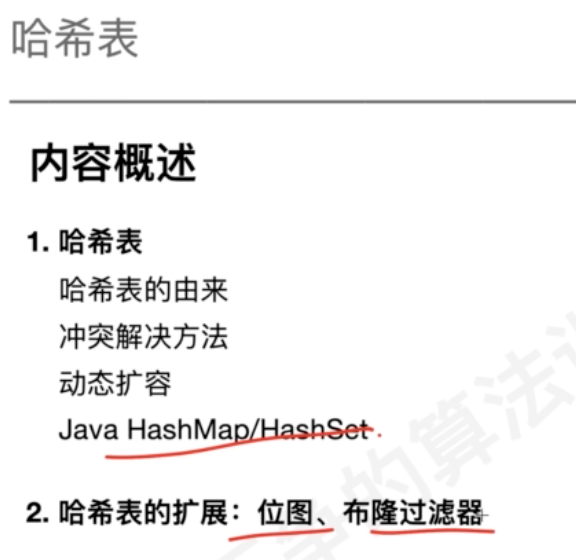
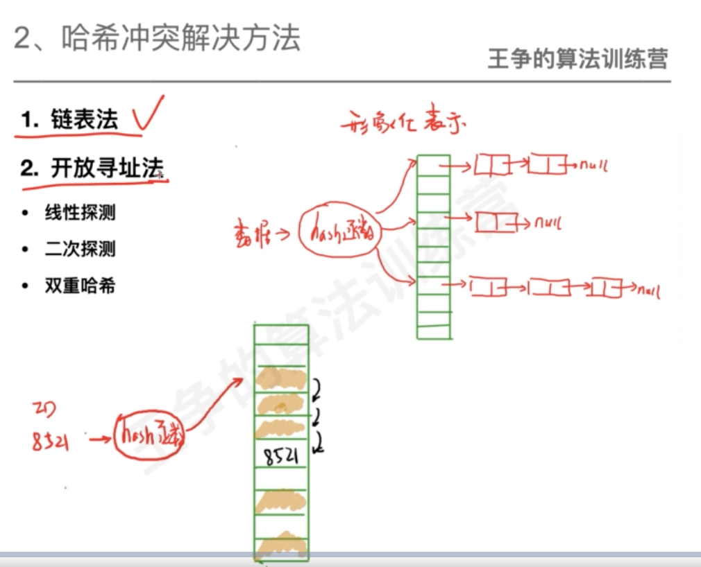
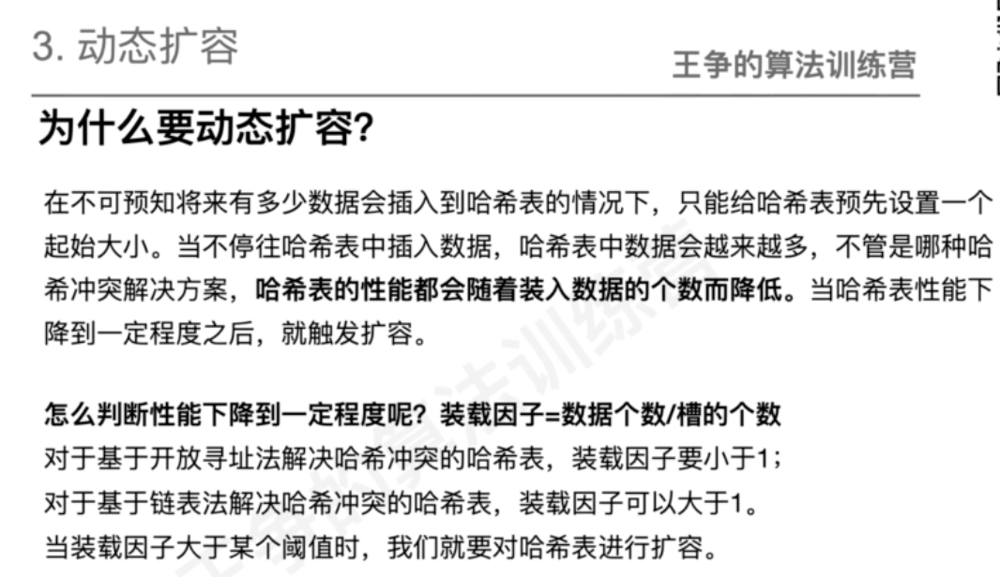
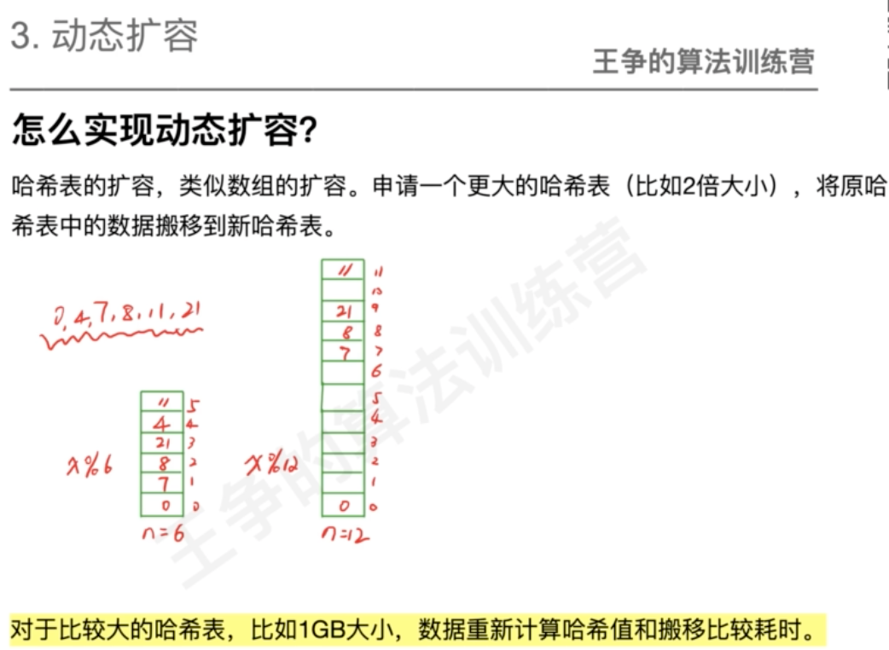
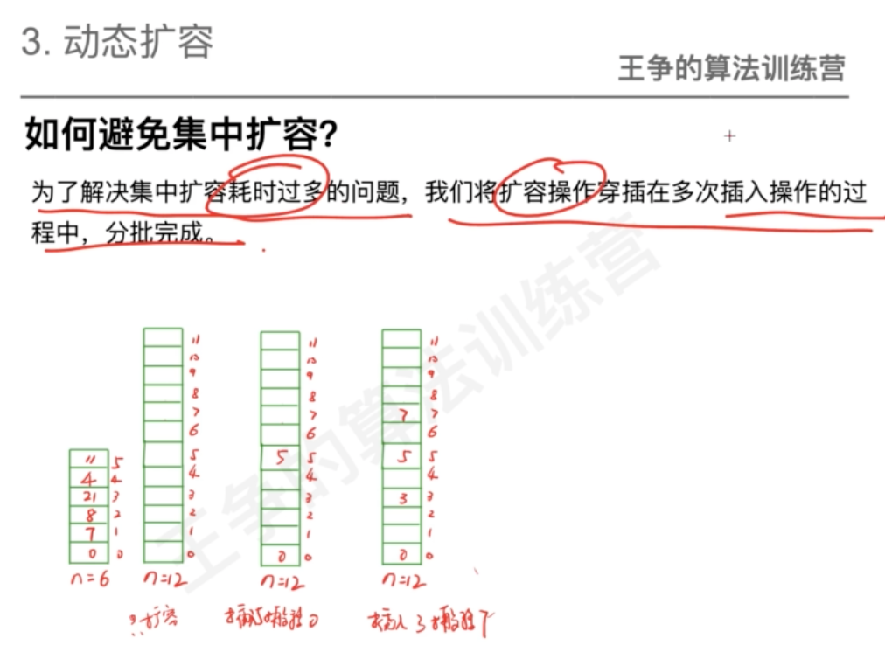
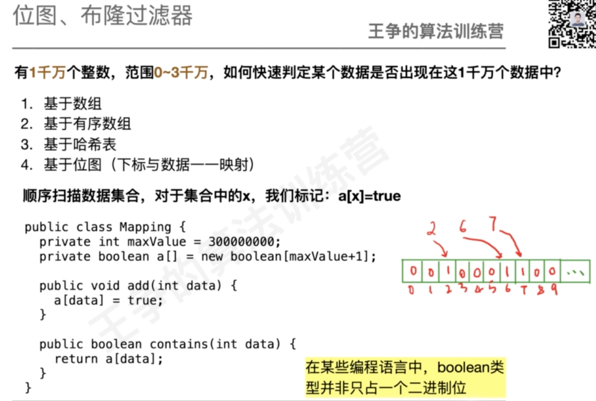
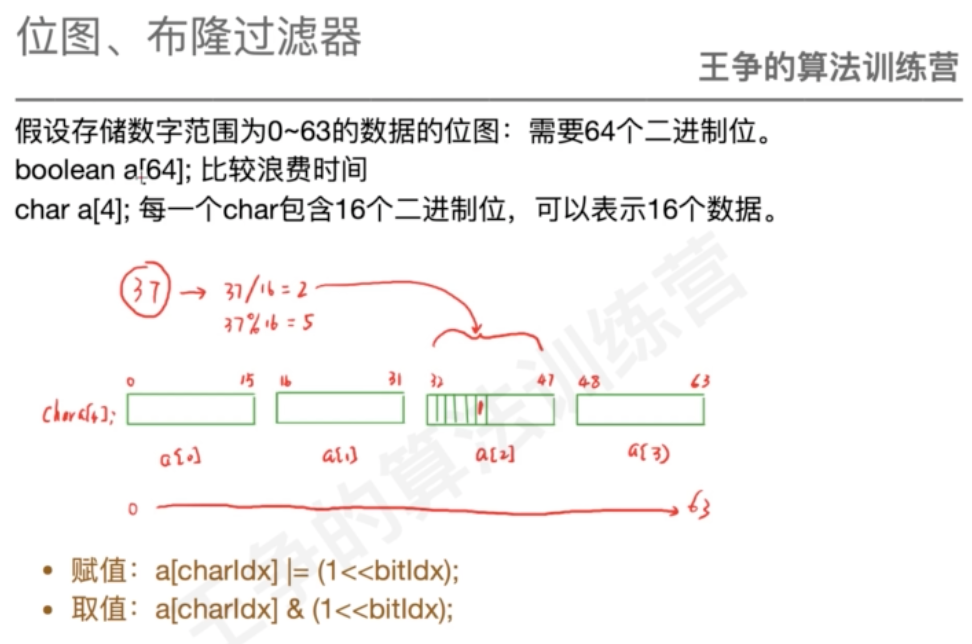
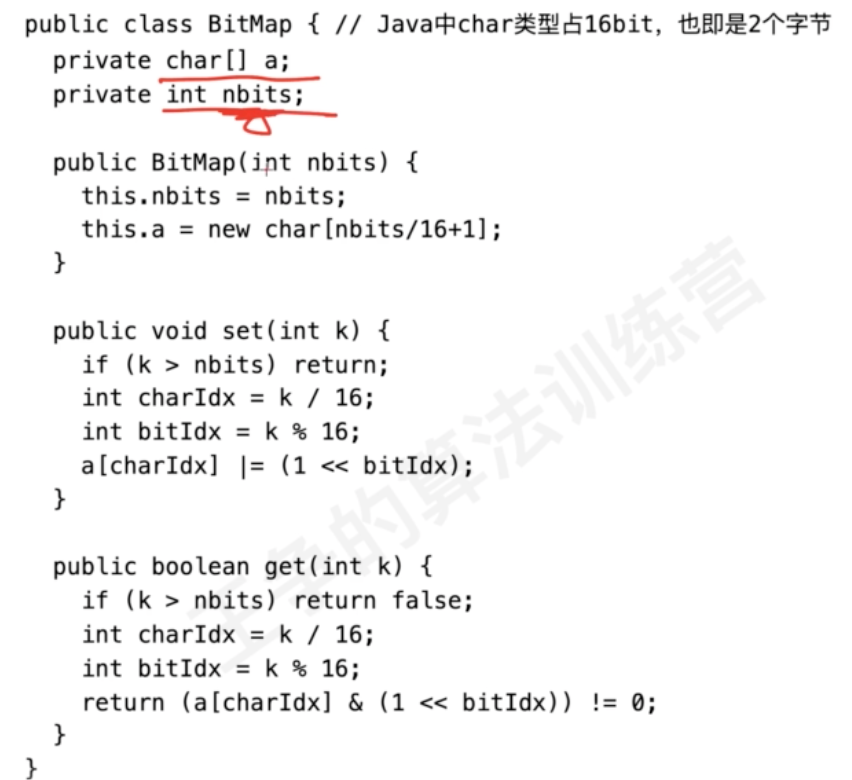
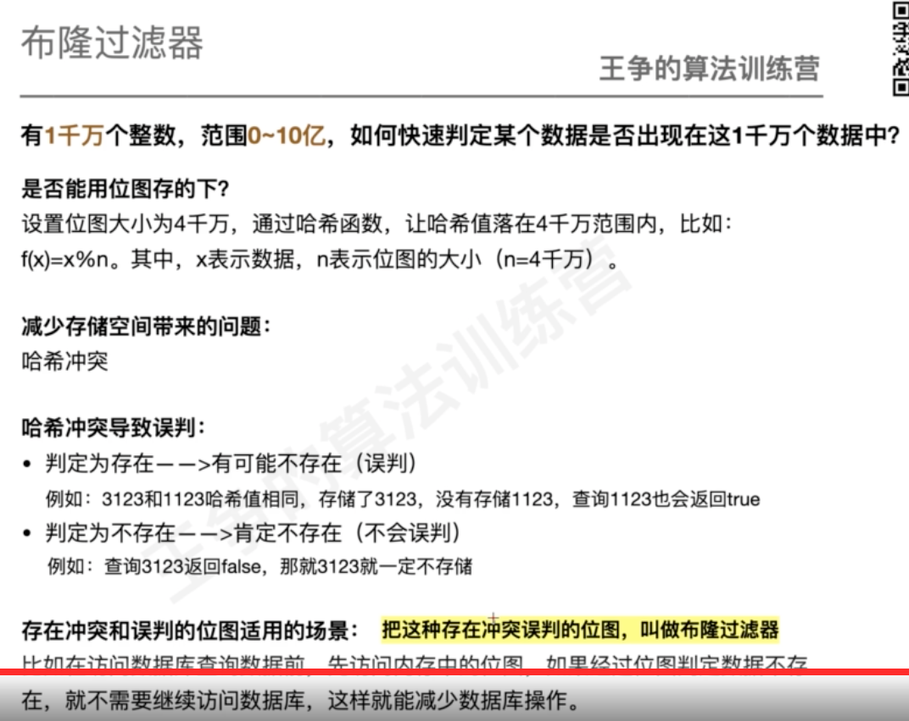
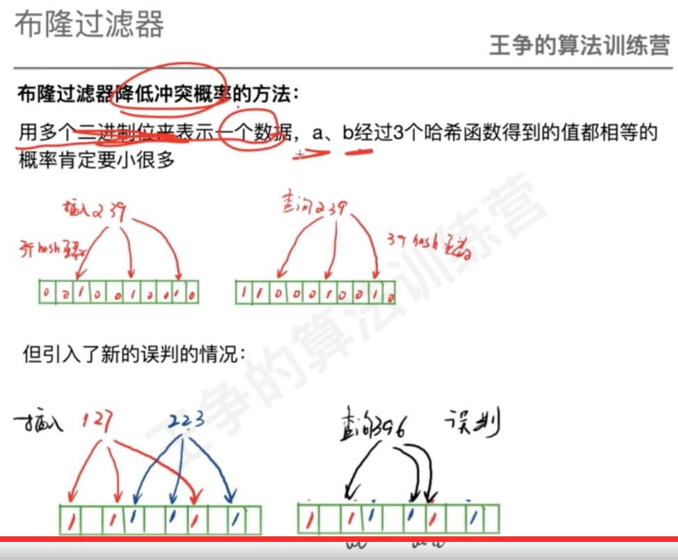
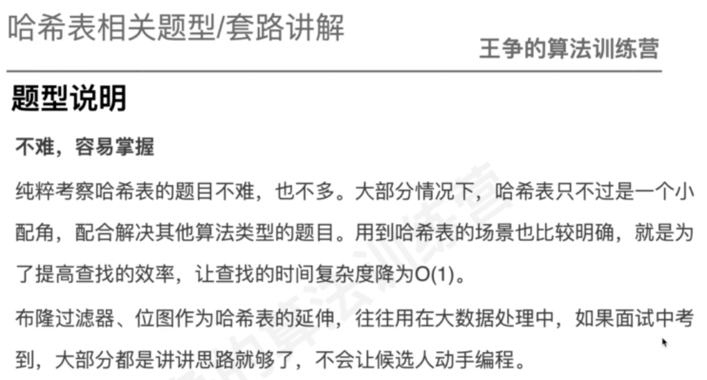
#题目(排序/hashmap)
##移除重复
hashset
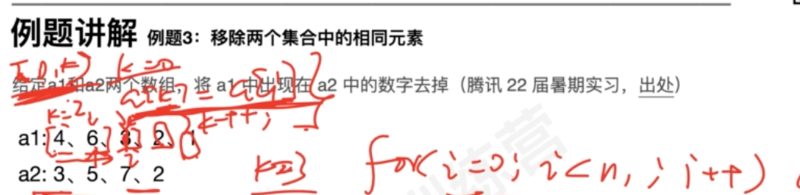
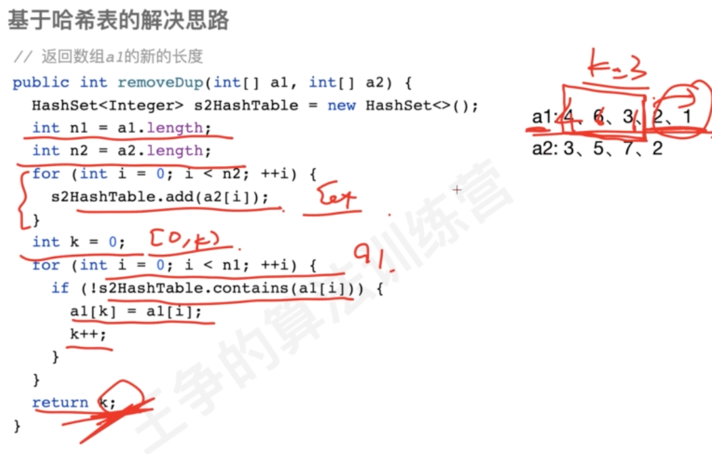
排序双指针
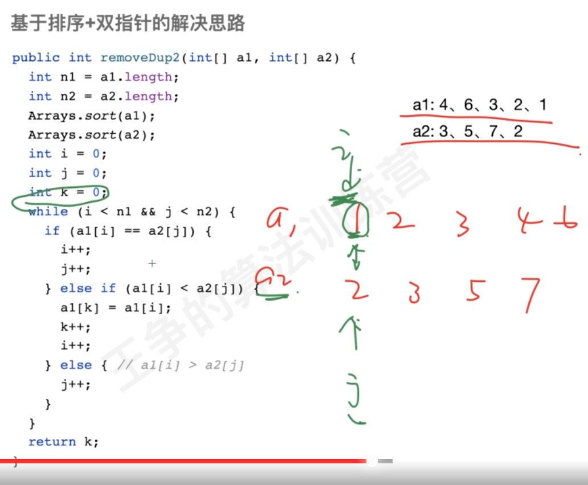
##128. 最长连续序列

##15. 三数之和

##16. 最接近的三数之和

##242. 有效的字母异位词
##1502. 判断能否形成等差数列
##面试题 16.21. 交换和
##LRU
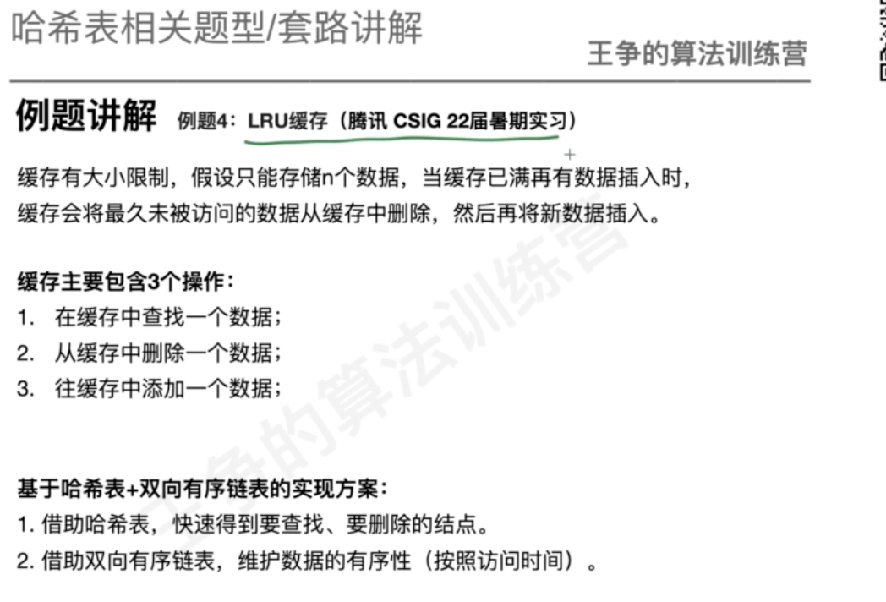
##349. 两个数组的交集
##1122. 数组的相对排序
##面试题 16.21. 交换和
