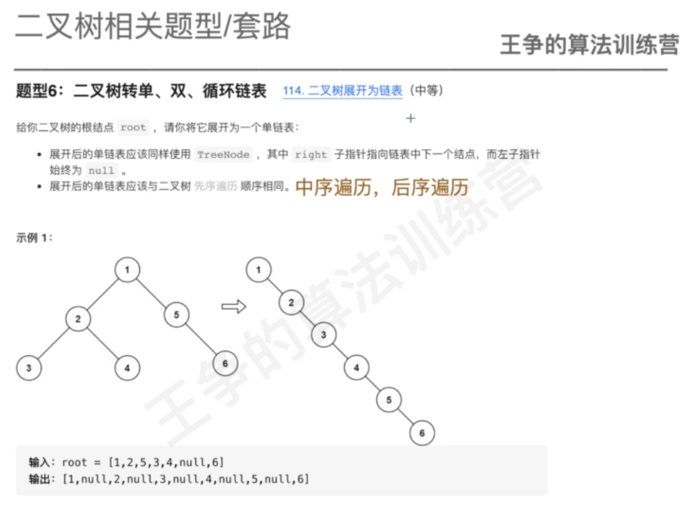

#二叉树概念

#二叉树存储

##指针存储

##数组存储

#二叉树节点&高度

#遍历

##前序遍历

##中序遍历

##后序遍历

#二叉查找树

存在相同数据该如何处理
##二叉查找树的查找

递归实现

非递归实现

##二叉查找树的插入

递归实现

非递归实现

##二叉查找树的删除

#平衡二叉查找树

#红黑树(TreeMap,TreeSet)

#题型套路

##二叉树前中后遍历

##二叉树层次遍历

##二叉树的递归
###最大深度

###是否是平衡二叉树

###二叉查找树第k大元素

###最近公共祖先

###二叉树展开成链表

###遍历结果构造二叉树

###路径和

