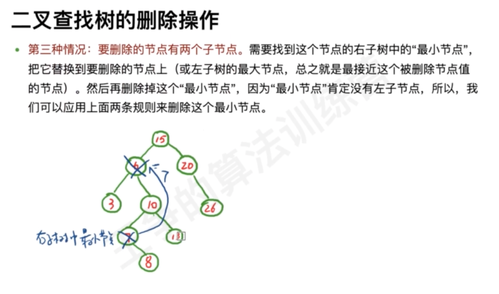
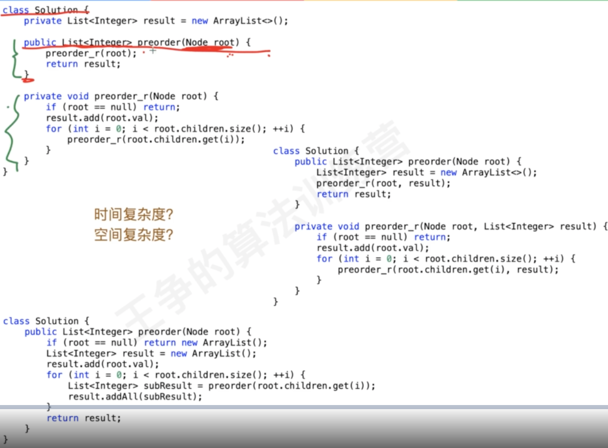
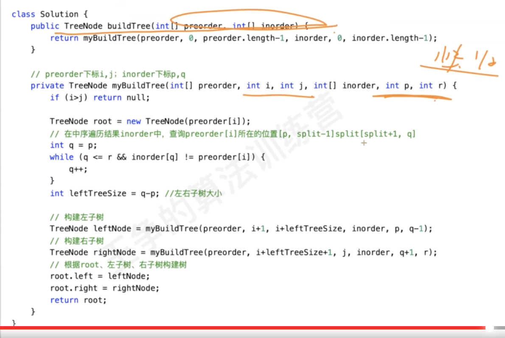

#二叉树概念


#二叉树存储

##指针存储

##数组存储

#二叉树节点&高度

#遍历

##前序遍历

```asp
public List<Integer> preorderTraversal(TreeNode root) {
        List<Integer> ans=new ArrayList<>();
        if(root==null)return ans;
        Stack<TreeNode> stack=new Stack<>();
        stack.push(root);
        while(!stack.isEmpty()){
            TreeNode node=stack.pop();
            ans.add(node.val);
            if(node.right!=null)stack.push(node.right);
            if(node.left!=null)stack.push(node.left);
        }
        return ans;
    }
```
多叉树
```asp
public List<Integer> preorder(Node root) {
        List<Integer> ans=new ArrayList<>();
        if(root==null)return ans;
        Stack<Node> stack=new Stack<>();
        stack.push(root);
        while(!stack.isEmpty()){
            Node cur=stack.pop();
            ans.add(cur.val);
            if(cur.children!=null){
                for(int i=cur.children.size()-1;i>=0;i--)stack.push(cur.children.get(i));
            }
        }
        return ans;
    }
```
##中序遍历

```asp
public void inorderTraversal(TreeNode root) {
        if (root == null) {
            return return;
        }
        Stack<TreeNode> stack = new Stack<>();
        TreeNode cur = root;
        while (cur != null || !stack.isEmpty()) {
            while (cur != null) {
                stack.push(cur);
                cur = cur.left;
            }
            cur = stack.pop();
            //这里不要判空，必须让当前节点cur向前走一步，否则到上面
            //还停留在当前节点cur判空是上面要做的事情
            cur = cur.right;
        }
    }
```
##后序遍历


```asp
public List<Integer> postorderTraversal(TreeNode root) {
        Stack<TreeNode> stack=new Stack<>();
        // 指向当前节点的上一个节点(遍历顺序)
        TreeNode pre=null;
        List<Integer> ans=new ArrayList<>();
        while(!stack.isEmpty()||root!=null){
            while(root!=null){
                stack.push(root);
                root=root.left;
            }
            root=stack.pop();
            // 右边子树结束了
            if(root.right==null||root.right==pre){
                ans.add(root.val);
                pre=root;
                root=null;
            }else{
                // 当前节点有右子树,需要等右子树访问后再访问,当前面已经pop,需要再次入栈
                stack.push(root);
                root=root.right;
            }
        }
        return ans;
    }
```
```asp
public List<Integer> postorder(Node root) {
        Stack<Node> stack=new Stack<>();
        // 后序遍历,使用pre记录上一个节点,
        // 当节点right==null,或者size==n-1时右子树结束,向上
        // 遍历当前节点找到pre,然后找下一个
        Node pre=null;
        List<Integer> ans=new ArrayList<>();
        while(!stack.isEmpty()||root!=null){
            while(root!=null){
                stack.push(root);
                if(root.children.size()!=0)root=root.children.get(0);
                else root=null;
            }
            root=stack.pop();
            if(root.children.size()==0||root.children.get(root.children.size()-1)==pre){
                ans.add(root.val);
                pre=root;
                root=null;
            }else{
                stack.push(root);
                for(int i=0;i<root.children.size();i++){
                    if(root.children.get(i)==pre){
                        root=root.children.get(i+1);
                        break;
                    }
                }
            }
        }
        return ans;
    }
```
#二叉查找树

存在相同数据该如何处理
##二叉查找树的查找

递归实现

非递归实现

##二叉查找树的插入

递归实现

非递归实现

##二叉查找树的删除



#平衡二叉查找树

#红黑树(TreeMap,TreeSet)

#题型套路

##二叉树前中后遍历


```asp
144. 二叉树的前序遍历(简单) 
94. 二叉树的中序遍历 (简单) 
145. 二叉树的后序遍历(简单) 
589. N 叉树的前序遍历(简单) 
590. N 叉树的后序遍历(简单)
```
##二叉树层次遍历


```asp
剑指 Offer 32 - I. 从上到下打印二叉树(中等) 
102. 二叉树的层序遍历(中等)
剑指 Offer 32 - III. 从上到下打印二叉树 III (中等) 
429. N 叉树的层序遍历(中等)
513. 找树左下⻆的值(中等)
```
##二叉树的递归
###最大深度


后序
###是否是平衡二叉树


后序
```asp
public boolean isBalanced(TreeNode root) {
        return dfs(root)>-1;
    }

    public int dfs(TreeNode root) {
        if(root==null)return 0;
        int left=dfs(root.left);
        int right=dfs(root.right);
        if(left==-1||right==-1||Math.abs(left-right)>1)return -1;
        return Math.max(left,right)+1;
    }
```
###合并二叉树
先序+后序(返回子问题根节点)
```asp
public TreeNode mergeTrees(TreeNode root1, TreeNode root2) {
        if(root1==null&&root2==null)return null;
        if(root1==null)return root2;
        if(root2==null)return root1;
        TreeNode node=new TreeNode(root1.val+root2.val);
        node.left=mergeTrees(root1.left,root2.left);
        node.right=mergeTrees(root1.right,root2.right);
        return node;
    }
```
###翻转二叉树
[](https://leetcode-cn.com/problems/invert-binary-tree/)
```asp
public TreeNode invertTree(TreeNode root) {
        if(root==null)return null;
        // 需要申明指针,否则指针作为参数传递,会产生变化
        TreeNode left=root.left;
        TreeNode right=root.right;
        root.left=invertTree(right);
        root.right=invertTree(left);
        return root;
    }
```
###98. 验证二叉搜索树(中序)
```asp
public boolean isValidBST(TreeNode root) {
        Long pre=dfs(root,null);
        return pre!=Long.MAX_VALUE;
}

public Long dfs(TreeNode root,Long pre) {
    if(root==null)return pre;
    pre=dfs(root.left,pre);
    long cur=(long)root.val;
    if(pre==null||pre < cur)pre=cur;
    else pre=Long.MAX_VALUE;
    return dfs(root.right,pre);
}
```
###二叉查找树第k大元素(中序)


```asp
public int kthLargest(TreeNode root, int k) {
        Integer[] ref=new Integer[1];
        kthLargest(root,k,ref);
        return ref[0];
    }

public int kthLargest(TreeNode root, int k,Integer[] ref) {
    if(root==null)return k;
    k=kthLargest(root.right,k,ref);
    if(k==1){
        if(ref[0]==null)ref[0]=root.val;
        return k;
    }else k--;
    return kthLargest(root.left,k,ref);
}
```
###538. 把二叉搜索树转换为累加树(中序,右)
```asp
public TreeNode convertBST(TreeNode root) {
        dfs(root,null);
        return root;
    }

public TreeNode dfs(TreeNode root,TreeNode pre) {
    if(root==null)return pre;
    pre=dfs(root.right,pre);
    if(pre!=null)root.val=root.val+pre.val;
    pre=root;
    return dfs(root.left,pre);
}
```
###最近公共祖先


```asp
public TreeNode lowestCommonAncestor(TreeNode root, TreeNode p, TreeNode q) {
        // 先序,找到p|q返回
        // 后序,left&right不为空,或者left|right不为空,root==其中一个,返回父节点,left|right为空,返回另一个
        if(root==null)return null;
        if(root==p||root==q)return root;
        TreeNode left=lowestCommonAncestor(root.left,p,q);
        TreeNode right=lowestCommonAncestor(root.right,p,q);
        if(left!=null&&right!=null)return root;
        else if(left!=null)return left;
        else if(right!=null)return right;
        return null;
}
```
###剑指 Offer 68 - I. 二叉搜索树的最近公共祖先
[](https://leetcode-cn.com/problems/er-cha-sou-suo-shu-de-zui-jin-gong-gong-zu-xian-lcof/)
```asp
public TreeNode lowestCommonAncestor(TreeNode root, TreeNode p, TreeNode q) {
        while(root!=null){
            if(p.val>root.val&&q.val>root.val)root=root.right;
            else if(p.val<root.val&&q.val<root.val)root=root.left;
            else break;
        }
        return root;
}
```
###二叉树展开成链表


```asp
public void flatten(TreeNode root) {
        // right作为next
        // 先序,pre,pre.left==null,pre.right=cur;
        dfs(root,null);
    }

public TreeNode dfs(TreeNode root,TreeNode pre) {
    // right作为next
    // 先序,pre,pre.left==null,pre.right=cur;
    if(root==null)return pre;
    TreeNode left=root.left;
    TreeNode right=root.right;
    if(pre!=null){
        pre.left=null;
        pre.right=root;
    }
    pre=root;
    pre=dfs(left,pre);
    return dfs(right,pre);
}
```
###二叉搜索树展开成链表
[](https://leetcode-cn.com/problems/binode-lcci/submissions/)
```asp
public TreeNode convertBiNode(TreeNode root) {
        TreeNode[] head=new TreeNode[1];
        convertBiNode(root,null,head);
        return head[0];
    }

public TreeNode convertBiNode(TreeNode root, TreeNode pre,TreeNode[] head) {
    if(root==null)return pre;
    pre=convertBiNode(root.left,pre,head);
    if(pre!=null){
        pre.right=root;
        pre.left=null;
        root.left=null;
    }else{spar
        head[0]=root;
    }
    pre=root;
    return convertBiNode(root.right,pre,head);
}
```
###剑指 Offer 36. 二叉搜索树与双向链表
[](https://leetcode-cn.com/problems/er-cha-sou-suo-shu-yu-shuang-xiang-lian-biao-lcof/)
```asp
public Node treeToDoublyList(Node root) {
        if(root==null)return root;
        Node[] head=new Node[1];
        Node last=inorder(root,null,head);
        head[0].left=last;
        last.right=head[0];
        return head[0];
    }

public Node inorder(Node root,Node pre,Node[] head){
    if(root==null)return pre;
    Node left=root.left;
    Node right=root.right;
    root.left=null;
    root.right=null;
    pre=inorder(left,pre,head);
    if(pre==null){
        head[0]=root;
    }else {
        pre.right=root;
        root.left=pre;
    }
    pre=root;
    return inorder(right,pre,head);
}
```
###面试题 04.03. 特定深度节点链表
[](https://leetcode-cn.com/problems/list-of-depth-lcci/)
```asp
public ListNode[] listOfDepth(TreeNode tree) {
        List<ListNode> ret=new ArrayList<>();
        Queue<TreeNode> queue=new LinkedList<>();
        queue.offer(tree);
        int level=0;
        while(!queue.isEmpty()){
            int size=queue.size();
            ListNode dummpy=new ListNode();
            ListNode cur=dummpy;
            for(int i=0;i<size;i++){
                TreeNode node=queue.poll();
                ListNode tmp=new ListNode(node.val);
                cur.next=tmp;
                cur=tmp;
                if(node.left!=null)queue.offer(node.left);
                if(node.right!=null)queue.offer(node.right);
            }
            ret.add(dummpy.next);
        }
        return ret.toArray(new ListNode[]{});
}
```
###遍历结果构造二叉树(反向构建)



[](https://leetcode-cn.com/problems/construct-binary-tree-from-preorder-and-inorder-traversal/)
###889. 根据前序和后序遍历构造二叉树
[](https://leetcode-cn.com/problems/construct-binary-tree-from-preorder-and-postorder-traversal/)
无法唯一确定一棵树的场景:当二叉树中某个节点仅仅只有一个孩子节点的时候，就无法更具其先序和后序唯一的确定一个二叉树
[](https://blog.csdn.net/suliangkuanjiayou/article/details/102960971)
###剑指 Offer 33. 二叉搜索树的后序遍历序列
[](https://leetcode-cn.com/problems/er-cha-sou-suo-shu-de-hou-xu-bian-li-xu-lie-lcof/)  
```asp
public boolean verifyPostorder(int[] postorder) {
        // 后序,右边遍历直到小于,然后右边,左边,
        return verifyPostorder(postorder,0,postorder.length-1);
    }

public boolean verifyPostorder(int[] postorder,int start,int end) {
    // 后序,右边遍历直到小于,然后右边,左边
    if(start>=end)return true;
    int root=postorder[end];
    int i=start;
    int pivot=0;
    while(i<=end&&postorder[i]<root)i++;
    pivot=i;
    while(i<=end&&postorder[i]>root)i++;
    if(i<end)return false;
    return verifyPostorder(postorder,start,pivot-1)&&verifyPostorder(postorder,pivot,end-1);
}
```
###543. 二叉树的直径
```asp
int max=0;
    public int diameterOfBinaryTree(TreeNode root) {
        dfs(root);
        return max;
    }

public int dfs(TreeNode root) {
    if(root==null)return 0;
    int left=dfs(root.left);
    int right=dfs(root.right);
    max=Math.max(max,left+right);
    return Math.max(left,right)+1;
}
```
###路径和


```asp
public int pathSum(TreeNode root, int targetSum) {
        // 保存当前路径的前缀和
        // 回溯时删除当前
        // 获取targetSum-cur的个数
        Map<Long,Integer> map=new HashMap<>();
        map.put(0L,1);
        return dfs(root,targetSum,0,map);
    }
    
public int dfs(TreeNode root, int targetSum,long prefixSum,Map<Long,Integer> map) {
    if(root==null)return 0;
    prefixSum=prefixSum+root.val;
    //放在前面保证结果是有节点的,避免targetSum=0的情况
    int count=map.getOrDefault(prefixSum-targetSum,0);
    map.put(prefixSum,map.getOrDefault(prefixSum,0)+1);
    count+=dfs(root.left,targetSum,prefixSum,map);
    count+=dfs(root.right,targetSum,prefixSum,map);
    map.put(prefixSum,map.getOrDefault(prefixSum,0)-1);
    return count;
}
```
###完全二叉树
