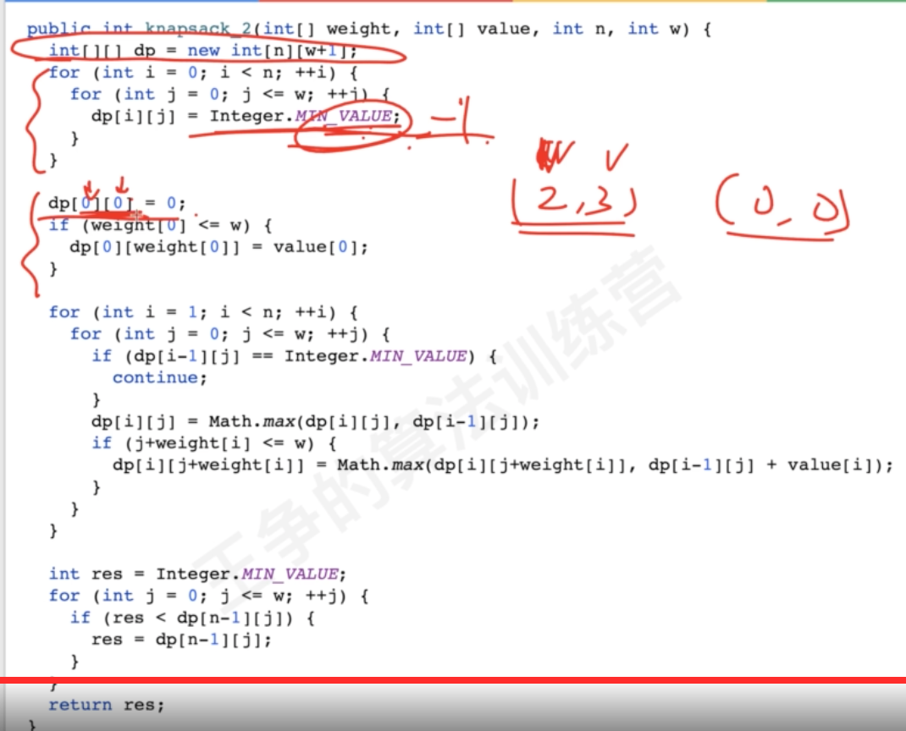
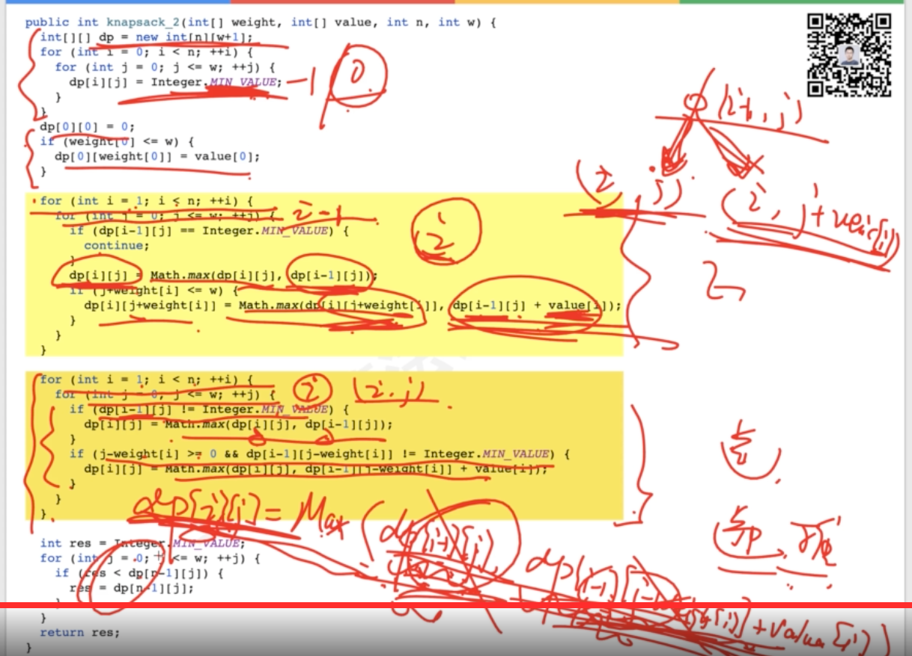
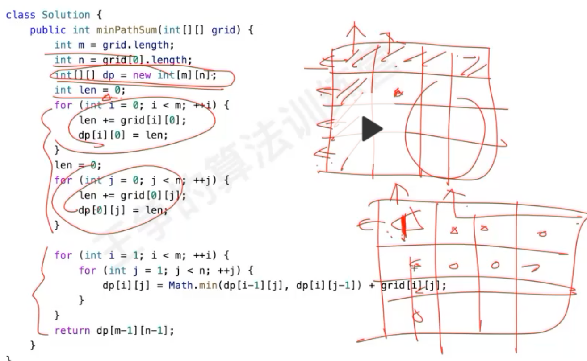
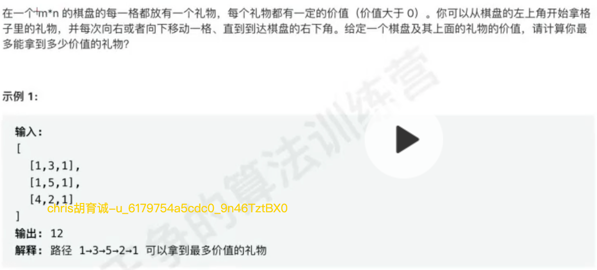
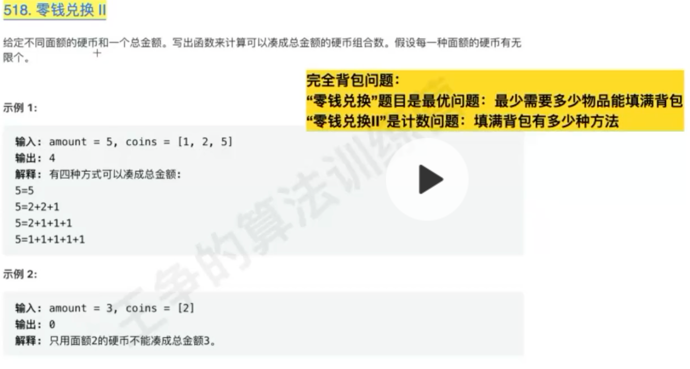

#DP专题

##动态规划特点
动态规划的3个特征是最优子结构、无后效性以及重叠子问题。
其中最优子结构和无后效性是动态规划的要素，不满足的问题无法通过动态规划来解决。
重叠子问题则使动态规划的效率能够发挥到更大。
###最优子结构
###无后效性
[](https://zhuanlan.zhihu.com/p/114695340)
[](https://leetcode-cn.com/problems/robot-in-a-grid-lcci/solution/cong-wu-hou-xiao-xing-yuan-lai-nong-dong-spqj/)
```asp
第二个问题：如果题目改为每个格子的上下左右都能走，那么解法会变吗？
答案是：会的。原因是如果每个格子的上下左右都能走，那么这题就不满足无后效性这个性质了，为什么呢？
可以这样分析，假设我现在在(row, col)这个位置，并且是从上面的格子(row - 1, col)过来的，那么我从row, col)接着走，就只能往下、左、右这三个方向，其他方向也是同理，有以下关系：

(row - 1, col) - > (row, col)，上边过来， 接下来的决策方向：下、左、右
(row, col - 1) - > (row, col)，左边过来， 接下来的决策方向：上、下、右
(row + 1, col) - > (row, col)，下边过来， 接下来的决策方向：上、左、右
(row, col + 1) - > (row, col)，右边过来， 接下来的决策方向：上、下、左
从列表中我们可以看到，(row, col)前的决策不同的话，(row, col)后的决策也是不同的，也就是说，(row, col)前的决策，会影响(row, col)后的决策，所以也就不满足无效性这个性质。
```

回溯题,但不需访问多次,由于递增性,一个点天然只需要访问一次,无后效性,从(row - 1, col) - > (row, col)能过来,说明是递增序列,记录(row, col)三个出口的最长序列mem[row][col]
从(row, col - 1) - > (row, col)的三个出口,一定<=(row - 1, col) - > (row, col)出口的最长序列,因为(row - 1, col) - > (row, col)递增,此路不通,
,只剩下两条出路可走,但这两条出路计算过,可以复用mem[row][col]

回溯题,有后效性,每次只能记录(row, col)三个出口,从不同方向进来,记录的mem[row][col]不同
(row - 1, col) - > (row, col)，上边过来， 接下来的决策方向：下、左、右
(row, col - 1) - > (row, col)，左边过来， 接下来的决策方向：上、下、右
(row + 1, col) - > (row, col)，下边过来， 接下来的决策方向：上、左、右
(row, col + 1) - > (row, col)，右边过来， 接下来的决策方向：上、下、左

DFS题目,仅需遍历完所有节点,判断连通性即可
###重叠子问题
##适用问题
回溯:全部子问题路径,重复子问题,剪枝
动态规划有重复子问题
##解题步粗
分析回溯:可回溯
确定重复问题:决策树,看决策树是否有重复节点
定义状态&状态转移方法:记忆状态转移模型
初始化状态:


##最值、可行、计数;小类别:树形DP、区间DP、数位DP
线性DP
树形DP

###最值


###可行

###计数


##空间优化

滚动数组

一维数组

#经典模型

##背包问题
###0-1背包问题,最大重量
回溯

重复子问题,备忘录去重

动态规划,背包状态


###0-1背包问题,能否装满整个包


###0-1背包问题,正好装满最少需要多少个物品


###0-1背包问题,装满有多少装法


###完全背包问题,最大重量


###完全背包问题,能否装满

改返回值

###完全背包问题,装满最少物品


###完全背包问题,装满多少种装法


###多重背包问题


###二维费用,0-1背包最大价值





##路径问题

###多少种走法
####62.不同路劲


####63.不同路劲,有障碍物


###最长/最短路径是?
####上下左右路径问题
有后效性
[1293. 网格中的最短路径]()
####64.最小路劲和



####47.礼物最大价值


####120.三角形最小路劲和


##打家劫舍&股票买卖


###198.打家劫舍


###213.打家劫舍II


###337.打家劫舍III(树形dp)
每个节点两个状态:偷、不偷


###714股票买卖含手续费


###309股票买卖含冷冻期


##爬楼梯
###爬楼梯(排列问题)


###零钱兑换


###零钱兑换ii(组合问题)

###剪绳子(爬楼梯)


###数字翻译成字符串(爬楼梯)


###单词拆分


##匹配问题(LCS,编辑距离)

###最长公共子序列


###编辑距离


###最长递增子序列


##其他
#例题
##416.分割等和子集(0-1背包问题能否装满)
装满=sum/2

##494.目标和(0-1背包问题有多少种装法)
状态=+,-
背包问题状态是=选择,不选择


##322.零钱兑换(完全背包问题,装满最少需要的物品)

##518.零钱兑换II(完全背包问题,装满多少种装法)

##一次编辑(重做)
[](https://leetcode-cn.com/problems/one-away-lcci/)
dfs转动态规划一直不成功,遗漏了边界条件
```asp
dp[first.length()][second.length()-1][1]=true;
dp[first.length()-1][second.length()][1]=true;
```
