#概述
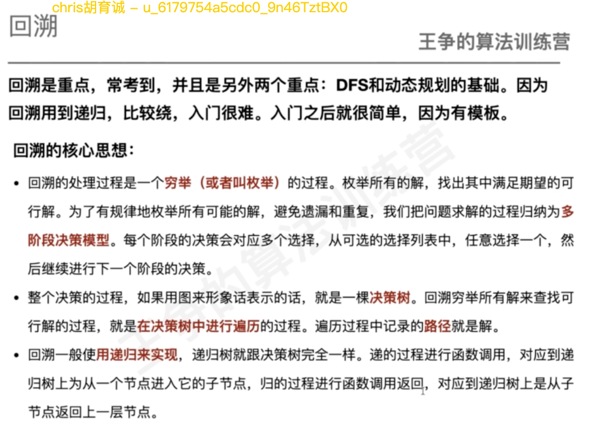
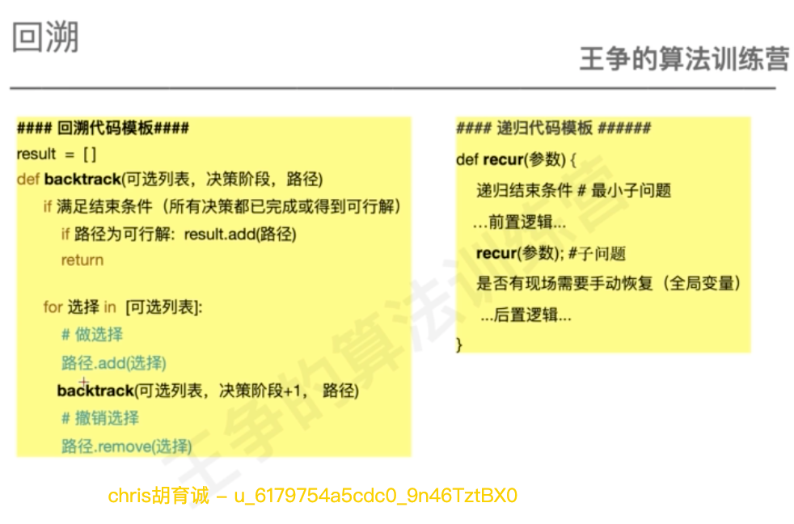

这两个都用到了回溯，回溯add, remove什么时候放在循环外面，什么时候放在循环里面？
全排列也可以在for循环外面add,remove，不一定在for循环里面add,remove
只是先进行一步,后进行一步的区别
#回溯题型
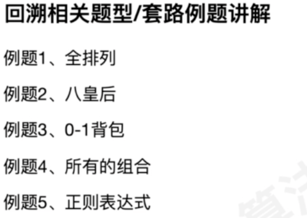
#全排列
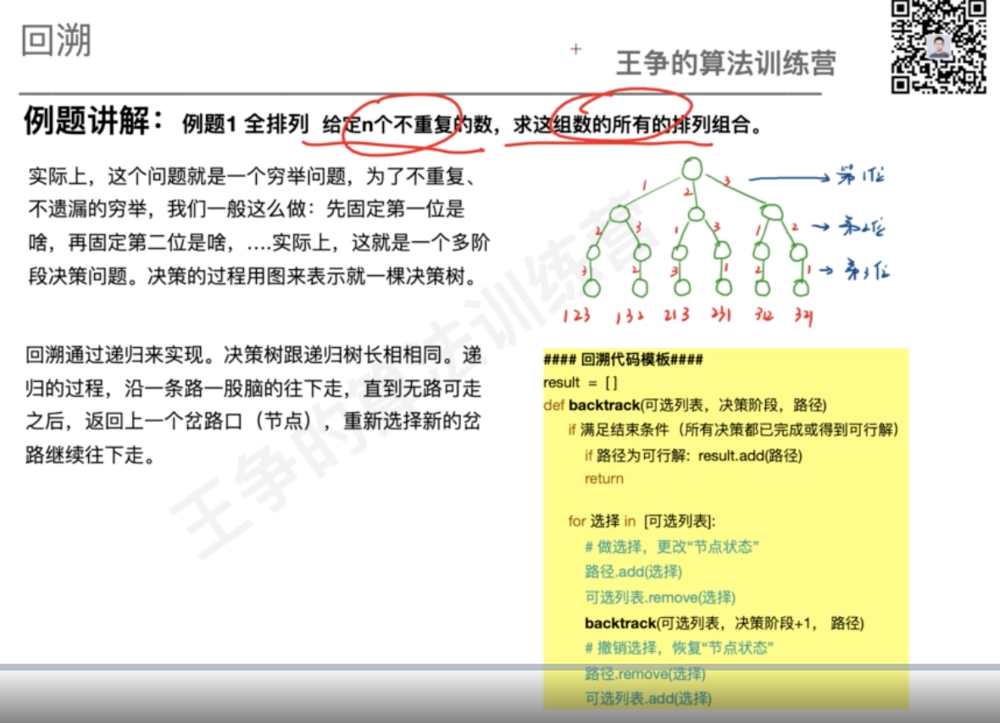
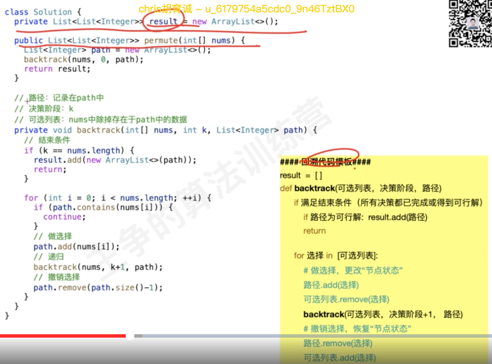
##46. 全排列

##47. 全排列 II

#八皇后
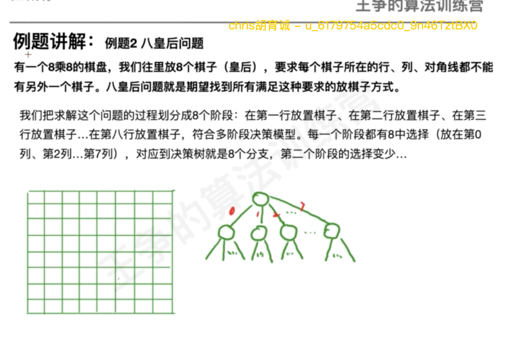
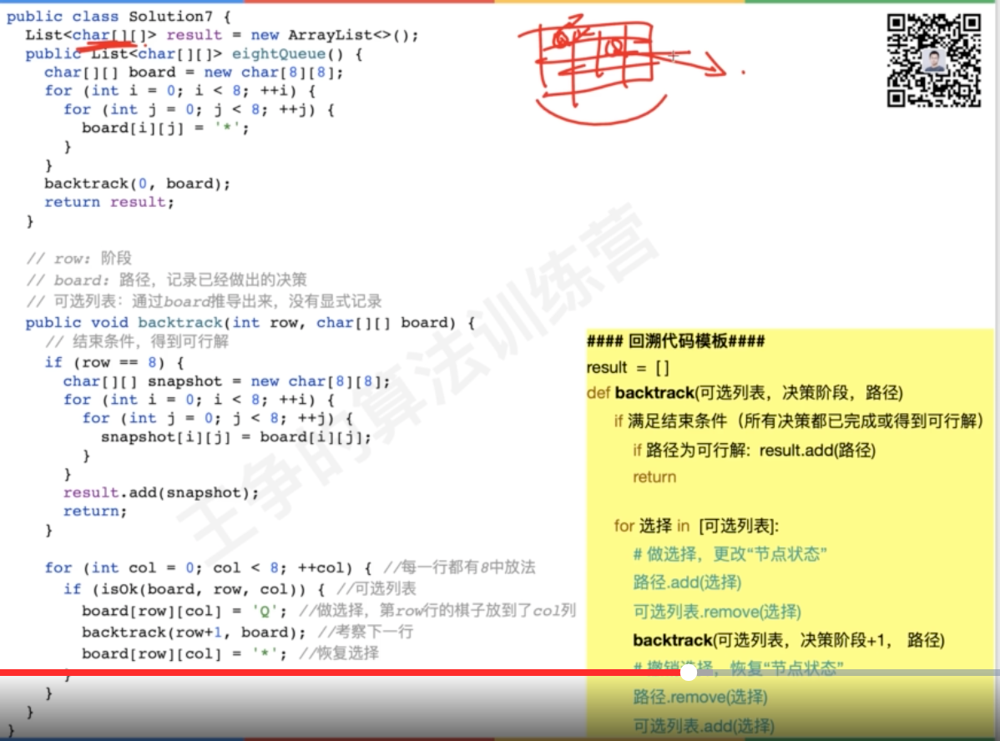
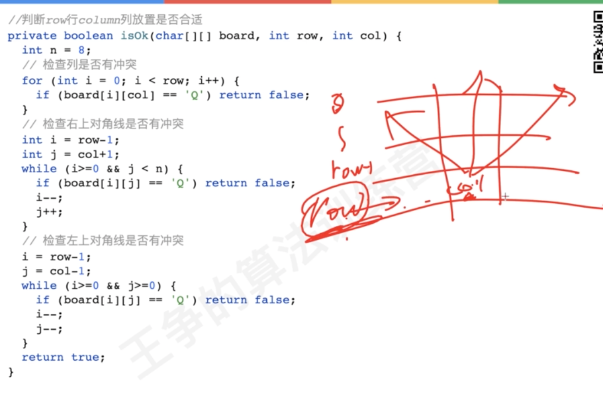
#0-1背包
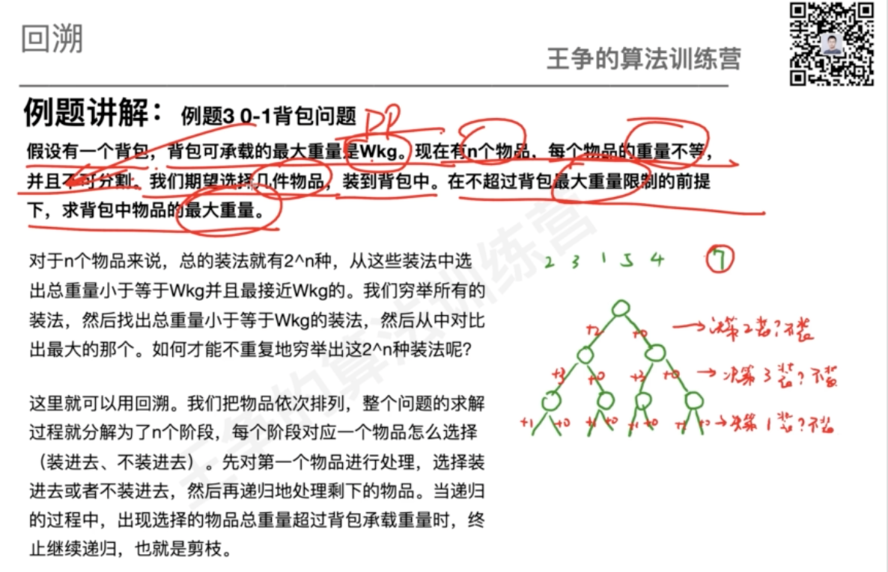
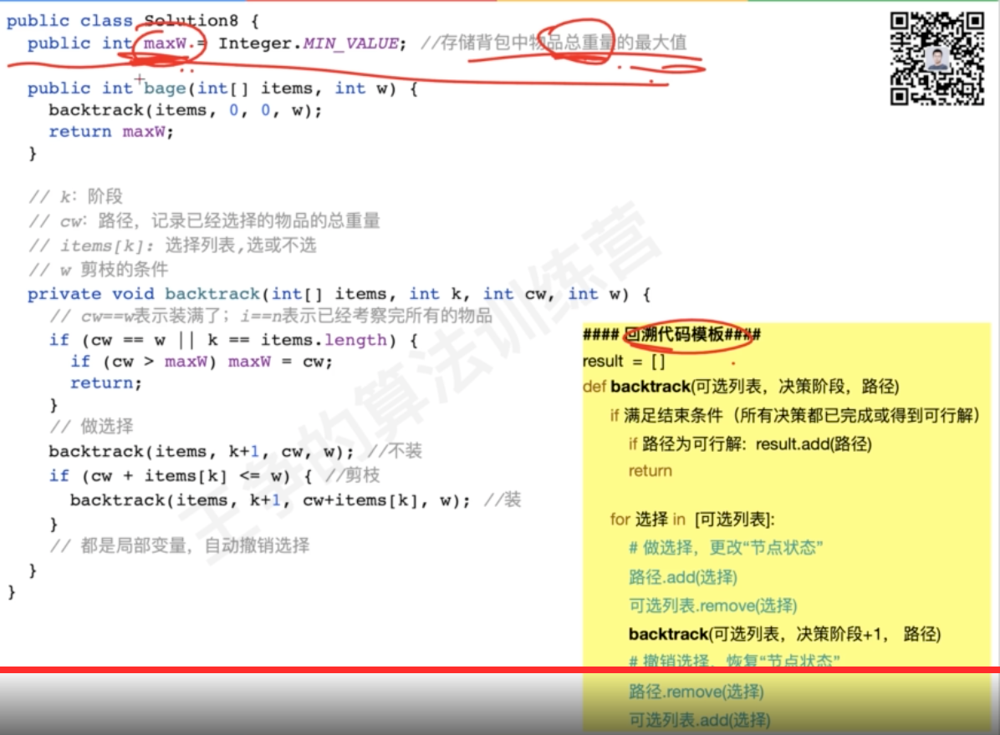
#所有组合
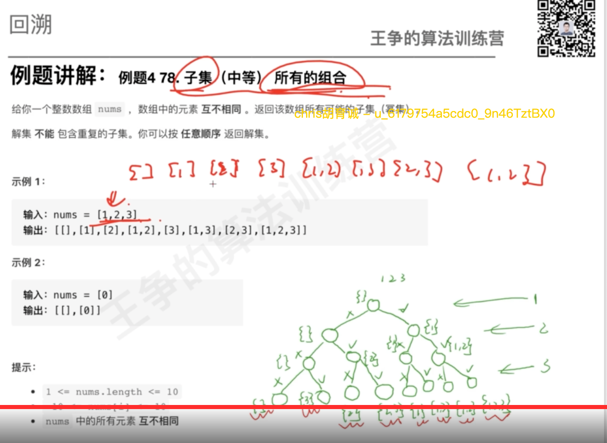
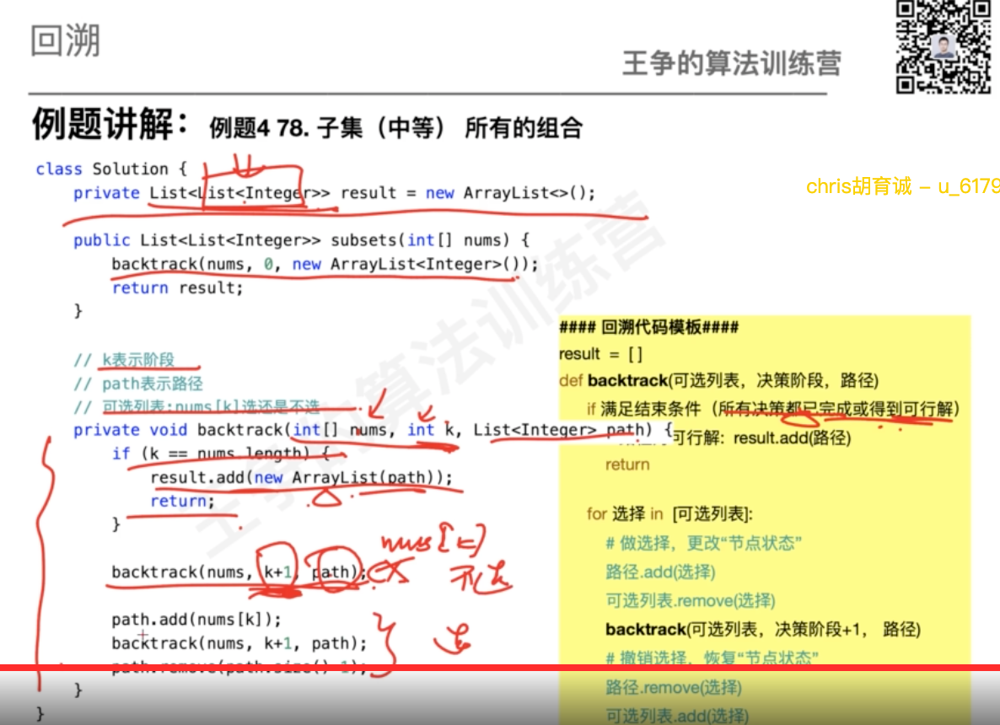
#正则表达式
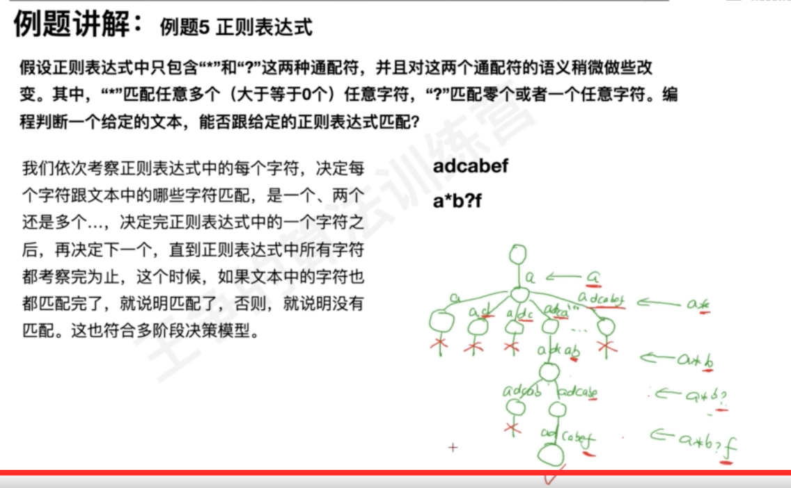
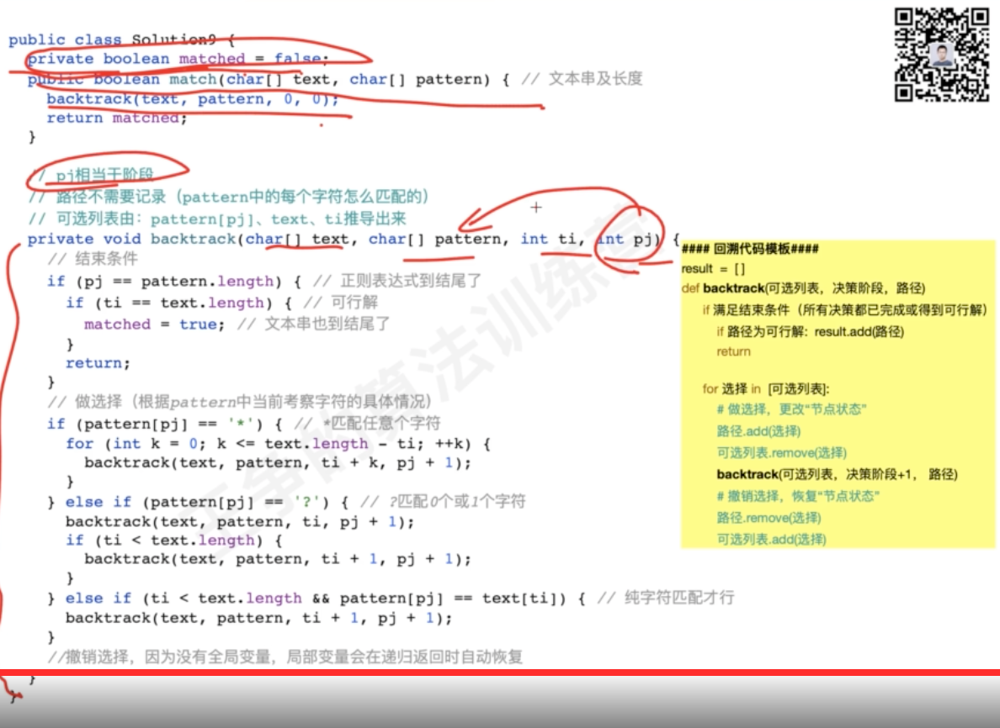
#组合
##无限制重复被选取

##只能使用一次

##k个数相加为给定和，没有重复数据，只能使用一次
时间空间复杂度计算

##131. 分割回文串

1.回文串动态规划
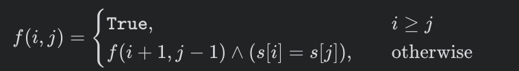
##复原 IP 地址

##22. 括号生成

