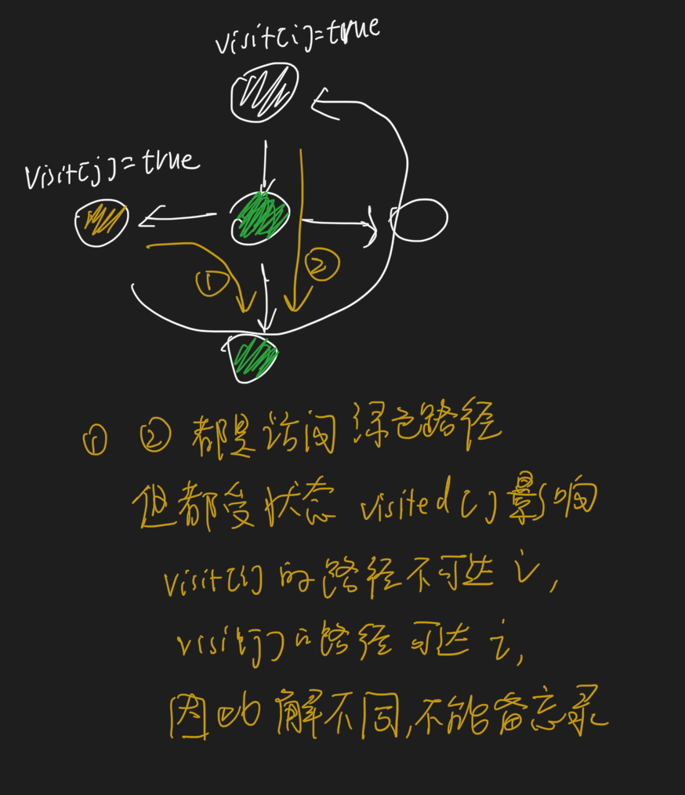
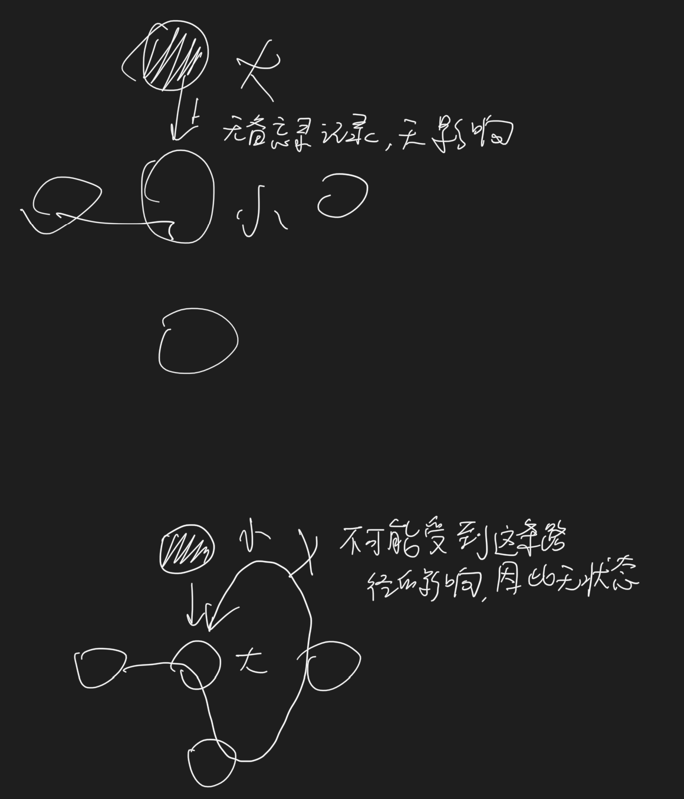

#概述

这两个都用到了回溯，回溯add, remove什么时候放在循环外面，什么时候放在循环里面？
全排列也可以在for循环外面add,remove，不一定在for循环里面add,remove
只是先进行一步,后进行一步的区别
#网格回溯题型
##网格右下
每个决策对其他决策无影响,无需状态visited,
##网格上下左右
每个决策对其他决策有影响,需状态visited

##网格上下左右最短路径和
每个决策对其他决策有影响,需状态visited

##网格上下左右矩阵中的最长递增路径
每个决策对其他决策无影响,无需状态visited

##DFS
DFS:DFS一般都在图里面,本身就需要访问图的节点,涉及到图的分支的访问,DFS往往只需要求一个解，且解为boolean类型
DFS的一个解和图的分支路径没关系,一个解对应整个图的遍历而不是对应一个分支,因此visited[i]=true不需要恢复成visited[i]=false
##回溯
回溯:回溯的解一般有多个,每个解对应决策树的一个分支,多个解形成决策树,常常需要visited[i]=true恢复成visited[i]=false,
[212. 单词搜索 II](https://leetcode-cn.com/problems/word-search-ii/):虽然是网格图,但实际是求多个解,多个解就需要回溯,需要visited[i]=true恢复成visited[i]=false,
##回溯+记忆集
回溯有重复子问题时可以用记忆集,如何确认是否有重复子问题?如何确认是否可以用记忆集?确定问题是否需要状态,回溯是否需要使用visited[i][j]避免在一个解中重复访问

DFS和回溯的关系:DFS深度优先遍历,回溯主要是在深度优先遍历过程中寻找结果,回溯涉及状态回退
一般回溯题目都是树的搜索,如果是图的搜索,也是需要记录访问过的节点,

DFS遍历一次没状态，回溯需要管理状态涉及回退,对比 [剑指 Offer 13. 机器人的运动范围] vs [79. 单词搜索]
一般来说，一个节点可能被多次访问，就用回溯法；一个节点只需访问一次，就用普通的无回溯步骤的dfs
DFS不关心状态,遍历完节点集合即可,回溯关心状态,需要维护解状态,涉及到状态回退(访问顺序),需要对一个节点遍历多次
#回溯题型

#全排列

##46. 全排列

##47. 全排列 II

#八皇后

#0-1背包

#所有组合

#正则表达式

#组合
##无限制重复被选取

##只能使用一次

##k个数相加为给定和，没有重复数据，只能使用一次
时间空间复杂度计算

##131. 分割回文串

1.回文串动态规划

##复原 IP 地址

##22. 括号生成

