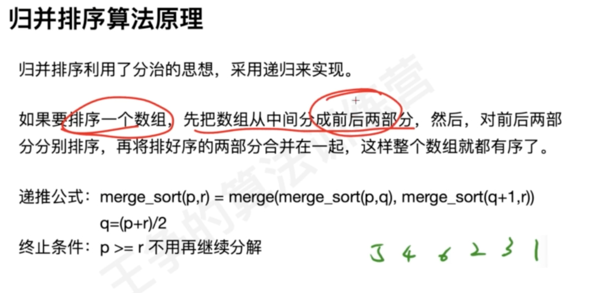
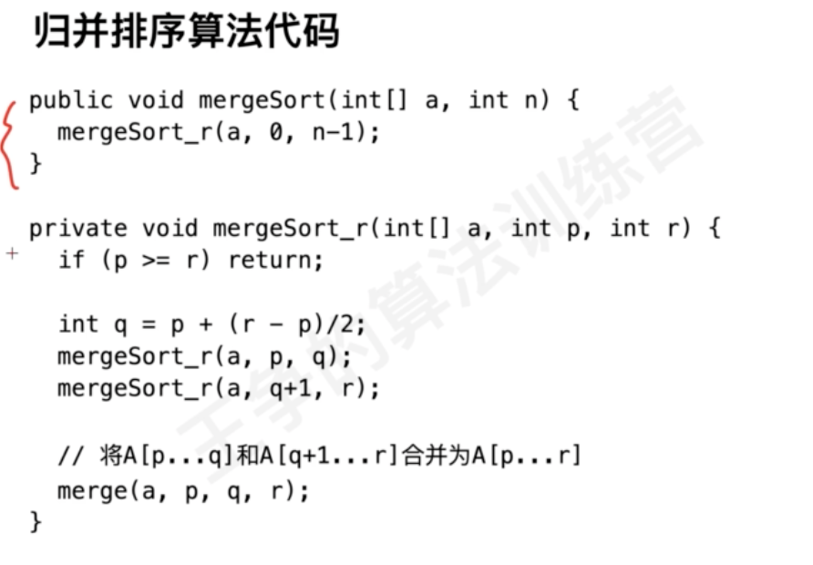
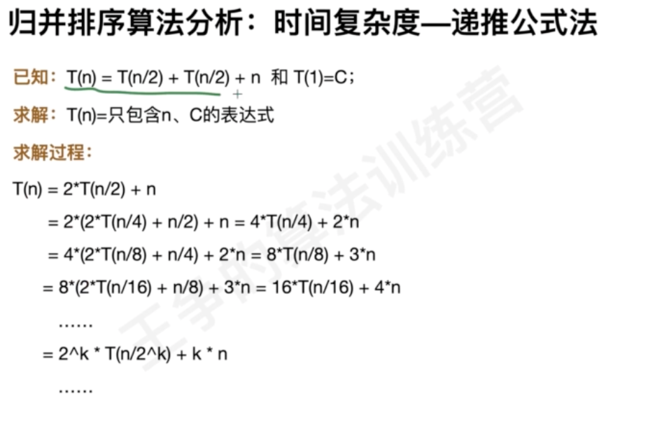
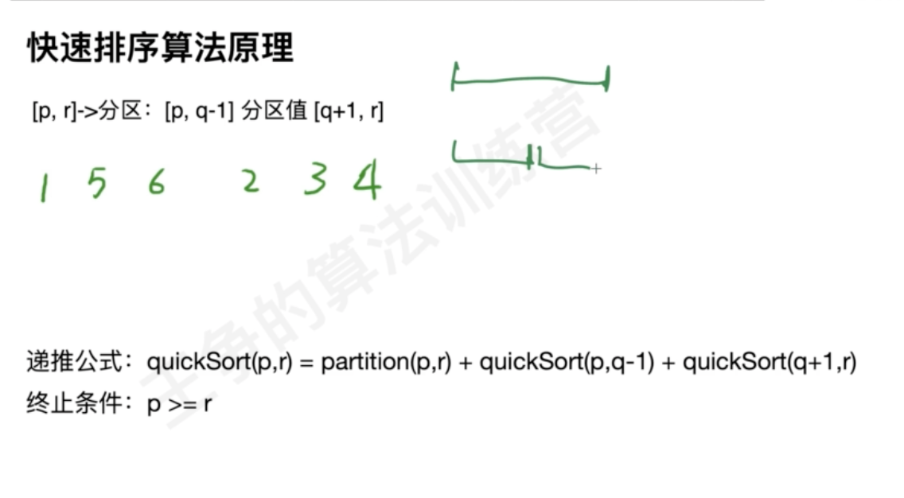
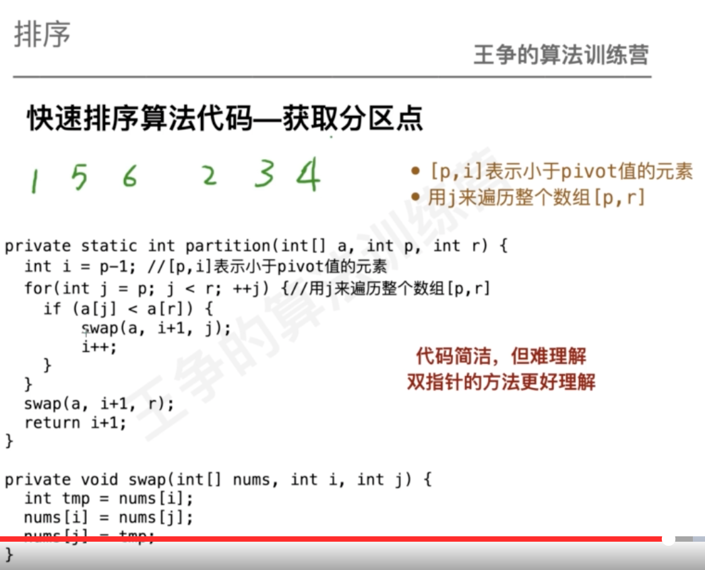
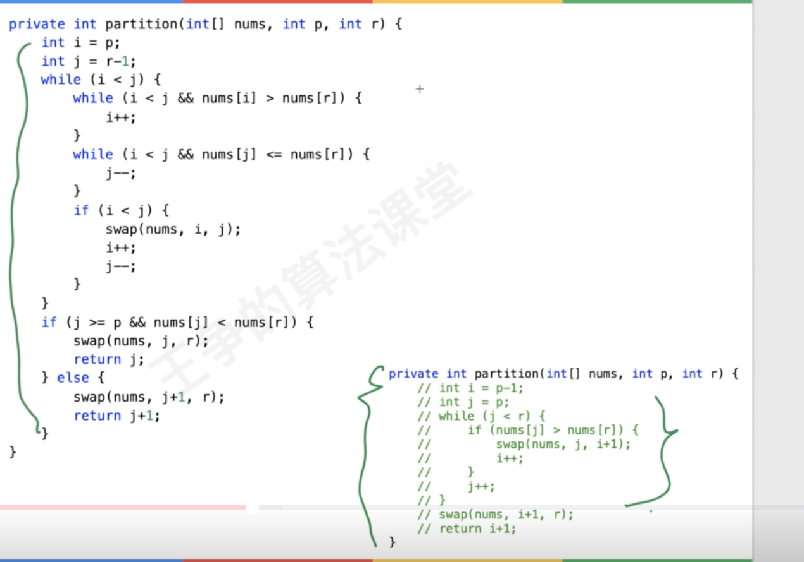
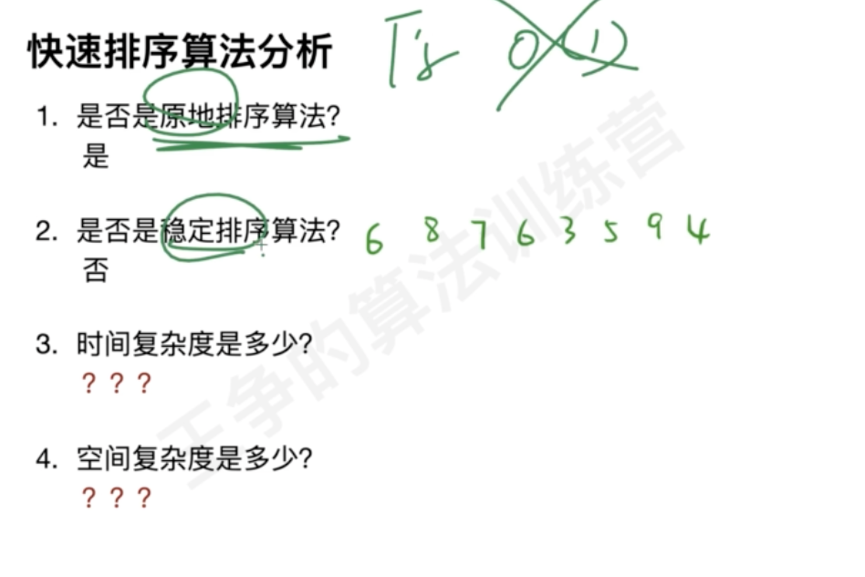
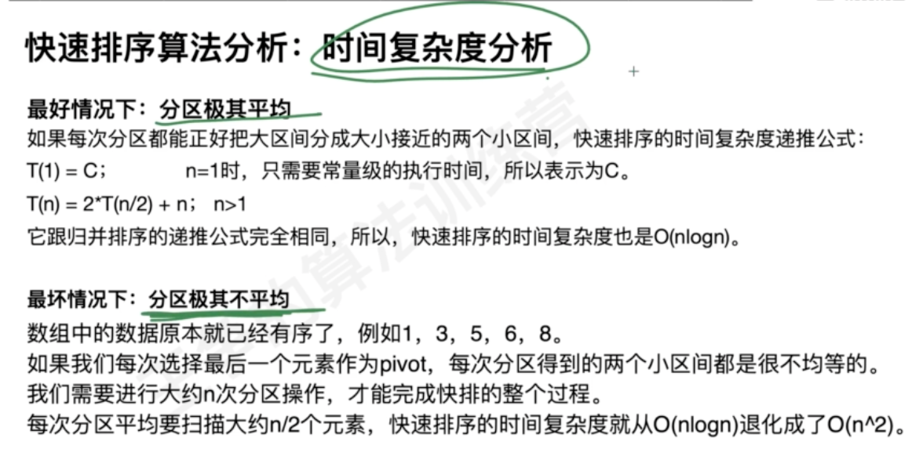
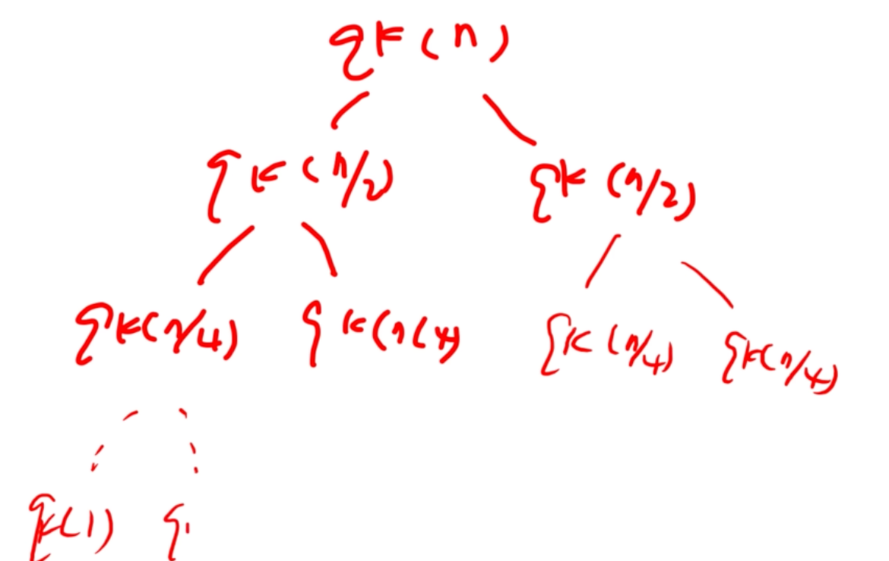
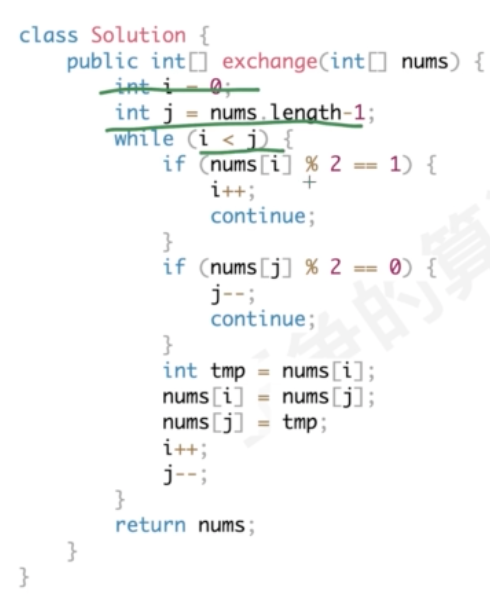

#排序指标
##时间复杂度
##空间复杂度
##原地性

##稳定性

#排序类型
##冒泡排序(加速,有序度)

指标分析

时间复杂度:o(n^2)
空间复杂度:o(1)
原地:是
稳定性:是
优化:没有发生交换就退出
###有序度

##插入排序

指标分析

时间复杂度:o(n^2)
空间复杂度:o(1)
原地:是
稳定性:是
##选择排序

指标分析

##归并排序(merge多个有序链表)

merge

指标分析

分治

寻找当前元素 相对 他之前所有元素的关系 可以用归并排序
###数的小和
在一个数组中，一个数左边比它小的数的总和，叫数的小和，所有数的小和累加起来，叫数组小和。求数组小和
###逆序对
在一个数组中，
任何一个前面的数a，和任何一个后面的数b，
如果(a,b)是降序的，就称为逆序对
返回数组中所有的逆序对
###
对于每个数num，求有多少个后面的数 * 2 依然<num，求总个数
比如：[3,1,7,0,2]
3的后面有：1，0
1的后面有：0
7的后面有：0，2
0的后面没有
2的后面没有
所以总共有5个
##快速排序(使用单指针)

单循环

双指针,代码是从大到小排序

指标分析

##桶排序(海量数据处理)
##计数排序
##基数排序(稳定性,类似group by,order by)

#题型
##排序
###912. 排序数组

###1502. 判断能否形成等差数列
###242. 有效的字母异位词
##区间排序
###252. 会议室 (简单)
###56. 合并区间

##有序合并

##特殊排序
###奇数偶数分离

###剑指 Offer 21. 调整数组顺序使奇数位于偶数前面
###75. 颜色分类

###BM51 数组中出现次数超过一半的数字

##TOP K
###215.数组中的第K个最大元素

###面试题 17.14. 最小K个数

##链表排序
###147.链表进行插入排序

###148. 排序链表

##排序预处理
排序再处理,hash

