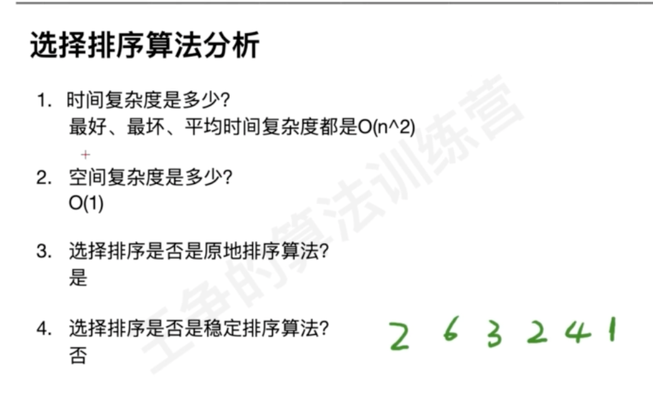

#排序指标
##时间复杂度
##空间复杂度
##原地性

##稳定性

#排序类型
##冒泡排序(加速,有序度)

指标分析

时间复杂度:o(n^2)
空间复杂度:o(1)
原地:是
稳定性:是
优化:没有发生交换就退出
###有序度

##插入排序

指标分析

时间复杂度:o(n^2)
空间复杂度:o(1)
原地:是
稳定性:是
##选择排序

指标分析

##桶排序(海量数据处理)
##计数排序
##基数排序(稳定性,类似group by,order by)

#题型
##排序
###912. 排序数组

###1502. 判断能否形成等差数列
###242. 有效的字母异位词
##区间排序
###252. 会议室 (简单)
###56. 合并区间

##有序合并

##TOP K
###215.数组中的第K个最大元素

###面试题 17.14. 最小K个数

##链表排序
###147.链表进行插入排序

###148. 排序链表

##排序预处理
排序再处理,hash

