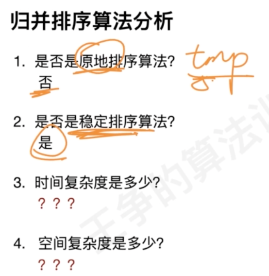

##归并排序(merge多个有序链表)


merge

指标分析

分治


寻找当前元素 相对 他之前,之后所有元素的关系(乘法关系,加法关系,比较大小关系,减法关系) 可以用归并排序
并且可用利用有序性,对逆序对求和的过程,无需每个目标对象都去遍历，比目标元素大的元素也具备相同的逆序性质
[](https://github.com/algorithmzuo/algorithmbasic2020/tree/master/src/class04)
###归并排序模板
```asp
private void merge(long[] nums, int lo, int mid, int hi) {
    for (int i = lo; i <= hi; i++) temp[i] = nums[i];
    
    // 最初上下界均为 mid + 1
    int start = mid + 1, end = mid + 1;
    for (int i = lo; i <= mid; i++) {
        ...
    }

    int cnt = lo;
    int i = lo, j = mid + 1;
    while (i <= mid || j <= hi) {
        if (i > mid) nums[cnt++] = temp[j++];
        else if (j > hi) nums[cnt++] = temp[i++];
        else if (temp[i] >= temp[j]) nums[cnt++] = temp[j++];
        else nums[cnt++] = temp[i++];
    }
}
```
###数的小和
在一个数组中，一个数左边比它小的数的总和，叫数的小和，所有数的小和累加起来，叫数组小和。求数组小和
###逆序对
在一个数组中，
任何一个前面的数a，和任何一个后面的数b，
如果(a,b)是降序的，就称为逆序对
返回数组中所有的逆序对
###总数
对于每个数num，求有多少个后面的数 * 2 依然<num，求总个数
比如：[3,1,7,0,2]
3的后面有：1，0
1的后面有：0
7的后面有：0，2
0的后面没有
2的后面没有
所以总共有5个
###327. 区间和的个数(模型转换)
[](https://leetcode.cn/problems/count-of-range-sum/solution/by-lfool-pkli/)
