##快速排序(使用单指针)
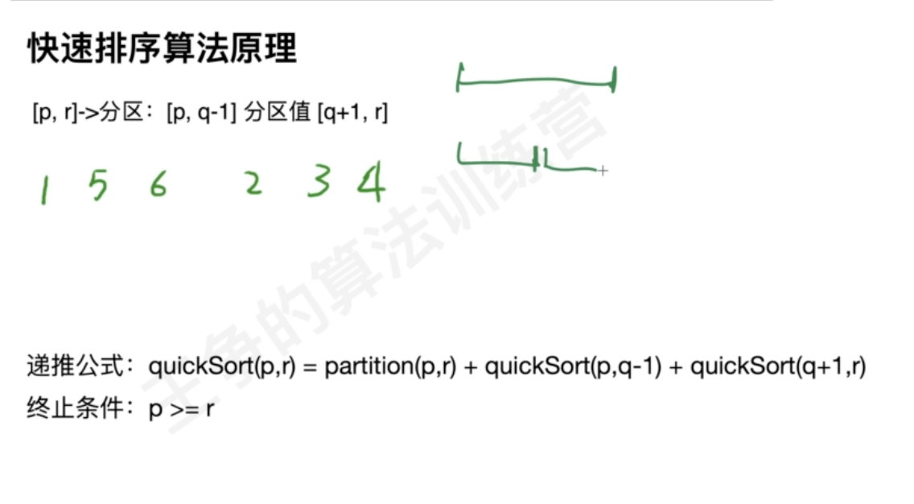
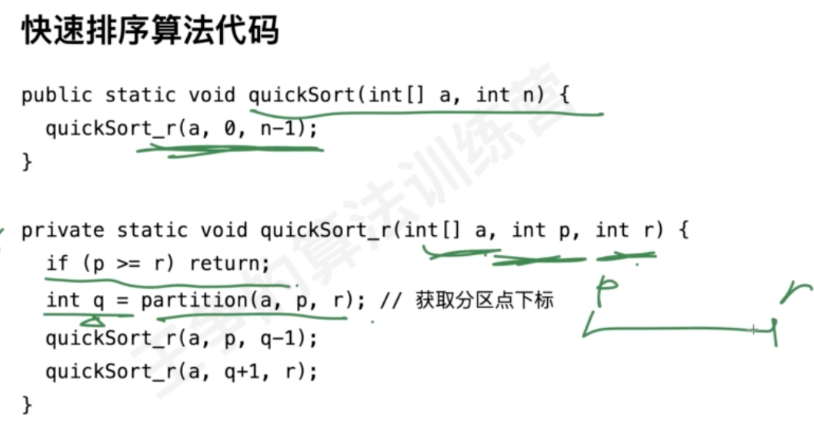
单循环
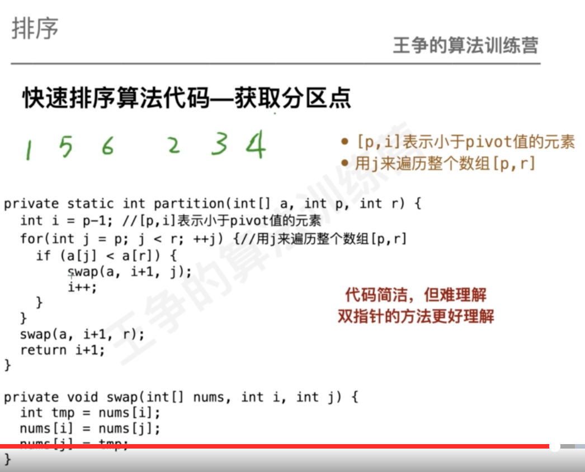
双指针,代码是从大到小排序
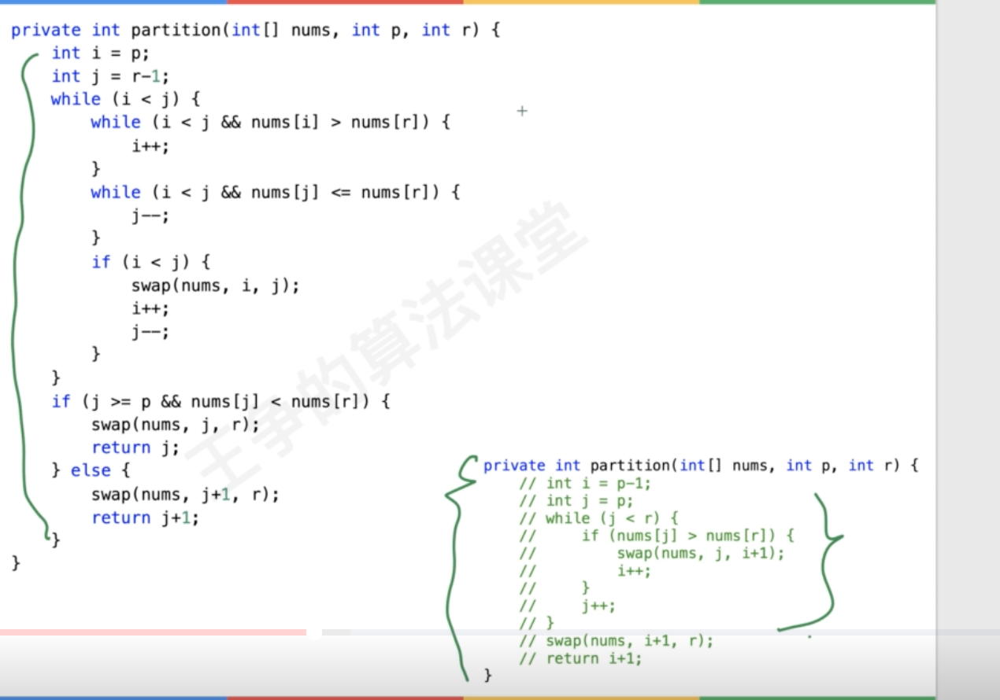
指标分析
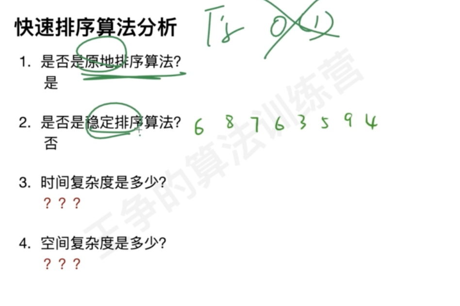
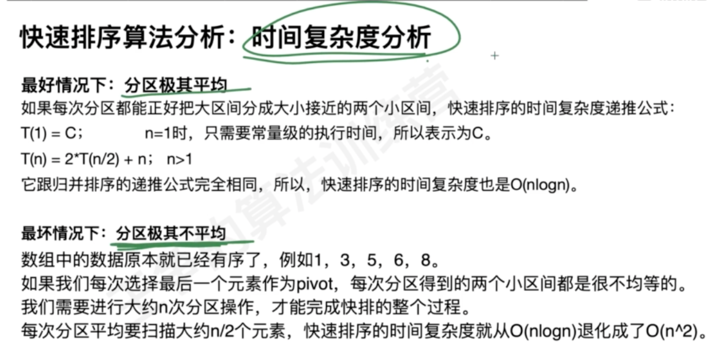
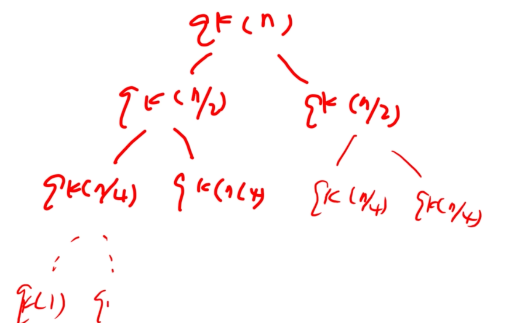
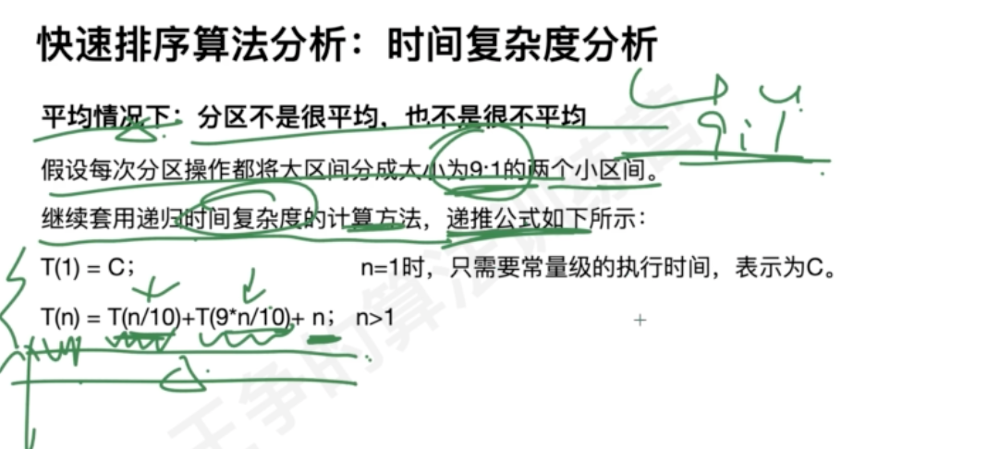
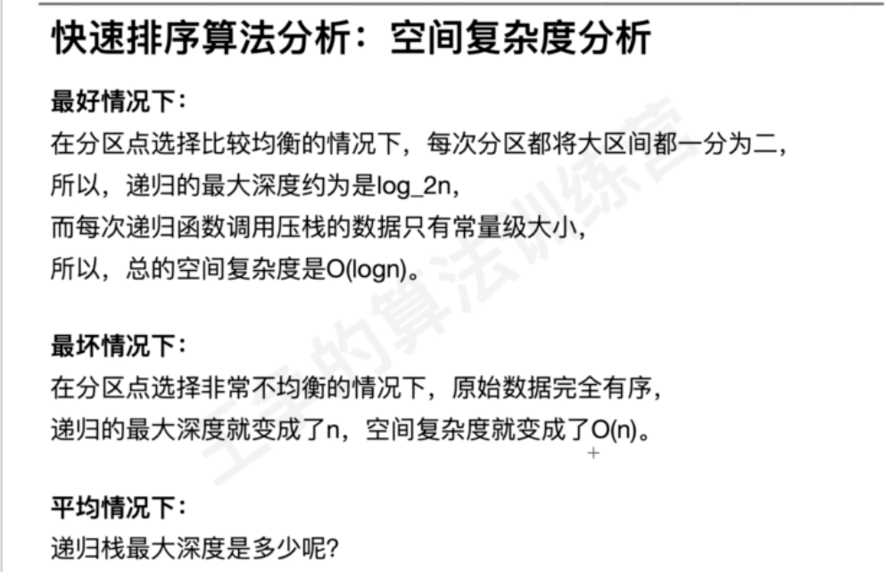
##循环不变性
[循环不变性],变量的定义在循环中是确定的

1.单向链表快排
2.双向链表快排
3.单向循环不变性分析,[0,j)为<pivot,[j,i)为>=pivot,[i,len)不确定
4.双向循环不变性分析,[0,i)为pivot, (j,len-1]为>=pivot,[i,j]不确定
[](https://leetcode.cn/problems/sort-colors/solution/kuai-su-pai-xu-partition-guo-cheng-she-ji-xun-huan/)
[](https://leetcode.cn/problems/sort-colors/solution/kuai-su-pai-xu-partition-guo-cheng-she-ji-xun-huan/)
5.颜色分类,[0,zero)为0,[zero,i)为1,[i,tow)待定,[two,len)为2
###快排荷兰国旗版
###奇数偶数分离
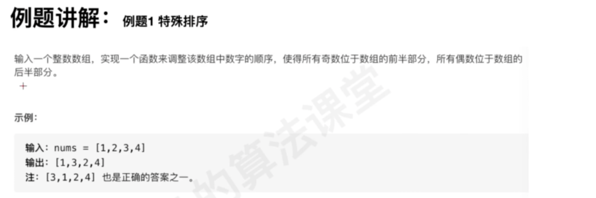
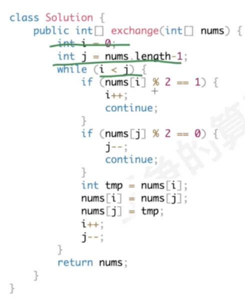
###剑指 Offer 21. 调整数组顺序使奇数位于偶数前面
###75. 颜色分类
循环不变性
[](https://leetcode-cn.com/problems/sort-colors/)
[](https://leetcode.cn/problems/sort-colors/solution/kuai-su-pai-xu-partition-guo-cheng-she-ji-xun-huan/)
```asp
```
###BM51 数组中出现次数超过一半的数字
[](https://www.nowcoder.com/practice/e8a1b01a2df14cb2b228b30ee6a92163?tpId=295&tqId=23271&ru=/exam/oj&qru=/ta/format-top101/question-ranking&sourceUrl=%2Fexam%2Foj)

###非递归快排

###链表快排
