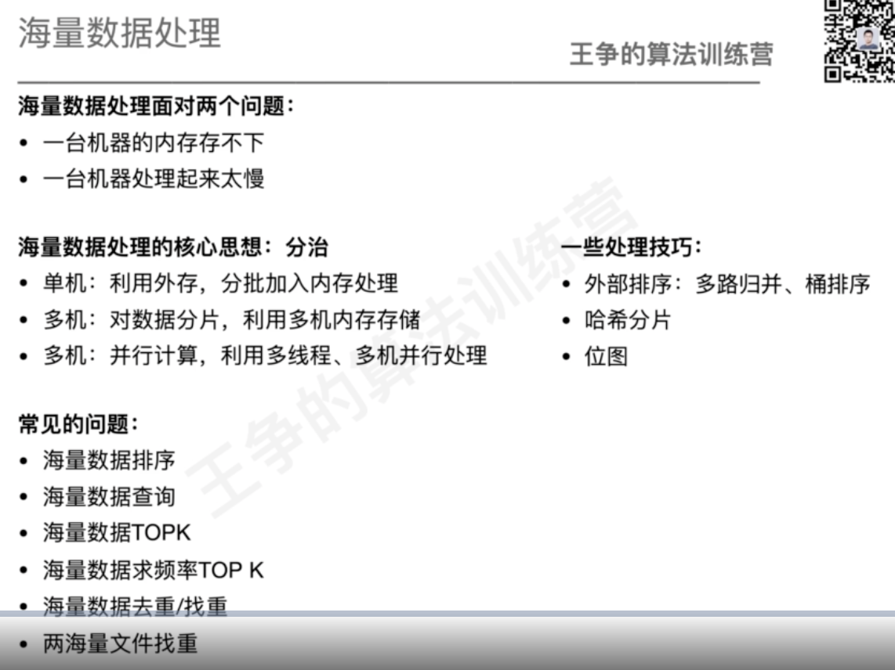

#概述

#题型

##10G订单按金额排序
###多路归并
1.分片,10G->1G文件,对1G文件进行排序
2.多路归并,长度为10的数组,每次选出最小值,放入新的10G文件中
3.优化,分批加载缓存进行排序,缓存排序后结果分批刷入10G的文件中

###桶排序
1.10个桶,每个桶按金额划分,0~99,100~199,200~300,...,900~1000
2.对每个桶数据进行内存排序

##10亿ip的白名单,判断ip是否在白名单

1.内存能放下,红黑树,hashmap
2.内存放不下,位图,10亿/8=500M
3.多机器,对ip求md5(让数据分布均匀),对机器数进行hash取余
4.对ip求md5,对ip hash取余

##10亿整数,判断某个整数是否在其中?
##10亿整数在文件中，内存有限,求最大的TOP100个整数?
1.维护100个元素的小顶堆
2.优化,批量读取100M

##100GB的搜索关键字文件,统计频率TOP100的关键字?(排序;hash表)

###多路排序
1.海量排序:文件分片,小文件排序,归并合入有序的100GB文件中
2.求计数
###hash表
1.对文件分片%10,对分片文件计数并写入文件,共10个计数文件
2.对每个文件求topk,比对10个文件的topk

##10亿url去重

###多路排序
优化:读写缓存
###hash表(数据倾斜)
1.md5取模打散数据,防止数据倾斜
2.hash取模,%8,划分多个文件,对每个文件去重

如果10亿数据中9亿数据一样,分片效果不好怎么办?
设置文件上线为1G,大于1G继续拆分
##a,b两文件,各50亿URL,每个URL 64B,内存限制4GB，找出共同的URL
###多路排序

###hash表
分片,内存hash表缓存
1.md5+hash分片
2.内存两个2hash表判断

