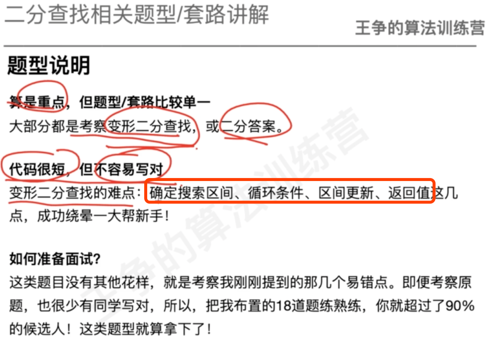
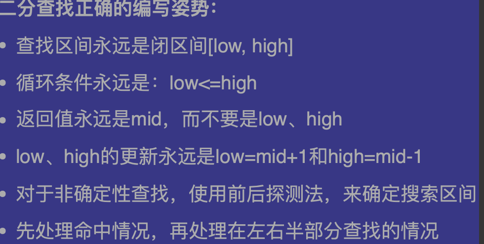
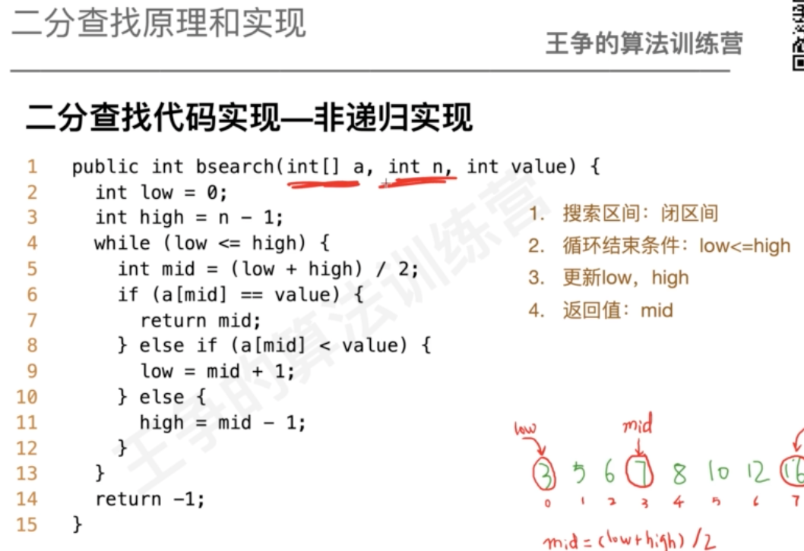
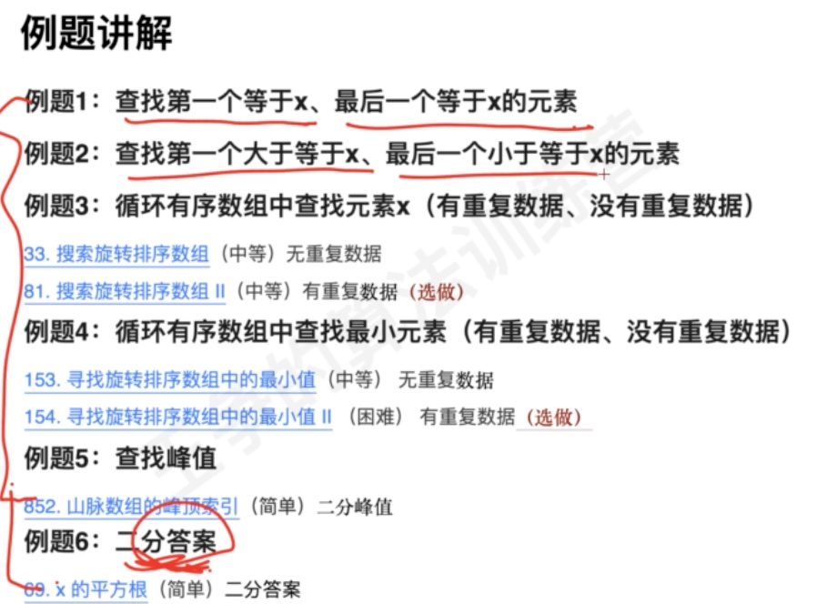
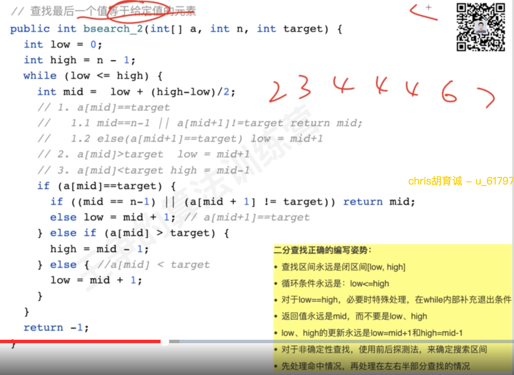
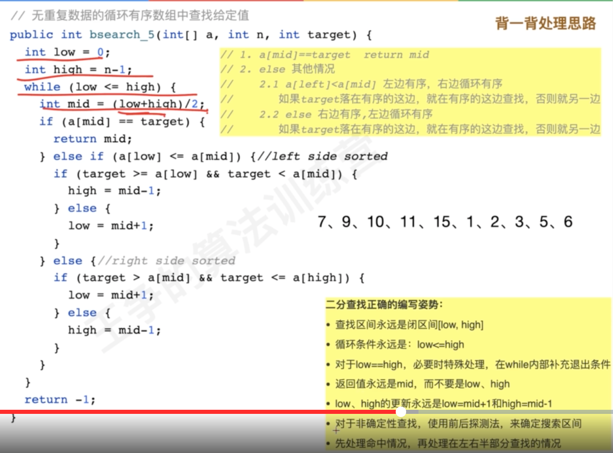
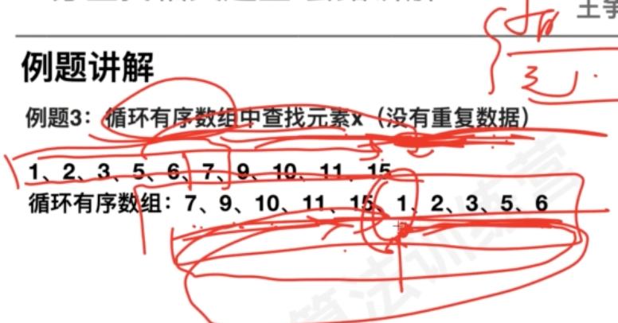
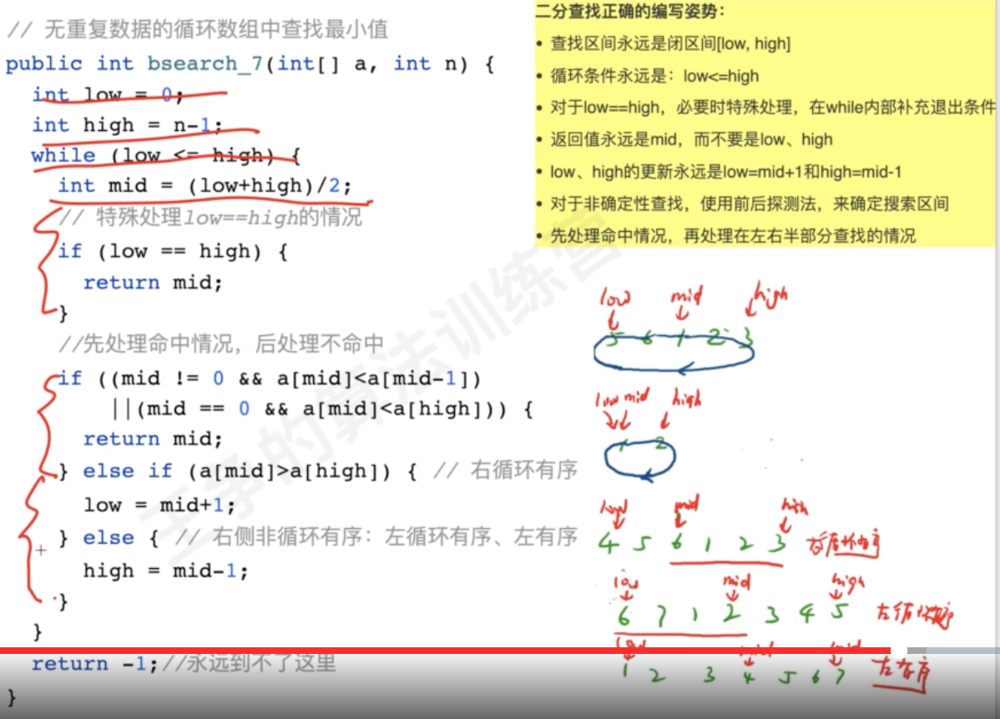
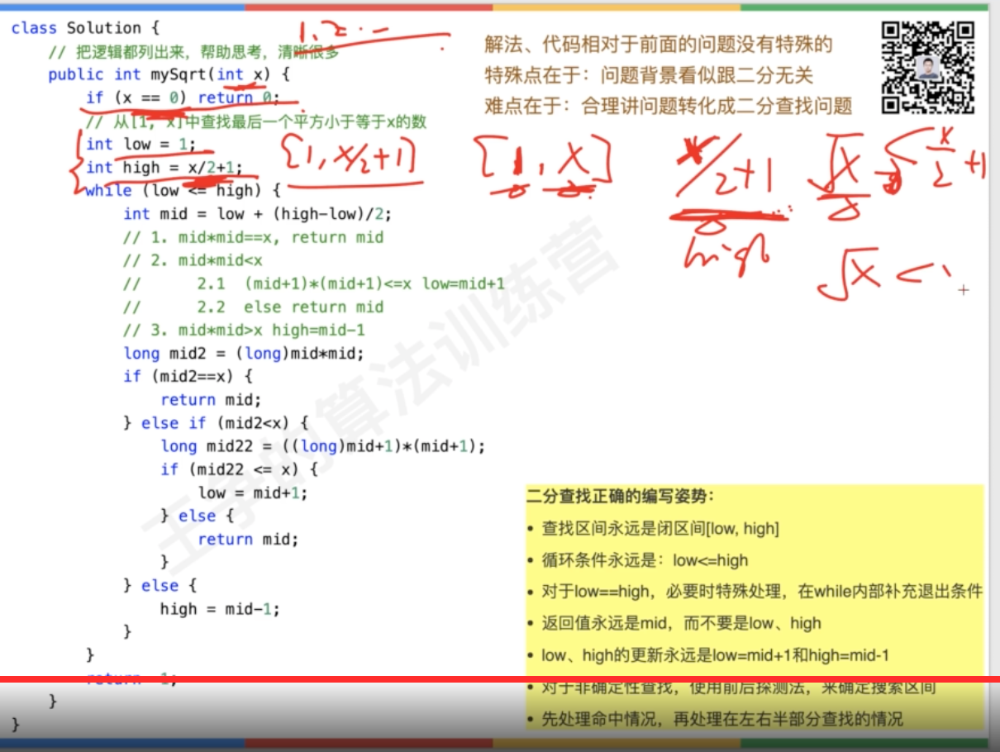

#概述

##难点

##模板


[](https://www.xzgedu.com/detail/v_60bd662ae4b07e4d7fdc86ec/3?from=term_61ab909e6ab61_khvVNp&type=25&parent_pro_id=)
#代码
非递归

递归

#时间复杂度
log(n)

#例题

##链表二分查找
##第一个最后一个

最后一个
```asp
public int[] searchRange(int[] nums, int target) {
        int[] ans={-1,-1};
        int left=0;
        int right=nums.length-1;
        while(left<=right){
            int mid=left+((right-left)>>1);
            if(nums[mid]<=target)left=mid+1;
            else right=mid-1;
        }
        return left-1;
    }
```


第一个
```asp
```asp
public int[] searchRange(int[] nums, int target) {
        int[] ans={-1,-1};
        int left=0;
        int right=nums.length-1;
        while(left<=right){
            int mid=left+((right-left)>>1);
            if(nums[mid]<target)left=mid+1;
            else right=mid-1;
        }
        return right+1;
    }
```

##第一个大于,最后一个小于


第一个大于:left
```asp
public int[] searchRange(int[] nums, int target) {
        int[] ans={-1,-1};
        int left=0;
        int right=nums.length-1;
        while(left<=right){
            int mid=left+((right-left)>>1);
            if(nums[mid]<=target)left=mid+1;
            else right=mid-1;
        }
        return left;
    }
```


最后一个小于,right
```asp
public int[] searchRange(int[] nums, int target) {
        int[] ans={-1,-1};
        int left=0;
        int right=nums.length-1;
        while(left<=right){
            int mid=left+((right-left)>>1);
            if(nums[mid]<target)left=mid+1;
            else right=mid-1;
        }
        return right;
    }
```
##稀疏数组
[面试题 10.05. 稀疏数组搜索](https://leetcode-cn.com/problems/sparse-array-search-lcci/)
```asp
public int findString(String[] words, String s) {
    int low = 0;
    int high = words.length - 1;
    while (low <= high) {
      int mid = (low + high) / 2;
      if (words[mid].equals(s)) {
        return mid;
      } else if (words[mid].equals("")) {
        // 随便找一边处理，能缩小有效范围就行
        if (words[low].equals(s)) return low;
        else low++;
      } else if (words[mid].compareTo(s) < 0) {
        low = mid + 1;
      } else {
        high = mid - 1;
      }
    }
    return -1;
  }
```
##循环数组找x


位置划分
```asp
public int search(int[] nums, int target) {
    int left = 0;
    int right = nums.length - 1;
    while (left <= right) {
      int mid = (left + right) / 2;
      if (nums[mid] == target) {
        return mid;
      } else if (nums[left] <= nums[mid]) {//left side sorted
        if (target >= nums[left] && target < nums[mid]) {
          right = mid - 1;
        } else {
          left = mid + 1;
        }
      } else {
        if (target > nums[mid] && target <= nums[right]) {
          left = mid + 1;
        } else {
          right = mid - 1;
        }
      }
    }
    return -1;
  }
```
##循环数组最小值



```asp
public int findMin(int[] nums) {
         int left=0;
         int right=nums.length-1;
         while(left<=right){
             int mid=left+((right-left)>>1);
             if(nums[mid]>nums[nums.length-1])left=mid+1;
             else right=mid-1;
         }
         return nums[left];
    }
```
##查找峰值


##x的平方根(溢出问题)


##二维矩阵

```asp
class Solution {
    public boolean searchMatrix(int[][] matrix, int target) {
        int rows = matrix.length - 1, columns = 0;
        while (rows >= 0 && columns < matrix[0].length) {
            int num = matrix[rows][columns];
            if (num == target) {
                return true;
            } else if (num > target) {
                rows--;
            } else {
                columns++;
            }
        }
        return false;
    }
}
```
##658. 找到 K 个最接近的元素
[](https://leetcode-cn.com/problems/find-k-closest-elements/)
[](https://leetcode-cn.com/problems/find-k-closest-elements/solution/pai-chu-fa-shuang-zhi-zhen-er-fen-fa-python-dai-ma/)
```asp
import java.util.ArrayList;
import java.util.List;

public class Solution {

    public List<Integer> findClosestElements(int[] arr, int k, int x) {
        int size = arr.length;

        int left = 0;
        int right = size - 1;

        int removeNums = size - k;
        while (removeNums > 0) {
            if (x - arr[left] <= arr[right] - x) {
                right--;
            } else {
                left++;
            }
            removeNums--;
        }

        List<Integer> res = new ArrayList<>();
        for (int i = left; i < left + k; i++) {
            res.add(arr[i]);
        }
        return res;
    }
}
```
```asp
import java.util.ArrayList;
import java.util.List;

public class Solution {

    public List<Integer> findClosestElements(int[] arr, int k, int x) {
        int size = arr.length;

        int left = 0;
        int right = size - k - 1;

        while (left <= right) {
            // int mid = left + (right - left) / 2;
            int mid = (left + right) >>> 1;
            // 尝试从长度为 k + 1 的连续子区间删除一个元素
            // 从而定位左区间端点的边界值
            if (x - arr[mid] > arr[mid + k] - x) {
                left = mid + 1;
            } else {
                right = mid - 1;
            }
        }

        List<Integer> res = new ArrayList<>();
        for (int i = left; i < left + k; i++) {
            res.add(arr[i]);
        }
        return res;
    }
}
```
##最小速度
[875. 爱吃香蕉的珂珂](https://leetcode-cn.com/problems/koko-eating-bananas/)
##81. 搜索旋转排序数组 II
[](https://leetcode-cn.com/problems/search-in-rotated-sorted-array-ii/)
```asp
public boolean search(int[] nums, int target) {
        int left=0;
        int right=nums.length-1;
        while(left<right&&nums[left]==nums[right])left++;
        while(left<=right){
            int mid=left+((right-left)>>1);
            if(nums[mid]==target)return true;
            else if(target<=nums[nums.length-1]&&nums[mid]>nums[nums.length-1])left=mid+1;
            else if(target>nums[nums.length-1]&&nums[mid]<=nums[nums.length-1])right=mid-1;
            else if(nums[mid]<target)left=mid+1;
            else if(nums[mid]>target)right=mid-1;
        }
        return false;
    }
```
##154. 寻找旋转排序数组中的最小值 II
```asp
public int findMin(int[] nums) {
         int left=0;
         int right=nums.length-1;
         while(left<right&&nums[left]==nums[right])left++;
         while(left<=right){
             int mid=left+((right-left)>>1);
             if(nums[mid]>nums[nums.length-1])left=mid+1;
             else right=mid-1;
         }
         return nums[left];
    }
```
##4. 寻找两个正序数组的中位数
