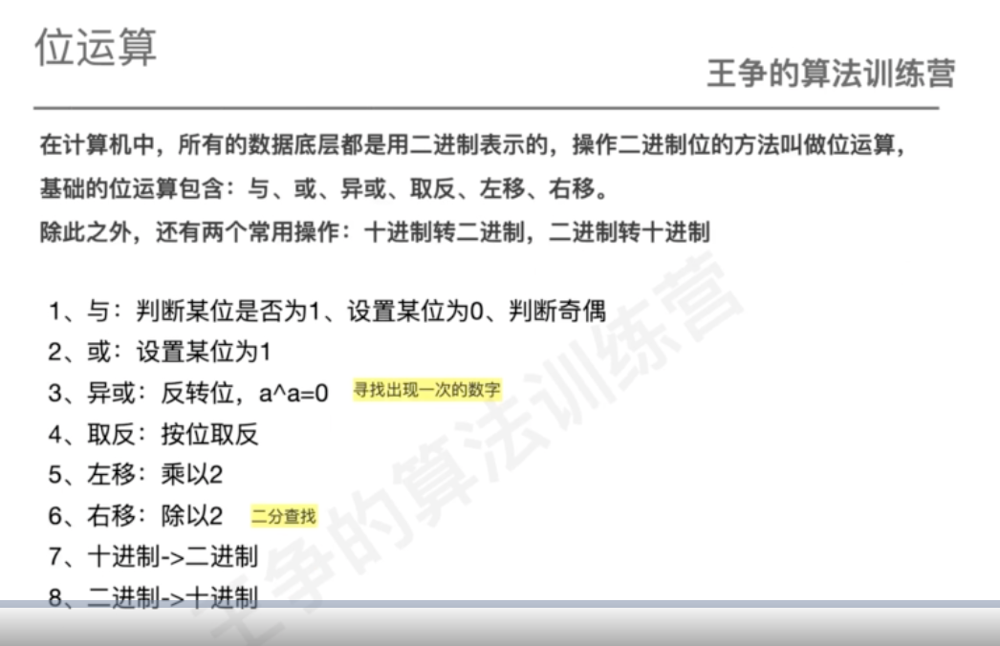
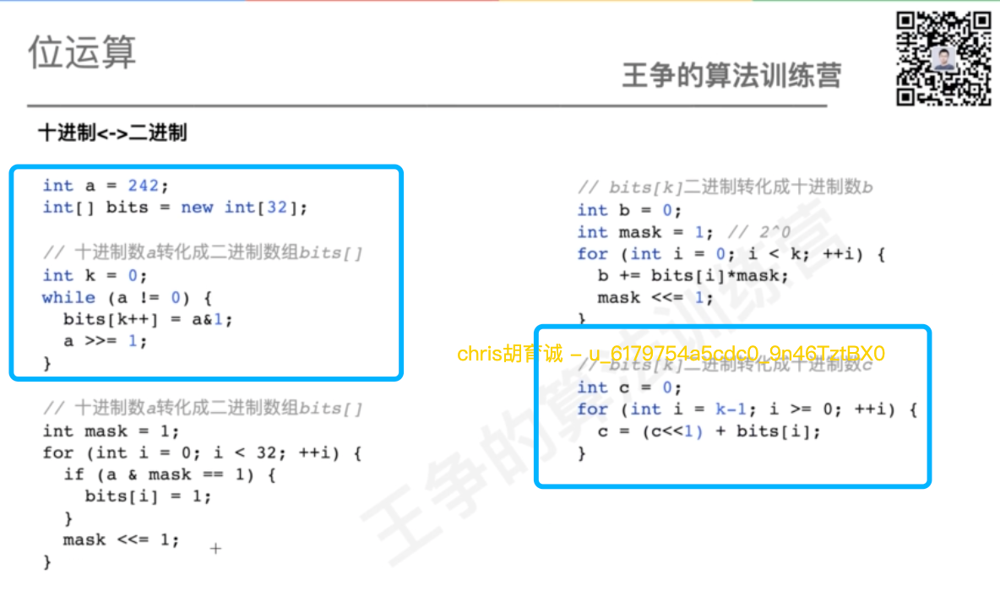
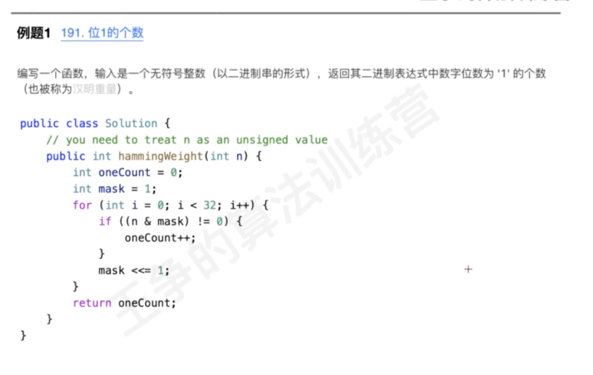
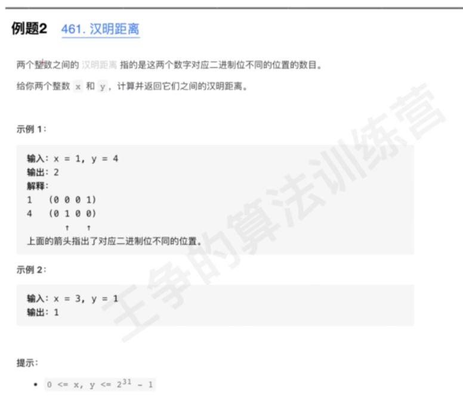
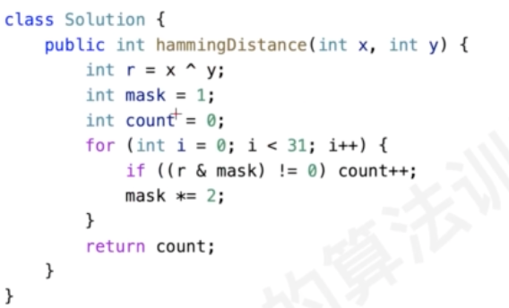

#概述

#题型
##十进制&二级制转换

##位1的个数

##汉明距离


##面试题 05.06. 整数转换
[](https://leetcode-cn.com/problems/convert-integer-lcci/submissions/)
##面试题 05.07. 配对交换
[](https://leetcode-cn.com/problems/exchange-lcci/)
```asp
public int exchangeBits(int num) {
        int result=0;
        for(int i=0;i<=30;i+=2){
            int even=num&(1<<i);
            int odd=num&(1<<(i+1));
            result|=(even<<1);
            result|=(odd>>1);
        }
        return result;
    }
```
##面试题 05.01. 插入
[](https://leetcode-cn.com/problems/insert-into-bits-lcci/)
##面试题 17.04. 消失的数字
[](https://leetcode-cn.com/problems/missing-number-lcci/)
##剑指 Offer 56 - I. 数组中数字出现的次数
[](https://leetcode-cn.com/problems/shu-zu-zhong-shu-zi-chu-xian-de-ci-shu-lcof/)
##剑指 Offer 56 - II. 数组中数字出现的次数 II
[](https://leetcode-cn.com/problems/shu-zu-zhong-shu-zi-chu-xian-de-ci-shu-ii-lcof/)
```asp
public int singleNumber(int[] nums) {
    int ans=0;
    int num=0;
    for(int i=0;i<32;i++){
        int cur=1<<i;
        for(int n:nums){
            if((n&cur)!=0)num++;
        }
        ans|=((num%3)<<i);
        num=0;
    }
    return ans;
}
```
##面试题 16.01. 交换数字
[](https://leetcode-cn.com/problems/swap-numbers-lcci/)
##231. 2 的幂

