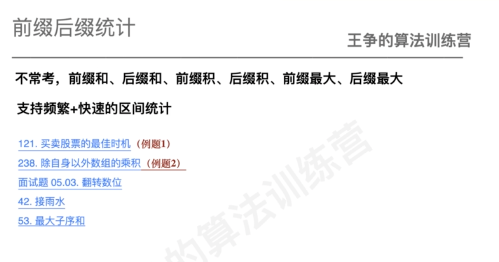
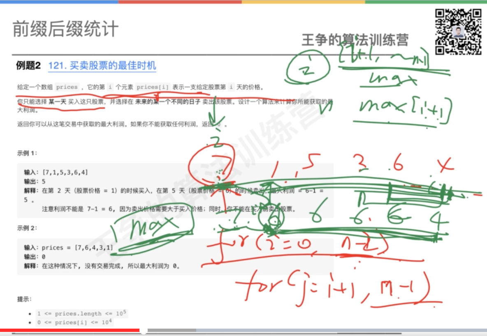
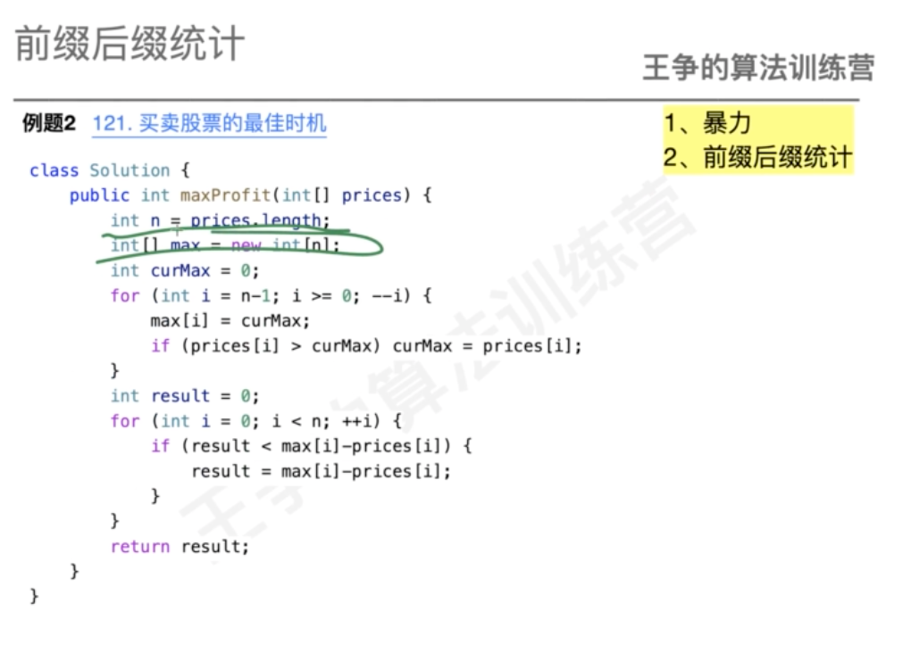
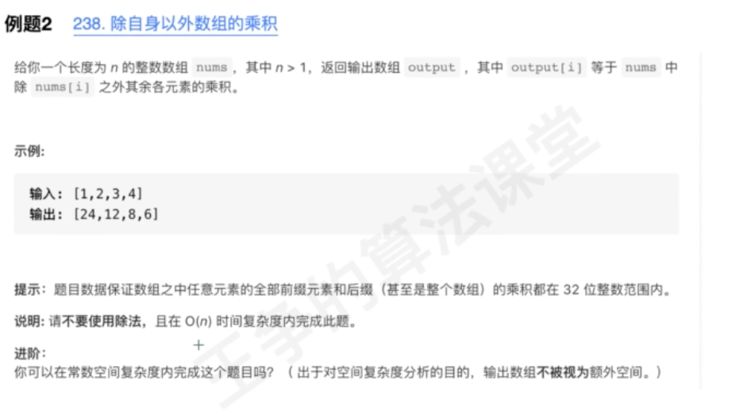
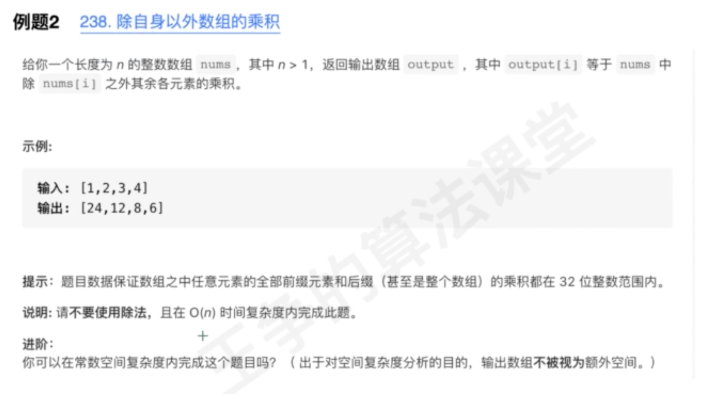
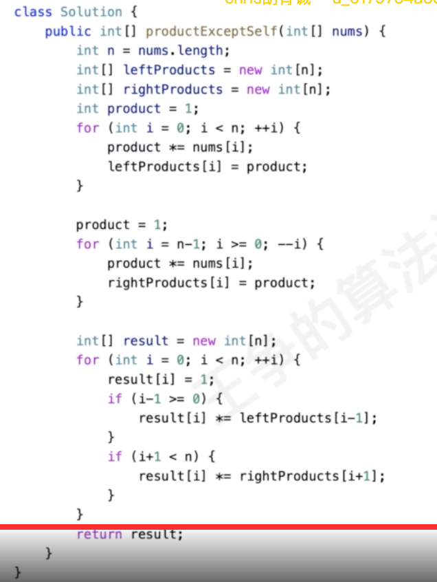
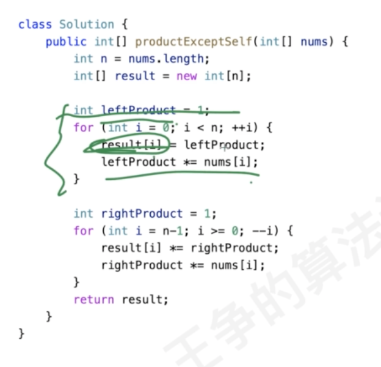

#概述

#一次买入


#除自身以外数组的乘积

#238除自身以外数组的乘积



#面试题 05.03. 翻转数位
前缀数组记录前缀乘积/前缀和
[](https://leetcode-cn.com/problems/reverse-bits-lcci/)
```asp
public int reverseBits(int num) {
        // num计数
        // left计数,累加,遇到0初始化
        int[] arr=new int[32];
        for(int i=arr.length-1;i>=0;i--){
            arr[i]=(num&1);
            num>>=1;
        }
        int[] left=new int[32];
        int count=0;
        for(int i=0;i<left.length;i++){
            left[i]=count;
            if(arr[i]==0)count=0;
            else if(arr[i]==1)count++;
        }
        int[] right=new int[32];
        count=0;
        for(int i=right.length-1;i>=0;i--){
            right[i]=count;
            if(arr[i]==0)count=0;
            else if(arr[i]==1)count++;
        }
        int max=0;
        for(int i=0;i<arr.length;i++){
            if(max<left[i]+right[i]+1)max=left[i]+right[i]+1;
        }
        return max;
    }
```
#42. 接雨水
[](https://leetcode-cn.com/problems/trapping-rain-water/)
对每个桶位求值,使用前缀后缀
```asp
public int trap(int[] height) {
       int[] leftMax=new int[height.length];
       int[] rightMax=new int[height.length];
       int max=0;
       for(int i=0;i<height.length;i++){
           leftMax[i]=max;
           max=Math.max(max,height[i]);
       }
       max=0;
       for(int i=height.length-1;i>=0;i--){
           rightMax[i]=max;
           max=Math.max(max,height[i]);
       }
       int result=0;
       for(int i=0;i<height.length;i++){
           int cur=Math.min(leftMax[i],rightMax[i])-height[i];
           if(cur>0)result+=cur;
       }
       return result;
    }
```
#53. 最大子数组和
[](https://leetcode-cn.com/problems/maximum-subarray/)
