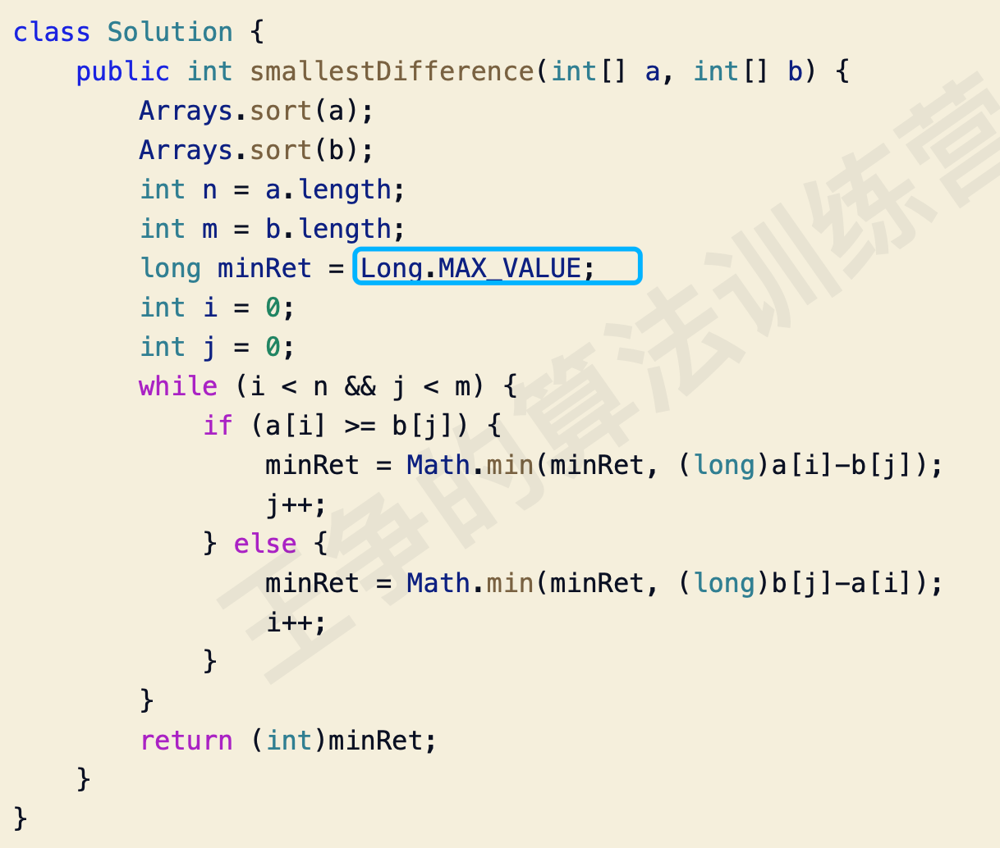

#概述

#例题
##数对(排序+双指针)


##两数之和
##15. 三数之和
[](https://leetcode-cn.com/problems/3sum/)
##移动零

##奇偶分离
[](https://leetcode-cn.com/problems/diao-zheng-shu-zu-shun-xu-shi-qi-shu-wei-yu-ou-shu-qian-mian-lcof/submissions/)
```asp
public int[] exchange(int[] nums) {
       int odd=0;
       int even=0;
       for(int i=0;i<nums.length;i++){
           if((nums[i]&1)==1){
               if(odd!=i){
                   swap(nums,odd,i);
               }
               odd++;
           }
       }
       return nums;
    }

public void swap(int[] nums,int a,int b){
    int temp=nums[a];
    nums[a]=nums[b];
    nums[b]=temp;
}
```
##75. 颜色分类
[](https://leetcode-cn.com/problems/sort-colors/)
##绝对差(排序+双指针)


##面试题 16.06. 最小差
[](https://leetcode-cn.com/problems/smallest-difference-lcci/)

##面试题 17.11. 单词距离
[](https://leetcode-cn.com/problems/find-closest-lcci/)
map<String, List<Integer>> 
##区间问题
[](https://mp.weixin.qq.com/s/Eb6ewVajH56cUlY9LetRJw)
