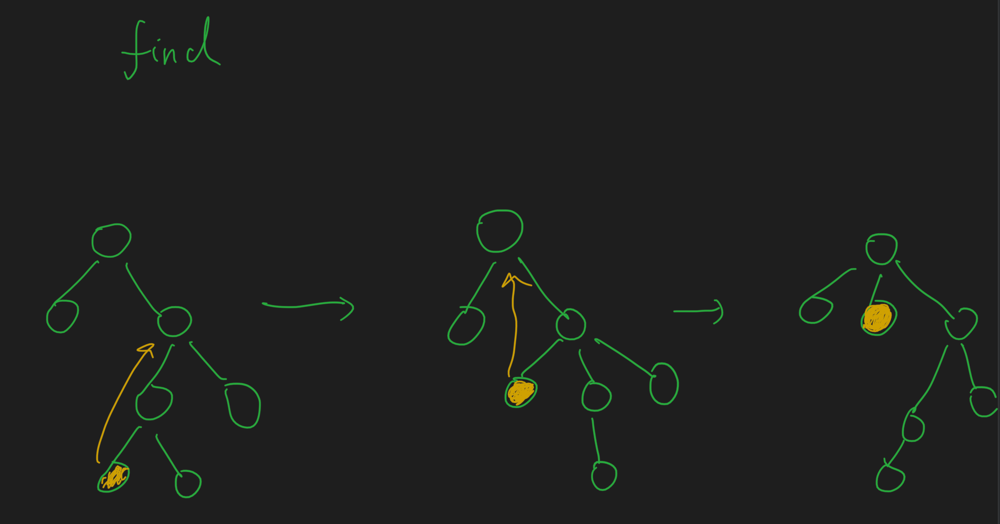
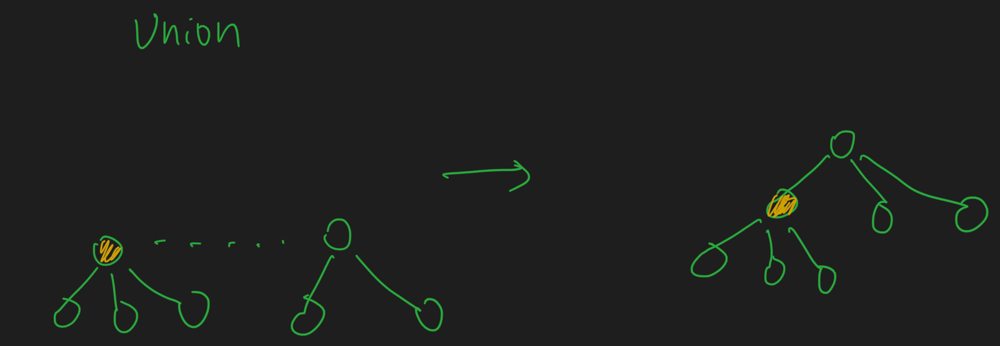

#并查集
[128. 最长连续序列]


```asp
public class UnionFind{
        private Map<Integer,Integer> map=new HashMap<>();
        public UnionFind(int[] nums){
            for(int i:nums)map.put(i,i);
        }

        public Integer find(int x){
            if(!map.containsKey(x)) return null;
            while(x!=map.get(x)){
                map.put(x,map.get(map.get(x)));
                x=map.get(x);
            }
            return x;
        }

        public void union(int x,int y){
            int root1=find(x);
            int root2=find(y);
            if(root1==root2)return;
            map.put(root1,root2);
        }
    }
```
