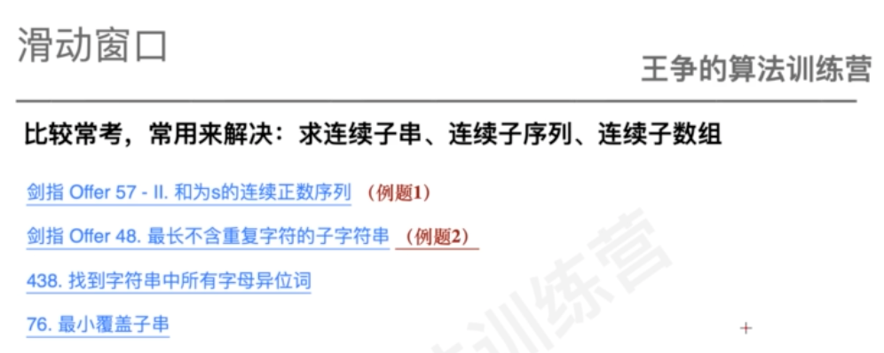
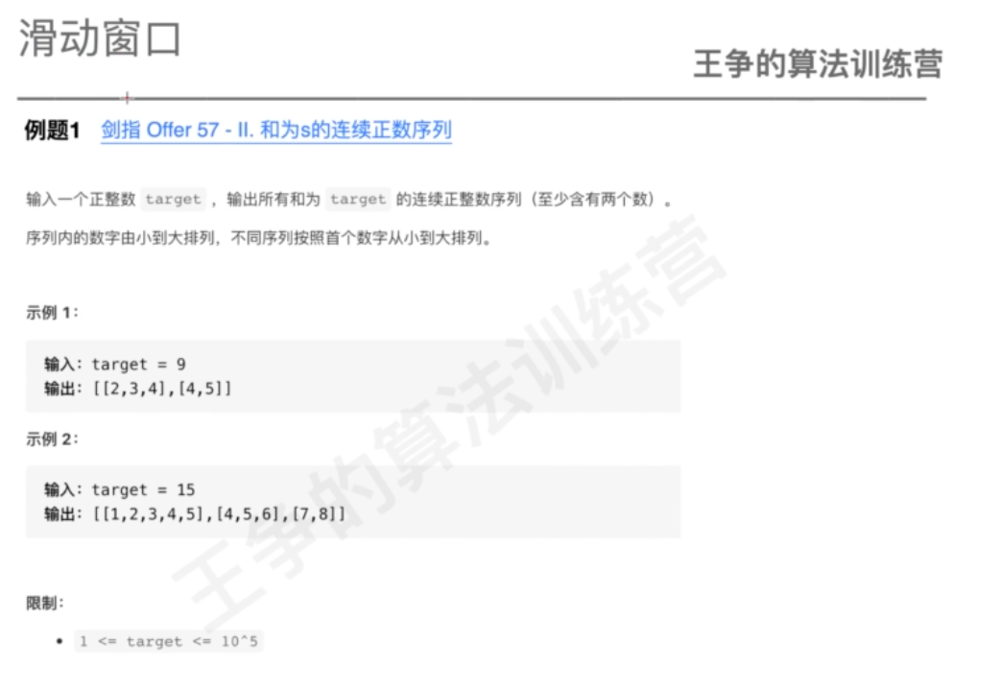

#概述

1.窗口右边界初始值,窗口右边界增大在最后进行
2.先while,shrink
3.判断结果
4.窗口右边界增大
#连续正数序列


[](https://leetcode-cn.com/problems/he-wei-sde-lian-xu-zheng-shu-xu-lie-lcof/)
```asp
public int[][] findContinuousSequence(int target) {
    // low,high
    // sum
    // ==sum,记录temp
    // >sum,--
    int low = 1;
    int high = 1;
    int sum = 0;
    List<int[]> ans = new ArrayList<>();
    while (high < target) {
      sum += high;
      while (sum > target) {
        sum -= low;
        low++;
      }
      if (sum == target) {
        int[] temp = new int[high - low + 1];
        for (int i = low; i <= high; i++) temp[i - low] = i;
        ans.add(temp);
      }
      high++;
    }
    return ans.toArray(new int[0][0]);
  }
```
#最长不重复子串


while:如果字符在窗口中间,需要删除多个
[](https://leetcode-cn.com/problems/zui-chang-bu-han-zhong-fu-zi-fu-de-zi-zi-fu-chuan-lcof/)
```asp
public int lengthOfLongestSubstring(String s) {
        int[] count=new int[256];
        int maxLen=0;
        int len=0;

        int high=0;
        int low=0;
        while(high<s.length()){
            count[s.charAt(high)]++;
            len++;
            while(count[s.charAt(high)]>1){
                count[s.charAt(low)]--;
                low++;
                len--;
            }
            maxLen=Math.max(maxLen,len);
            high++;
        } 
        return maxLen;
    }
```
#438. 找到字符串中所有字母异位词
[](https://leetcode-cn.com/problems/find-all-anagrams-in-a-string/)
```asp
public List<Integer> findAnagrams(String s, String p) {
        int[] count=new int[26];
        int[] need=new int[26];
        int low=0;
        int high=0;
        List<Integer> temp=new ArrayList<>();
        for(int i=0;i<p.length();i++)count[p.charAt(i)-'a']++;
        while(high<s.length()){
            int cur=s.charAt(high)-'a';
            need[cur]++;
            while(need[cur]>count[cur]){
                need[s.charAt(low)-'a']--;
                low++;
            }
            int i=0;
            for(;i<26&&count[i]==need[i];i++);
            if(i==26)temp.add(low);
            high++;
        }
        return temp;
    }
```
#76. 最小覆盖子串
[](https://leetcode-cn.com/problems/minimum-window-substring/)
```asp
public String minWindow(String s, String t) {
        int[] count=new int[256];
        int[] need=new int[256];
        int low=0;
        int high=0;
        int len=0;
        int minLen=Integer.MAX_VALUE;
        int index=-1;
        for(int i=0;i<t.length();i++)count[t.charAt(i)]++;
        while(high<s.length()){
            int cur=s.charAt(high);
            need[cur]++;
            while(match(count,need)){
                if(minLen>high-low+1){
                    index=low;
                    minLen=Math.min(minLen,high-low+1);
                }
                need[s.charAt(low)]--;
                low++;
            }
            high++;
        }
        return index==-1?"":s.substring(index,index+minLen);
    }

    public boolean match(int[] count,int[] need){
        for(int i=0;i<256;i++){
                if(count[i]==0)continue;
                if(need[i]<count[i]){
                    return false;
                }
            }
        return true;
    }
```
