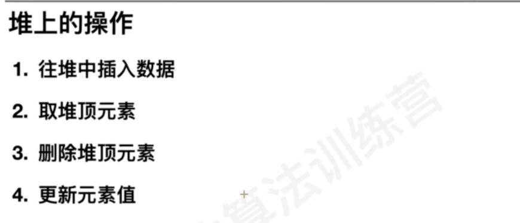

#堆(完全二叉树)

##定义

1.每个节点的值大于等于子树每个节点的值
2.堆是完全二叉树,适合数组来存储

##增删改查

堆的定义和存储
堆的操作:插入数据、取堆顶元素、删除堆顶元素、更新元素值
###往堆中插入数据(堆化,自下而上,时间复杂度o(h))

###取元素top(o(1))

###删除元素(堆化,自上而下,o(h))
把最后一个节点放到堆顶,使用自上而下的堆化方式

###更新元素(变小,自上而下;变大,自下而上,o(h))

##算法复杂度分析

##例题
###堆排序(每次取出最大的值,取n次)

建堆,

1.类似插入数据,自下而上,时间复杂度o(nlogn):叶子节点n/2,每个叶子节点时间复杂度log(n),n/2 * log(n),堆化越慢节点越多

2.类似删除数据,自上而下,时间复杂度o(n):2^0 * h,2^1 * (h-1), 2^2 * (h-2), 2^(h-1) * 1,堆化越慢节点越少

排序

时间复杂度:O(nlogn)

###优先级队列
####23. 合并K个升序链表(困难)

###TOPK(静态数据,动态数据,排序,快排,堆排)

静态数据:排序nlog(n),快排o(n)
动态数据:堆排logk,

####347. 前 K 个高频元素

###中位数

进阶

###百分位数

