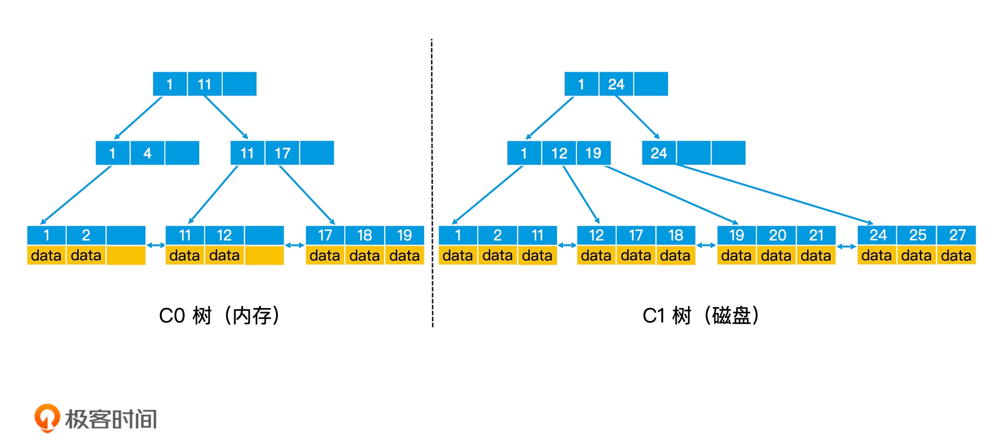

#临界知
延迟写入和批量操作
WAL
适合用在写多读少的日志或监控系统
#LSM 树(Log Structured Merge Trees)
[](https://time.geekbang.org/column/article/222768)
##随机写入磁盘慢
```asp
LSM 树就是根据这个思路设计了这样一个机制：当数据写入时，延迟写磁盘，将数据先存放在内存中的树里，进行常规的存储和查询。当内存中的树持续变大
达到阈值时，再批量地以块为单位写入磁盘的树中。因此，LSM 树至少需要由两棵树组成，一棵是存储在内存中较小的 C0 树，另一棵是存储在磁盘中较大的 C1 树
```

##持久化防崩溃
WAL 技术(Write Ahead Log)

##崩溃恢复
```asp
系统崩溃重启，我们只需要从磁盘中读取检查点，就能知道最后一次成功处理的数据在 log 文件中的位置。接下来，我们就可以把这个位置之后未被处理的数据，从 log 文件中读出，然后重新加载到内存中
```
##合并
滚动合并
归并排序
多页块
清空块和填充块
##检索(插入,删除)
采取延迟写入和批量操作的思路。对于被删除的数据，我们会将这些数据的 key 插入到 C0 树中，并且存入删除标志。如果 C0 树中已经存有这些数据，我们就将 C0 树中这些数据对应的 key 都加上删除标志
