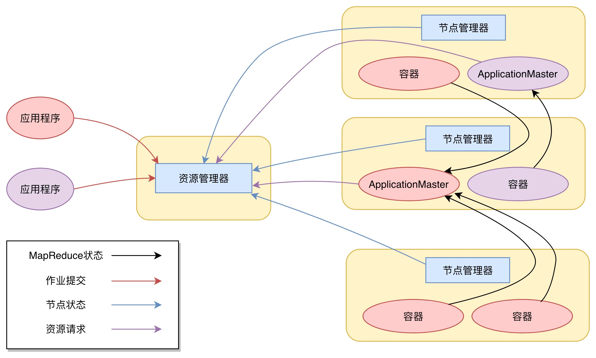
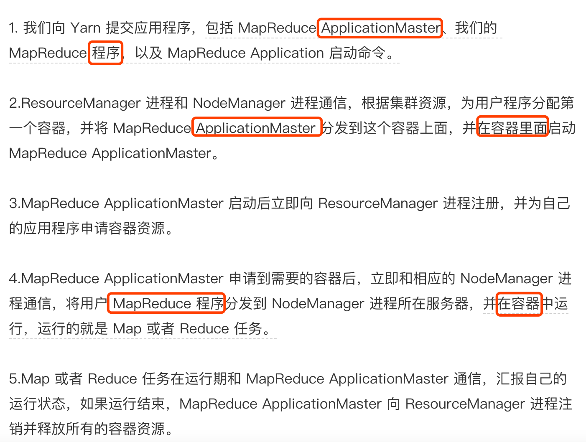
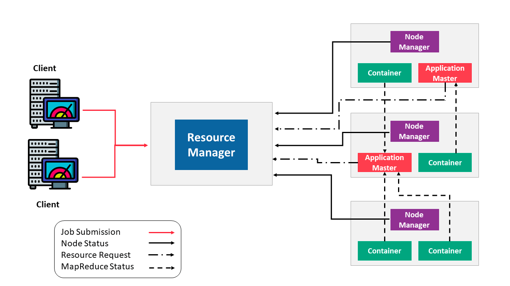
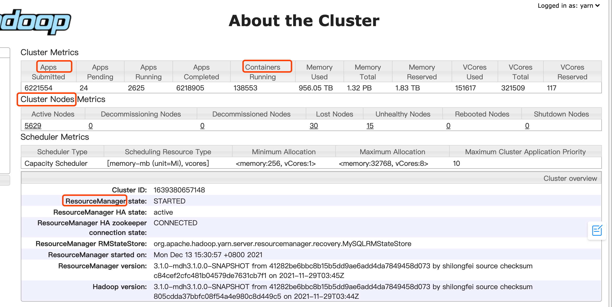
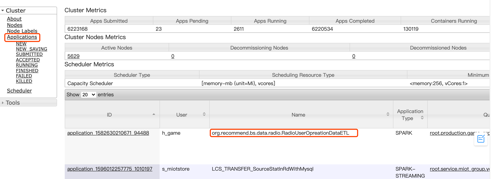

#拓扑关系


[](https://time.geekbang.org/column/article/68732)

##ResourceManager
整个集群中包括内存、CPU等资源的管理
###调度器
####队列
##NodeManager
本节点上资源的供给和隔离
###ApplicationMaster
应用程序在整个生命周期的任务调度
###Container
```asp

 也需要运行在容器里面

Yarn 进行资源分配的单位是容器（Container），每个容器包含了一定量的内存、CPU 等计算资源，默认配置下，每个容器包含一个 CPU 核心。
容器由 NodeManager 进程启动和管理，NodeManger 进程会监控本节点上容器的运行状况并向 ResourceManger 进程汇报。
应用程序管理器负责应用程序的提交、监控应用程序运行状态等。应用程序启动后需要在集群中运行一个 ApplicationMaster，
ApplicationMaster 也需要运行在容器里面。每个应用程序启动后都会先启动自己的 ApplicationMaster，由 ApplicationMaster 
根据应用程序的资源需求进一步向 ResourceManager 进程申请容器资源，得到容器以后就会分发自己的应用程序代码到容器上启动，进而开始分布式计算
```
###application





