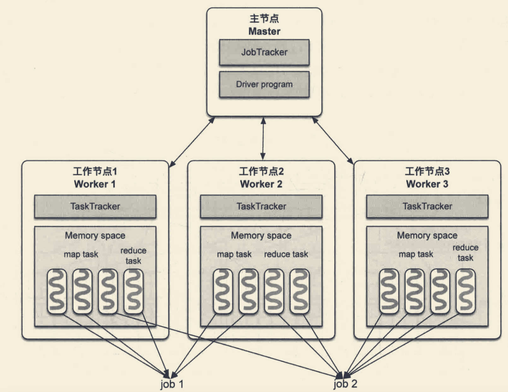

#四层

##用户层
<输入数据,用户代码,配置参数>
输入数据:网络流,消息队列,hdfs
用户代码:map reduce,combine,rdd
配置参数:并行度,cpu,内存,分区
##并行处理层
mapReduce:map->shuffle-reduce

spark:多阶段，DAG(有向无环图)

##资源管理&任务调度层
mapReduce:master-work,jobTrack,taskTracker,每个map/reduce task都是进程

spark:预先启动资源容器Executor JVM,执行任务时在Executor JVM内启动task线程
##物理执行层
内存消耗:

#容错机制
