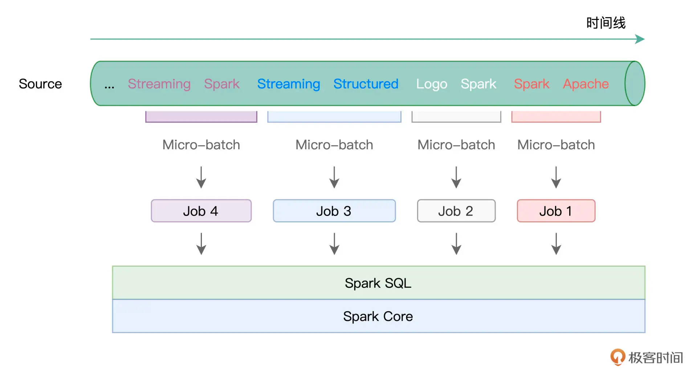

#mapReduce如何实现计算向数据迁移?
#OLTP VS OLAP ,lambda vs Kapper
#map Reduce vs spark
##编程模型
1.mapReduce:map,reduce
2.spark:RDD,多阶段灵活,DAG
##shuffle机制
[大数据处理架构Apache Spark设计]

#spark比map Reduce快的原因?
[画图]

[z_04_spark_01_拓扑.md]

##DAG(RDD+物理执行计划)
Spark计算比MapReduce快的根本原因在于DAG计算模型。一般而言，DAG相比Hadoop的MapReduce在大多数情况下可以减少shuffle次数。
Spark的DAGScheduler相当于一个改进版的MapReduce，如果计算不涉及与其他节点进行数据交换，Spark可以在内存中一次性完成这些操作，
也就是中间结果无须落盘，减少了磁盘IO的操作
##缓存机制
Spark支持将需要反复用到的中间数据给Cache到内存中，减少数据加载耗时

Spark是内存计算引擎，而MapReduce在计算的过程中，需要频繁落盘，因此，一般来说，相比MapReduce，Spark在执行性能上，更胜一筹
##多进程模型 vs 多线程模型
MapReduce采用了多进程模型，而Spark采用了多线程模型。多进程模型的好处是便于细粒度控制每个任务占用的资源，
但每次任务的启动都会消耗一定的启动时间。就是说MapReduce的Map Task和Reduce Task是进程级别的，
而Spark Task则是基于线程模型的，就是说mapreduce 中的 map 和 reduce 都是 jvm 进程，每次启动都需要重新申请资源，
消耗了不必要的时间
##checkpoint
不需要从头恢复
#spark stream vs flink

##微批 vs 事件

##window
Spark只支持基于时间的窗口操作（处理时间或者事件时间），而Flink支持的窗口操作则非常灵活，不仅支持时间窗口，还支持基于数据本身的窗口，开发者可以自由定义想要的窗口操作

##flink 算子丰富
flink支持聚合操作,，状态的维护，keyedStream的支持，窗口的操作
###时间的操作
lateness,sideout

###状态管理

。在流处理的框架里引入状态管理大大提升了系统的表达能力，让用户能够很方便地实现复杂的处理逻辑，是流处理在功能上的一个飞跃
###keyedStream
##checkpoint

#Lambda架构 vs Kappa架构

##Lambda

1.批处理部分。定时拉取业务库的数据，并在hive做批处理计算。
2.速度部分。通过订阅mysql数据库的binlog，实时获取数据库的增删改等的操作，通过kafka和flink，生成相关结果。
3.lamda的希腊字母是λ，这正好表示batch 和 speed两种最后汇聚到一起
4.lambda架构，批处理层和流处理层（速度层），对于某些相同的业务往往需要开发两套代码，这个很不友好
##Kappa

#分析系统

