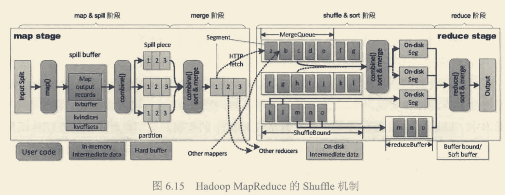
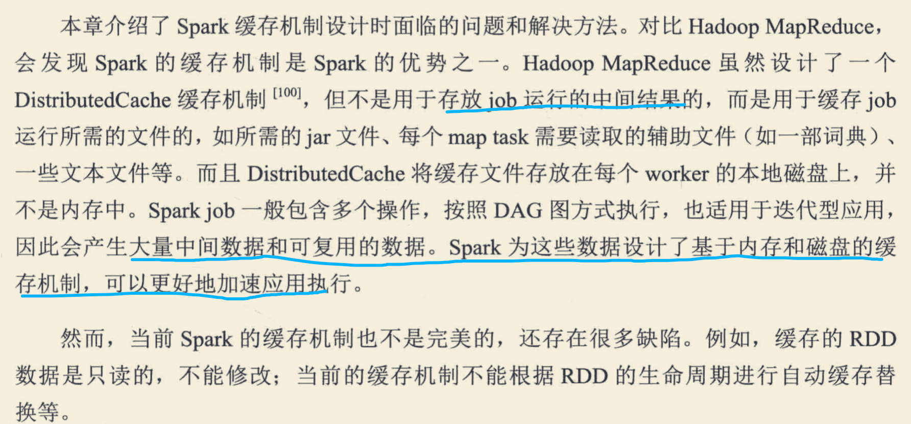
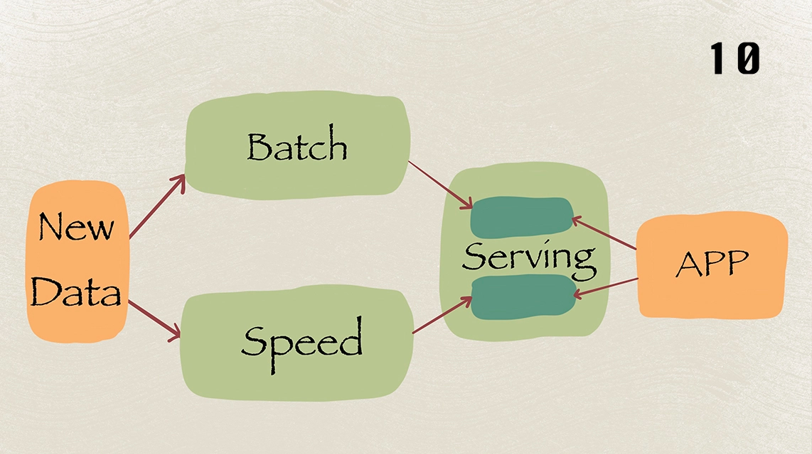
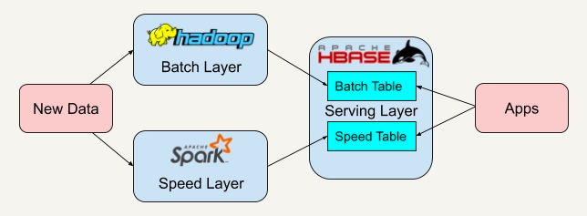
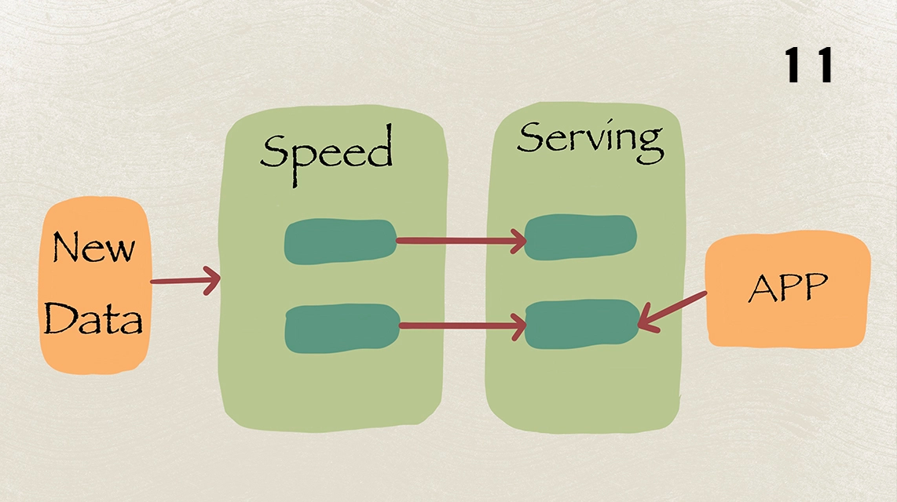

#mapReduce如何实现计算向数据迁移?
#OLTP VS OLAP ,lambda vs Kapper
#map Reduce vs spark
##编程模型
1.mapReduce:map,reduce
2.spark:RDD,多阶段灵活,DAG
##shuffle机制
[大数据处理架构Apache Spark设计]

#spark比map Reduce快的原因?
[画图]

[z_04_spark_01_拓扑.md]

##DAG(RDD+物理执行计划)
Spark计算比MapReduce快的根本原因在于DAG计算模型。一般而言，DAG相比Hadoop的MapReduce在大多数情况下可以减少shuffle次数。
Spark的DAGScheduler相当于一个改进版的MapReduce，如果计算不涉及与其他节点进行数据交换，Spark可以在内存中一次性完成这些操作，
也就是中间结果无须落盘，减少了磁盘IO的操作
##缓存机制
Spark支持将需要反复用到的中间数据给Cache到内存中，减少数据加载耗时

Spark是内存计算引擎，而MapReduce在计算的过程中，需要频繁落盘，因此，一般来说，相比MapReduce，Spark在执行性能上，更胜一筹
##多进程模型 vs 多线程模型
MapReduce采用了多进程模型，而Spark采用了多线程模型。多进程模型的好处是便于细粒度控制每个任务占用的资源，
但每次任务的启动都会消耗一定的启动时间。就是说MapReduce的Map Task和Reduce Task是进程级别的，
而Spark Task则是基于线程模型的，就是说mapreduce 中的 map 和 reduce 都是 jvm 进程，每次启动都需要重新申请资源，
消耗了不必要的时间
##checkpoint
不需要从头恢复
#说说你对flink的理解

#spark stream vs flink
阿里Blink

##微批 vs 事件

##window
Spark stream只支持基于时间的窗口操作，而Flink支持的窗口操作则非常灵活，不仅支持时间窗口，还支持基于数据本身的窗口，开发者可以自由定义想要的窗口操作
psi就有需要基于计数的窗口

##时间的操作
lateness,sideout，处理时间、事件时间、注入时间。同时也支持 watermark 机制

##状态管理

。在流处理的框架里引入状态管理大大提升了系统的表达能力，让用户能够很方便地实现复杂的处理逻辑，是流处理在功能上的一个飞跃
##丰富的窗口聚合方法
richFunction

##keyedStream
##checkpoint
容错机制对于 Spark Streaming 任务，我们可以设置 checkpoint，然后假如发生故障
并重启，我们可以从上次 checkpoint 之处恢复，但是这个行为只能使得数据不丢失，可能 会重复处理，不能做到恰好一次处理语义。
Flink 则使用两阶段提交协议来解决这个问题
#flink vs storm

storm:
无状态，需用户自行进行状态管理
没有高级功能，如事件时间处理、聚合、窗口、会话、水印等
##状态管理	
##窗口支持	
##吞吐量
#Lambda架构 vs Kappa架构

##Lambda

1.批处理部分。定时拉取业务库的数据，并在hive做批处理计算。
2.速度部分。通过订阅mysql数据库的binlog，实时获取数据库的增删改等的操作，通过kafka和flink，生成相关结果。
3.lamda的希腊字母是λ，这正好表示batch 和 speed两种最后汇聚到一起
4.lambda架构，批处理层和流处理层（速度层），对于某些相同的业务往往需要开发两套代码，这个很不友好
##Kappa

#分析系统

#项目问题
监控
##你们的 Flink 集群规模多大?并行度配置?
1 个 Jobmanager
16 个 taskManager,Containers,每个2g
##项目中的难点
数据倾斜:数据源倾斜,数据倾斜

幂等性:kafka
成功率比例:避免一个用户拉低成功率
##难点
#flink问题

##flink编程模型
##flink集群角色
##flink常用算子
##分区配置
##flink checkpoint
##flink 窗口
##Flink 中的状态存储，容错，快照
Flink 实现容错主要靠强大的 CheckPoint 机制和 State 机制。Checkpoint 负责定时制作
分布式快照、对程序中的状态进行备份;State 用来存储计算过程中的中间状态

Flink 的分布式快照是根据 Chandy-Lamport 算法量身定做的。简单来说就是持续创建分 布式数据流及其状态的一致快照。
核心思想是在 input source 端插入 barrier，控制 barrier 的同步来实现 snapshot 的备 份和 exactly-once 语义。
##Exactly-once 语义
##Flink 中的时间,水印?
##Flink 的内存管理是如何做?
##Flink 的序列化?
##Flink 中的 Window 出现了数据倾斜，你有什么解决办法?
##Flink 中在使用聚合函数 GroupBy、Distinct、KeyBy 等函数时 出现数据热点该如何解决?
##Flink 任务延迟高，想解决这个问题，你会如何入手?
