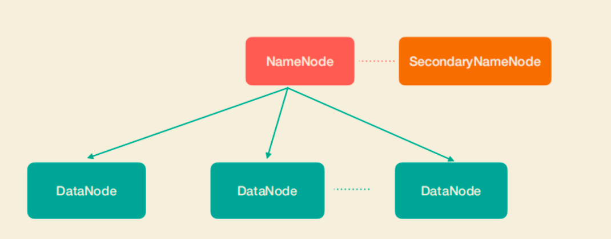
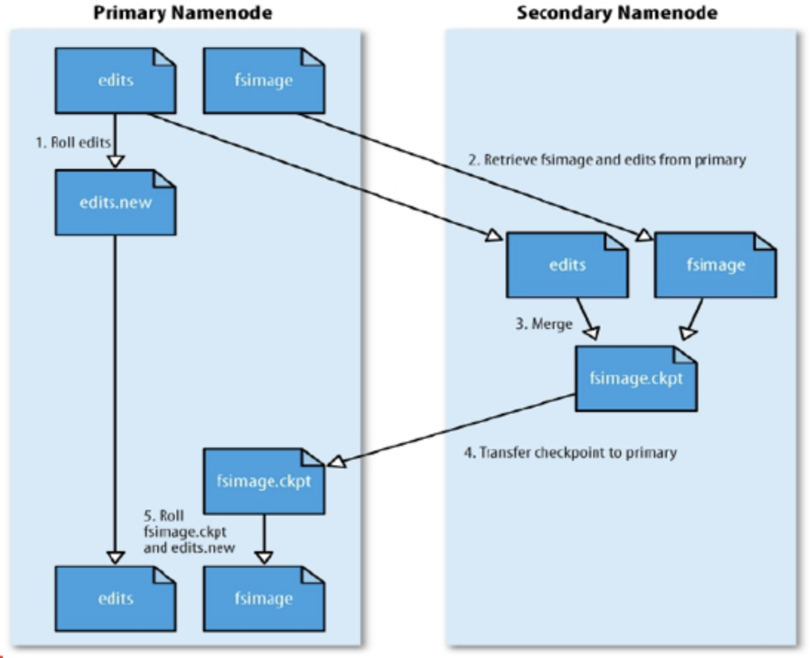
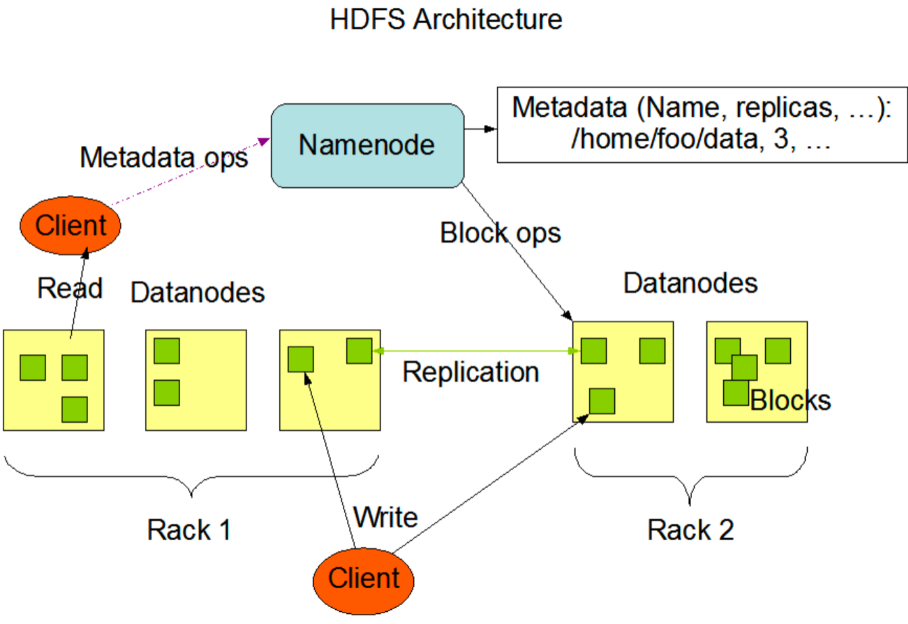
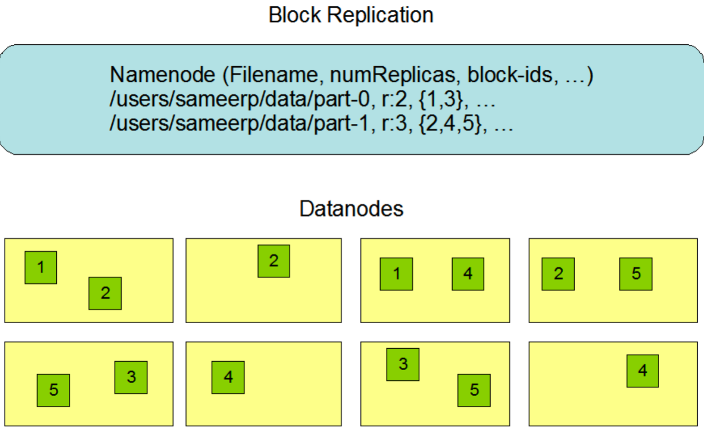

#HDFS是什么?
分布式文件系统
```asp
1.高可用:Block具有副本(replication)，没有主从概念，副本不能出现在同一个节点
2.高扩展:主从架构,也可分片集群，zookeeper+选举,复制同步
3.高性能:文件线性按字节切割成块(block,128M)，一次写入多次读取，不支持修改,不支持随机写,block的大小依据硬件的I/O特性调整,传输时间1ms/读时间
```
默写图
##存储模型
分block(128M),散列->分治,目的:分布式计算
##架构角色
##定位
#拓扑(主从架构)



[](https://weread.qq.com/web/reader/632326807192b335632d09ck70e32fb021170efdf2eca12)
##SecondaryNameNode（SNN）

```asp
在非Ha模式下，SNN一般是独立的节点，周期完成对NN的EditLog向FsImage合并，减少EditLog大小，减少NN启动时间
根据配置文件设置的时间间隔fs.checkpoint.period  默认3600秒
根据配置文件设置edits log大小 fs.checkpoint.size 规定edits文件的最大值默认是64MB
```
##NameNode(主备模式,StandBy备机,目录结构,心跳)

1.存储文件的元数据，比如文件名、文件目录结构、文件属性(生成时间、副本数、文件权限)，以及每个文件的块列表和块所在的DataNode等
2.NameNode会把所有文件的元数据全部维护在内存中。因此，如果在HDFS中存放大量的小文件，则造成分配大量的Block，这样可能耗尽NameNode所有内存而导致OOM。
因此，HDFS并不适合存储大量的小文件。
3.当然，后续的HDFS版本支持NameNode对元数据分片，解决了NameNode的扩展性问题
4.辅助NameNode更好的工作，用来监控HDFS状态的辅助后台程序，每隔一段时间获取HDFS元数据快照。
5.Client和NameNode交互文件元数据和DataNode交互文件block数据
###EditLog(WAL)
[z_01_分布式_临界知识_持久化方案_同步方案_全量备份_增量备份.md]
EditLog具有完整性，数据丢失少，但恢复速度慢，并有体积膨胀风险
###FsImage(快照)
使用FsImage存储内存所有的元数据状态,使用FsImage存储内存所有的元数据状态
NameNode使用了FsImage+EditLog整合的方案：
滚动将增量的EditLog更新到FsImage，以保证更近时点的FsImage和更小的EditLog体积
###安全模式
```asp
Hadoop的安全模式在分布式文件系统启动的时候，开始的时候会有安全模式，当分布式文件系统处于安全模式的情况下，
文件系统中的内容不允许修改也不允许删除，直到安全模式结束。 安全模式主要是为了系统启动的时候检查各个DataNode上数据块的有效性，
同时根据策略必要的复制或者删除部分数据块


当集群启动的时候，会首先进入到安全模式。系统在安全模式下，会检查数据块的完整性。假设我们设置的副本数(即参数dfs.replication)是5，
那么在dataNode上就应该有5个副本存在，假设只存在3个副本，那么比率就是3/5=0.6。在配置文件hdfs-default.xml中定义了一个最小的副本率，见图7-1
我们的副本率0.6明显小于0.999，因此系统会自动的复制副本到其他dataNode，争取是的最小副本率>=0.999。如果系统中有8个副本，超过我们设定的5个副本，
那么系统也会删除多于的3个副本
```
##DataNode(存储block,心跳)
1.组成文件的所有Block都是存放在DataNode节点上的。一个逻辑上的Block会存放在N个不同的DataNode上
文件的各个 block 的具体存储管理由 DataNode 节点承担。
2.一个block会有多个DataNode来存储，DataNode会定时向NameNode来汇报自己持有的block信息
##Block(多副本)
文件与文件的block大小可以不一样

HDFS 中的文件在物理上是分块存储(block)的，块的大小可以通过配置参数来规定; 
每一个HDFS文件由若干个数据块组成, 默认数据块是128M(lgprc-xiaomi)或者256M(c3prc-hadoop).
###副本放置策略
第一个副本：放置在上传文件的DN；如果是集群外提交，则随机挑选一台磁盘不太满，CPU不太忙的节点。
第二个副本：放置在于第一个副本不同的 机架的节点上。
第三个副本：与第二个副本相同机架的节点。
更多副本：随机节点。
##命名空间
目录,文件系统名字空间的层次结构和大多数现有的文件系统类似:用户可以创建、删除、移动 或重命名文件。
##副本机制


文件的所有 block 都会有副本。每个文件的 block 大小和副本系数都是可配置的。应用 程序可以指定某个文件的副本数目。
副本系数可以在文件创建的时候指定，也可以在之后改变。 副本数量默认是3个。
##一次写入，多次读出
HDFS 是设计成适应一次写入，多次读出的场景，且不支持文件的随机修改。 (支持追加写入， 不只支持随机更新)
