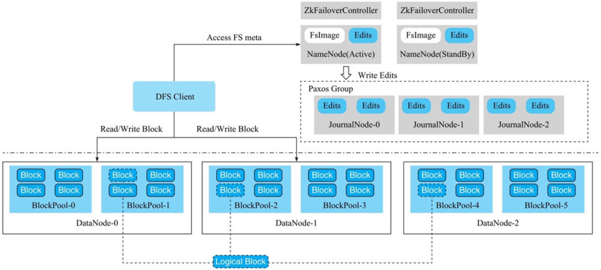

#HDFS是什么
#拓扑(主从结构)

##NameNode(主备模式,StandBy备机)
1.存储文件的元数据，比如文件名、文件目录结构、文件属性(生成时间、副本数、文件权限)，以及每个文件的块列表和块所在的DataNode等
2.NameNode会把所有文件的元数据全部维护在内存中。因此，如果在HDFS中存放大量的小文件，则造成分配大量的Block，这样可能耗尽NameNode所有内存而导致OOM。
因此，HDFS并不适合存储大量的小文件。
3.当然，后续的HDFS版本支持NameNode对元数据分片，解决了NameNode的扩展性问题
4.辅助NameNode更好的工作，用来监控HDFS状态的辅助后台程序，每隔一段时间获取HDFS元数据快照。
##DataNode
组成文件的所有Block都是存放在DataNode节点上的。一个逻辑上的Block会存放在N个不同的DataNode上
文件的各个 block 的具体存储管理由 DataNode 节点承担。一个block会有多个DataNode来存
储，DataNode会定时向NameNode来汇报自己持有的block信息
##Block
HDFS 中的文件在物理上是分块存储(block)的，块的大小可以通过配置参数来规定; 
每一个HDFS文件由若干个数据块组成, 默认数据块是128M(lgprc-xiaomi)或者256M(c3prc-hadoop).
##命名空间
目录,文件系统名字空间的层次结构和大多数现有的文件系统类似:用户可以创建、删除、移动 或重命名文件。
##副本机制
文件的所有 block 都会有副本。每个文件的 block 大小和副本系数都是可配置的。应用 程序可以指定某个文件的副本数目。
副本系数可以在文件创建的时候指定，也可以在之后改变。 副本数量默认是3个。
##一次写入，多次读出
HDFS 是设计成适应一次写入，多次读出的场景，且不支持文件的随机修改。 (支持追加写入， 不只支持随机更新)
