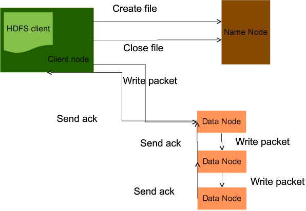
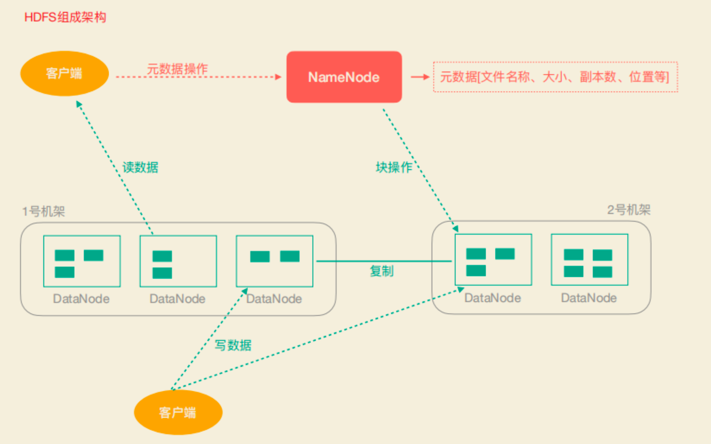
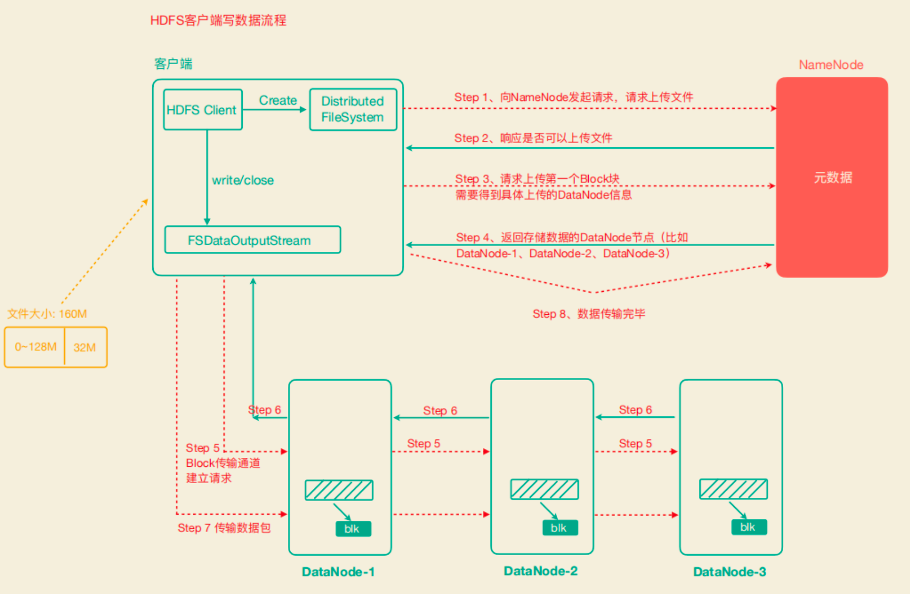
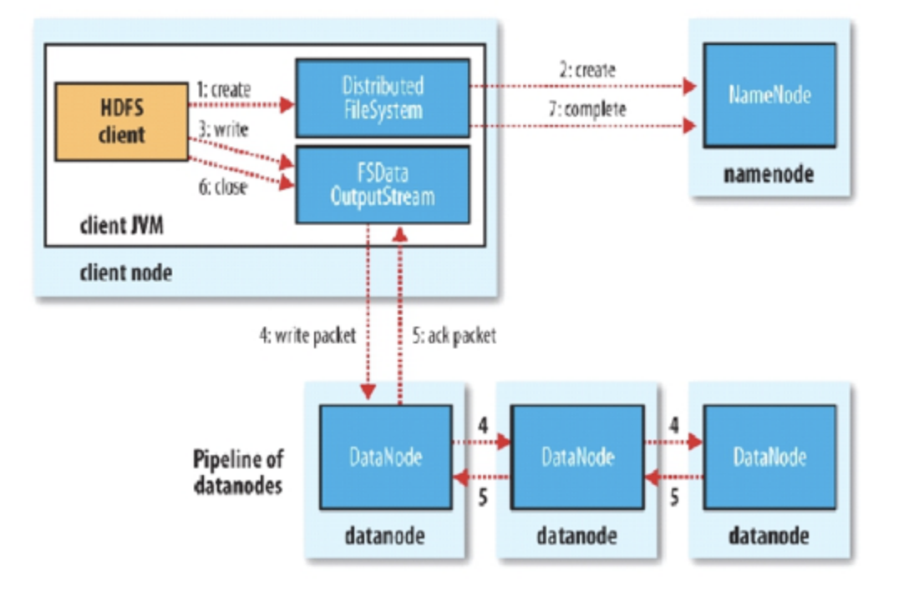
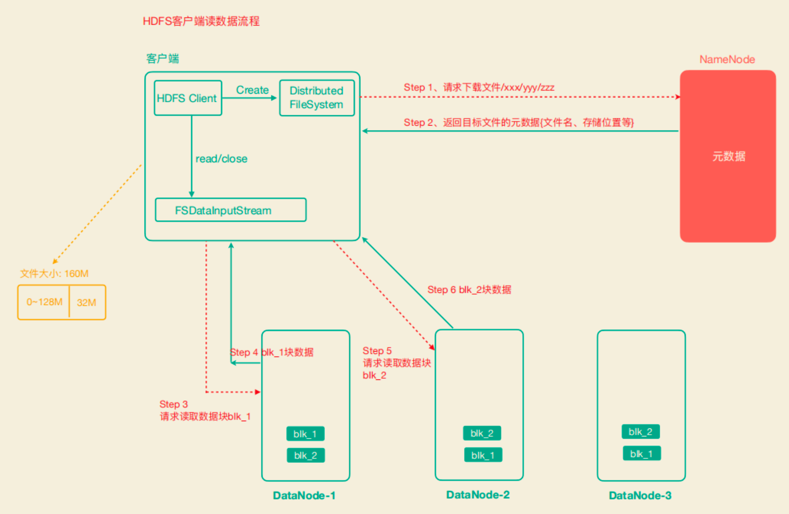
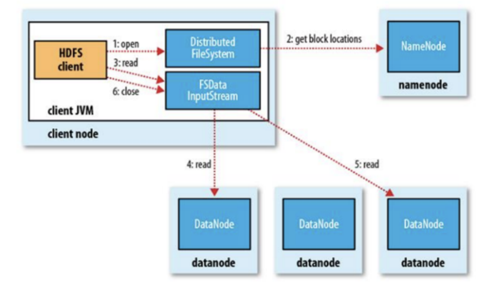

#写




```asp
1.Client和NN连接创建文件元数据
2.NN判定元数据是否有效
3.NN处发副本放置策略，返回一个有序的DN列表
4.Client和DN建立Pipeline连接
5.Client将块切分成packet（64KB），并使用chunk（512B）+chucksum（4B）填充
6.Client将packet放入发送队列dataqueue中，并向第一个DN发送
7.第一个DN收到packet后本地保存并发送给第二个DN
8.第二个DN收到packet后本地保存并发送给第三个DN
9.这一个过程中，上游节点同时发送下一个packet生活中类比工厂的流水线：结论：流式其实也是变种的并行计算

Hdfs使用这种传输方式，副本数对于client是透明的
当block传输完成，DN们各自向NN汇报，同时client继续传输下一个block
所以，client的传输和block的汇报也是并行的

```
#读


```asp
1.为了降低整体的带宽消耗和读取延时，HDFS会尽量让读取程序读取离它最近的副本。
2.如果在读取程序的同一个机架上有一个副本，那么就读取该副本。
4.如果一个HDFS集群跨越多个数据中心，那么客户端也将首先读本地数据中心的副本。

语义：下载一个文件：
Client和NN交互文件元数据获取fileBlockLocation
NN会按距离策略排序返回
Client尝试下载block并校验数据完整性

语义：下载一个文件其实是获取文件的所有的block元数据，那么子集获取某些block应该成立
Hdfs支持client给出文件的offset自定义连接哪些block的DN，自定义获取数据
这个是支持计算层的分治、并行计算的核心

```
