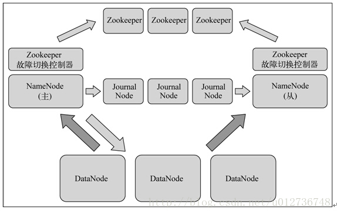
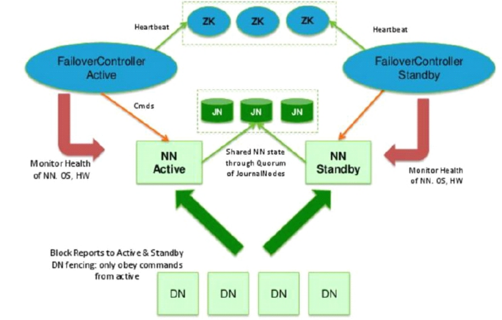
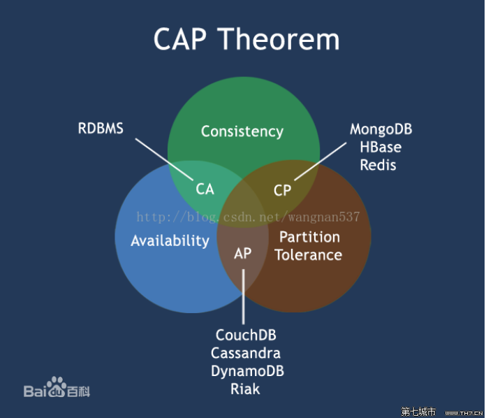
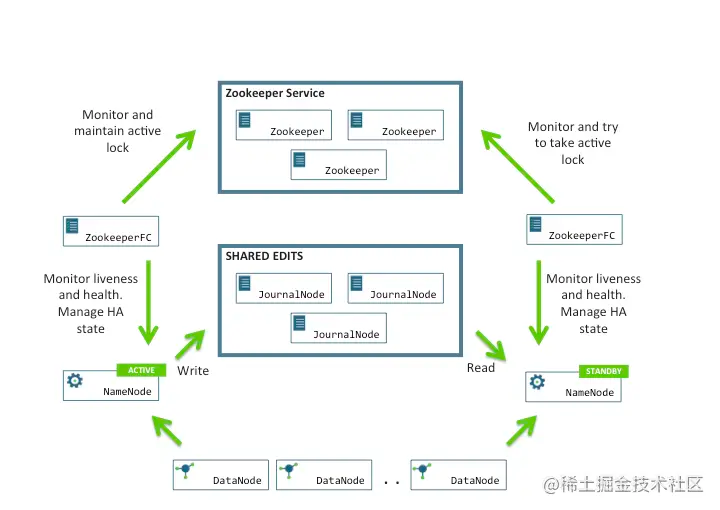
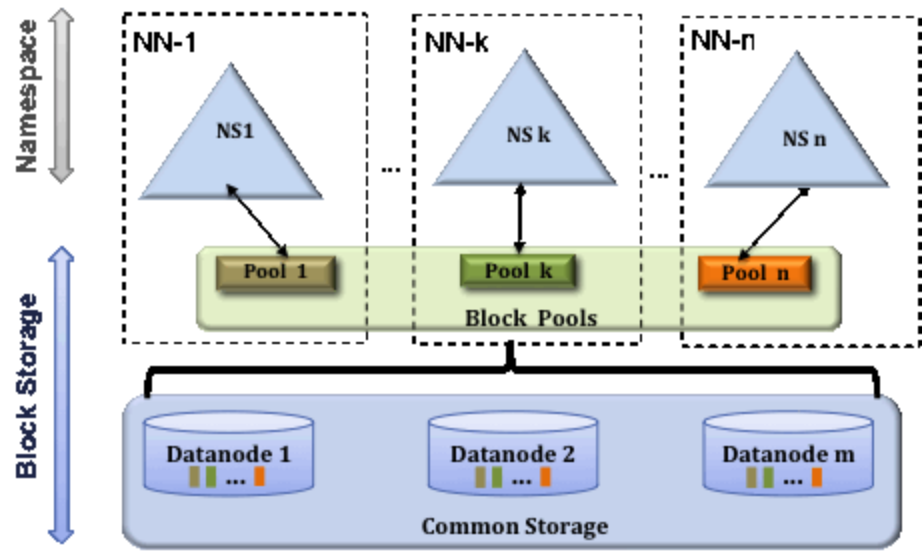

#HDFS-高可用方案HA
多个NN，主备切换



##zookeeper
paxos
[z_01_分布式_临界知识_共识(consensus)算法_paxos_选举(强leader算法)_raft(共识算法_强领导算法_强一致性)_zab(顺序一致性_强领导算法)_gossip(共识算法_最终一致性_无领导算法)_bully.md]
##NN active
##NN standby
备库
##DN
##journal node

```asp
QJM全称是Quorum JournalManager,由JournalNode（JN）组成，一般是奇数点结点组成。每个JournalNode对外有一个简易的RPC接口，
以供NameNode读写EditLog到JN本地磁盘。当写EditLog时，NameNode会同时向所有JournalNode并行写文件，
只要有N/2 + 1节点写成功则认为此次写操作成功，遵循Paxos协议

```
##zookeeper Failover controller
ZooKeeperFailoverController，Hadoop中通过ZK实现FC功能的一个实用工具。它作为一个ZK集群的客户端，用来监控NN的状态信息，
定期发送心跳保证自己可被选举为active。每个NN节点都需要运行ZKFC
增加zkfc角色(与NN同台)，通过zookeeper集群协调NN的主从选举和切换事件回调机制

#HDFS-Federation
[](https://cloud.tencent.com/developer/article/1349468)
[](https://tech.meituan.com/2017/04/14/hdfs-federation.html)

NN的压力过大，内存受限问题:
联邦机制： Federation（元数据分片），多个NN，管理不同的元数据
元数据分治，复用DN存储，元数据访问隔离性，DN目录隔离block

Federation架构与单组Namenode架构相比，主要是Namespace被拆分成了多个独立的部分，分别由独立的Namenode进行管理。

