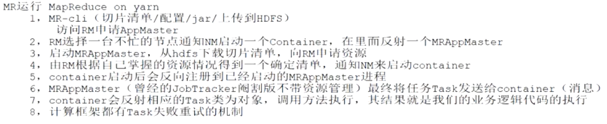

#yarn集群拓扑(主从架构)
默写图

资源管理,任务分配,job-track,资源汇报
计算向数据移动

##客户端
1.客户端请求ResourceManager调度资源
2.客户端定义计算资源cpu,mem的配置
3.客户端上传jar,split清单,xml到某个HDFS目录
4.通知ResourceManager启动计算程序
##ResourceManager(资源管理,任务调度)

1.定期收到node manager汇报的资源状态,根据block:node映射关系+node 状态,确定最终程序的节点
2.处理客户端请求、启动/监控ApplicationMaster、监控NodeManager、资源分配与调度
3.监控集群node节点资源使用情况,根据ApplicationMaster的block:ip+自身掌握的集群资源情况,判断程序适合分配到哪些节点，分配到各节点
##ApplicationMaster(任务监控与容错,特殊container)
1.ResourceManager分配一个ApplicationMaster容器作为任务的主节点，任务监控与容错，接受来自container的心跳
2.ApplicationMaster反向注册到ResourceManager,如果container挂了，请求ResourceManager分配新的container
3.从name node获取split清单，获取block:node关系,split偏移量,以及split应该移动到哪些节点ip,每个block有多个副本,对应多个ip
4.向ResourceManager申请资源
5.通知container执行mapTask
##NodeManager(work机器)
1.单个节点上的资源管理、处理来自ResourceManager的命令
2.定期向ResourceManager汇报心跳,提交自己的资源情况
##container(资源单位,cgroup,类似docker)
0.ResourceManager选择不忙的节点NodeManager，启动container
1.容器反向注册到ApplicationMaster
2.从某个HDFS目录中下载jar,xml到本机
2.启动任务的MapTask/ReduceTask
3.处理来自ApplicationMaster的命令

#高可用
zookeeper+备库

