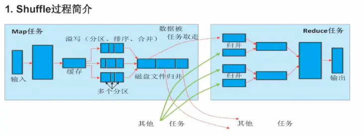

#临界知识

默写两张图


map,reduce解决的问题:一条记录为单位,分区为单位的问题
map中局部分区排序,reduce中归并排序,降低时间复杂度,减少io成本
计算向数据移动:hdfs提供数据坐标,yarn分配资源
#什么是map Reduce
##计算模型
MapReduce计算 = Map阶段 + Reduce阶段;2阶段模型
map和reduce是串行关系,是阻塞关系

存储与计算共生,map reduce与hdfs


#拓扑


##map(一条记录为单位,并行度由split大小确定)
过滤,map,flatmap,每条数据单独处理不考虑和其他数据的关系


###数据切片/map并行度(split并行度)
split逻辑概念(block抽象出的窗口概念),block物理概念

在文件块为 128M 时，MapReduce Map阶段129M文件只有一个split。在源码中文件切分规则为：当剩余文件大于split默认值的 110%时，
继续切分文件，否则为一个切片,有多少个split就对应启动多少个MapTask。split与block的对应关 系默认是一对一

###排序(局部分区排序)
当溢写线程启动后，需要对这80MB空间内的key做排序(Sort)。排序是MapReduce模型默认的行为!
降低时间复杂度,减少io成本
###hash分区
###环形缓冲区(100M)
mapTask:缓冲区=1:1
###溢写文件(合并,offset)
```asp
缓冲区是有大小限制，默认是100MB。当map task的输出结果很多时，就可能会撑爆内存，所以 需要在一定条件下将缓冲区中的数据临时写入磁盘，
然后重新利用这块缓冲区。这个从内存往磁盘 写数据的过程被称为Spill，中文可译为溢写。这个溢写是由单独线程来完成，不影响往缓冲区写 
map结果的线程。溢写线程启动时不应该阻止map的结果输出，所以整个缓冲区有个溢写的比例 spill.percent。这个比例默认是0.8，
也就是当缓冲区的数据已经达到阈值(buffer size * spill percent = 100MB * 0.8 = 80MB)，溢写线程启动，锁定这80MB的内存，
执行溢写过程。Map task的输出结果还可以往剩下的20MB内存中写，互不影响。
```

```asp
内存缓冲区溢写磁盘时：做一个2次排序：
分区有序，且分区内key有序
未来相同的一组key会相邻的排在一起
```
##reduce(分区为单位,并行度由业务逻辑确定)


默认对key hash后再以reduce task数量取模
###reduce并行度(业务逻辑)
###合并(局部分区归并排序)
降低时间复杂度,减少io成本
不一定将局部分区 全部归并后再 reduce,也许归并到只有两个局部分区,就开始计算,提高并行度,减少io
例如sum函数


