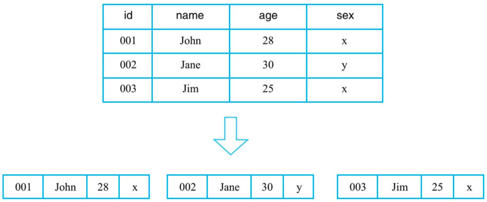
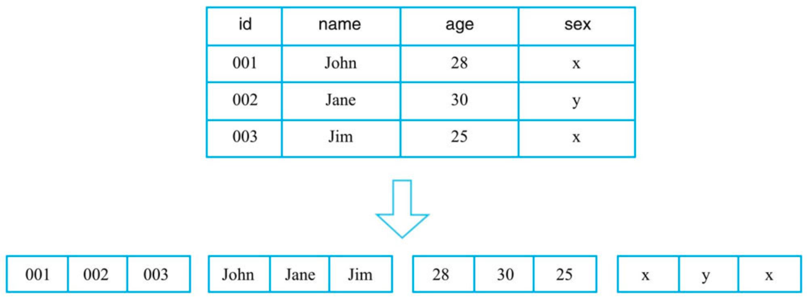

#行式存储
行式存储系统会将一行数据存储在一起，一行数据写完之后再接着写下一行，最典型的如MySQL这类关系型数据库

```asp
行式存储在获取一行数据时是很高效的，但是如果某个查询只需要读取表中指定列对应的数据，那么行式存储会先取出一行行数据，再在每一行数据中截取待
查找目标列。这种处理方式在查找过程中引入了大量无用列信息，从而导致大量内存占用。因此，这类系统仅适合于处理OLTP类型的负载，
对于OLAP这类分析型负载并不擅长
```
#列式存储(天然高压缩)
```asp
列式存储理论上会将一列数据存储在一起，不同列的数据分别集中存储，最典型的如Kudu、Parquet on HDFS等系统（文件格式）
```

```asp
列式存储对于只查找某些列数据的请求非常高效，只需要连续读出所有待查目标列，然后遍历处理即可；但是反过来，列式存储对于获取一行的请求就不那么高效了，
需要多次IO读多个列数据，最终合并得到一行数据。另外，因为同一列的数据通常都具有相同的数据类型，因此列式存储具有天然的高压缩特性。
```
#列簇式存储
列簇式存储介于行式存储和列式存储之间，可以通过不同的设计思路在行式存储和列式存储两者之间相互切换
比如，一张表只设置一个列簇，这个列簇包含所有用户的列。HBase中一个列簇的数据是存储在一起的，因此这种设计模式就等同于行式存储。
再比如，一张表设置大量列簇，每个列簇下仅有一列，很显然这种设计模式就等同于列式存储。
这种架构为HBase将来演变成HTAP（Hybrid Transactional and Analytical Processing）系统提供了最核心的基础
