[hbase原理与实践,微信读书]
#临界知识
LSM树的索引结构本质是将写入操作全部转化成磁盘的顺序写入,但造成了读放大,设计了异步的compaction来降低文件个数
#什么是LSM(Log-Structured Merge-Tree,有序集合,内存数据结构+磁盘结构)
1.LSM树分为内存部分和磁盘部分。内存部分是一个维护有序数据集合的数据结构。
2.一般来讲，内存数据结构可以选择平衡二叉树、红黑树、跳跃表（SkipList）等维护有序集的数据结构,HBase选择了表现更优秀的跳跃表
3.磁盘部分是由一个个独立的文件组成，每一个文件又是由一个个数据块组成,数据块索引
4.为了避免不必要的IO耗时，可以在磁盘中存储一些额外的二进制数据，这些数据用来判断对于给定的key是否有可能存储在这个数据块中，这个数据结构称为布隆过滤器（Bloom Filter）
##内存部分(跳跃表)
内存部分一般采用跳跃表来维护一个有序的KeyValue集合。
##磁盘部分(顺序写)
磁盘数据的索引结构
因为无论是何种写入请求，LSM树都会将写入操作处理为一次顺序写，而HDFS擅长的正是顺序写（且HDFS不支持随机写），
因此基于HDFS实现的HBase采用LSM树作为索引是一种很合适的选择
磁盘部分一般由多个内部KeyValue有序的文件组成
##KeyValue存储格式(key的二进制,timestamp,type)
[](https://weread.qq.com/web/reader/632326807192b335632d09ck65132ca01b6512bd43d90e3)
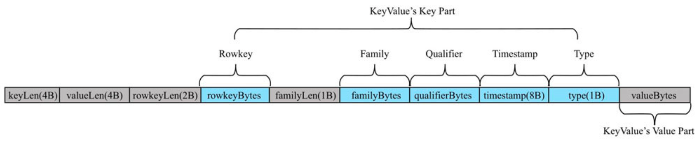
其中Rowkey、Family、Qualifier、Timestamp、Type这5个字段组成KeyValue中的key部分
Value部分直接存储这个KeyValue中Value的二进制内容。所以，字节数组串主要是Key部分的设计
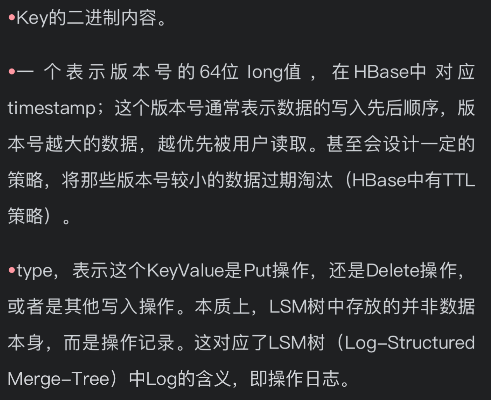
##LSM树索引(双MemStore)
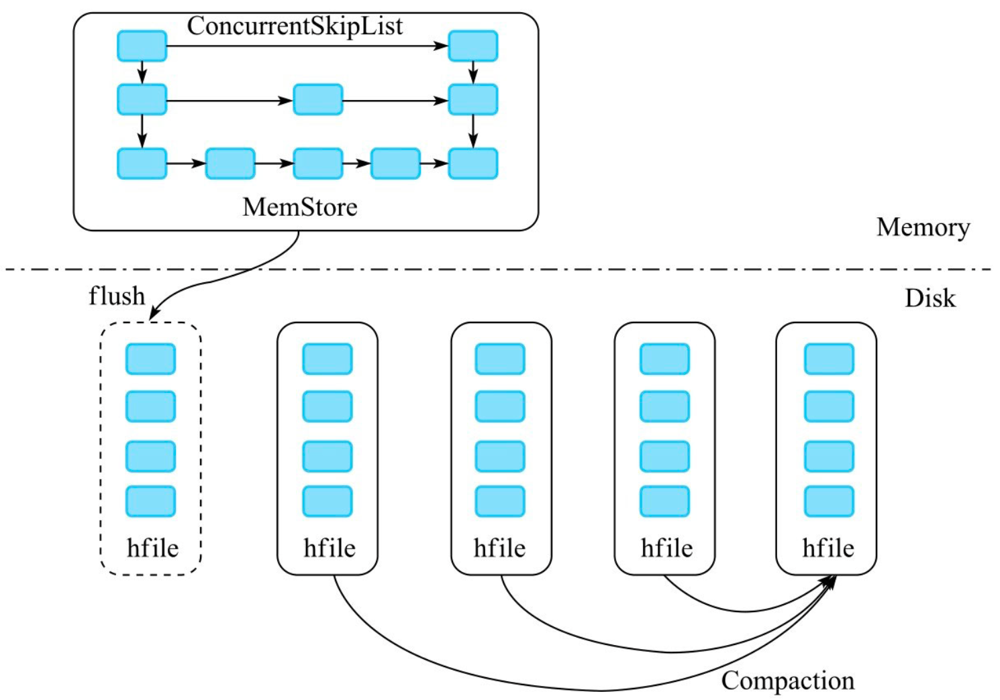
内存部分和磁盘部分。内存部分是一个ConcurrentSkipListMap，Key就是前面所说的Key部分，Value是一个字节数组。数据写入时，直接写入MemStore中。
随着不断写入，一旦内存占用超过一定的阈值时，就把内存部分的数据导出，形成一个有序的数据文件，存储在磁盘上。
```asp
内存部分导出形成一个有序数据文件的过程称为f lush。为了避免f lush影响写入性能，会先把当前写入的MemStore设为Snapshot，不再容许新的写入操作写入
这个Snapshot的MemStore。另开一个内存空间作为MemStore，让后面的数据写入。一旦Snapshot的MemStore写入完毕，对应内存空间就可以释放。
这样，就可以通过两个MemStore来实现稳定的写入性能


在整个数据写入过程中，LSM树全部都是使用append操作（磁盘顺序写）来实现数据写入的，没有使用任何seek+write（磁盘随机写）的方式来写入。
无论HDD还是SSD，磁盘的顺序写操作性能和延迟都远好于磁盘随机写。因此LSM树是一种对写入极为友好的索引结构，它能将磁盘的写入带宽利用到极致。
```
##LSM索引文件的索引
二分搜索,文件索引块
[](https://weread.qq.com/web/reader/632326807192b335632d09ckc51323901dc51ce410c121b)
#跳表(更高并发)
与红黑树以及其他的二分查找树相比，跳跃表的优势在于实现简单，而且在并发场景下加锁粒度更小，从而可以实现更高的并发性

##查询:O(logN)
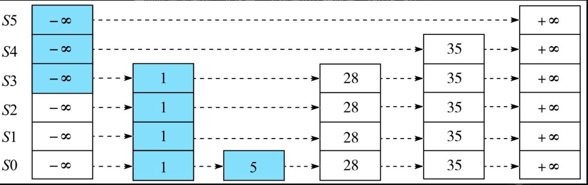
查找5的过程,蓝色部分
##插入:O(logN),随机算法

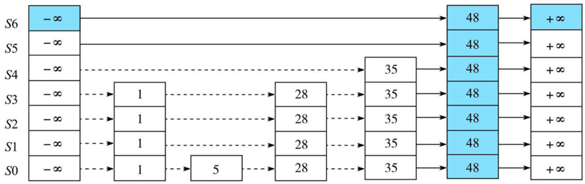
插入48的过程
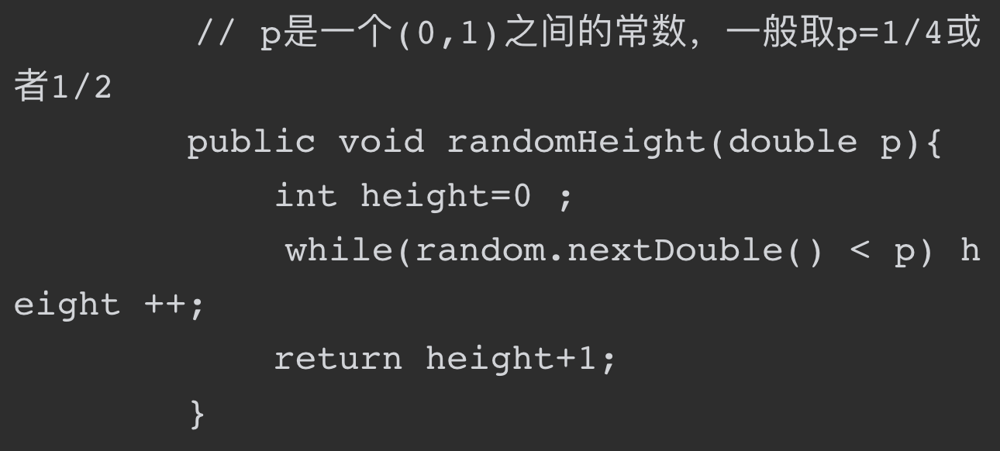
```asp
最后，将待插入节点按照高度值生成一个垂直节点（这个节点的层数正好等于高度值），之后插入到跳跃表的多条链表中去。
假设height=randomHeight(p)，这里需要分两种情况讨论：

•如果height大于跳跃表的高度，那么跳跃表的高度被提升为height，同时需要更新头部节点和尾部节点的指针指向。
•如果height小于等于跳跃表的高度，那么需要更新待插入元素前驱和后继的指针指向。
```
##删除:O(logN)
##高度:O(logN)
##空间复杂度O(N)
#多路归并(异步compact)
最小堆
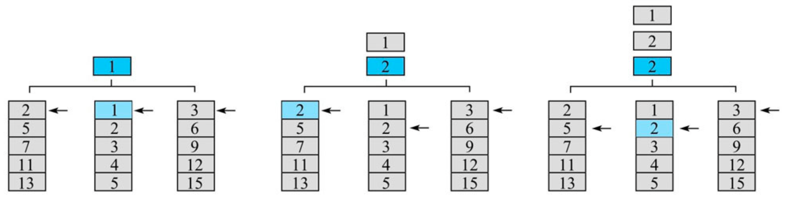
##minor compact
选中少数几个hf ile，将它们多路归并成一个文件。这种方式的优点是，可以进行局部的compact，通过少量的IO减少文件个数，提升读取操作的性能，适合较高频率地跑；
##major compact
将所有的hf ile一次性多路归并成一个文件。这种方式的好处是，合并之后只有一个文件，这样读取的性能肯定是最高的；
#手写LSM KV存储引擎
[](https://weread.qq.com/web/reader/632326807192b335632d09ckc51323901dc51ce410c121b)
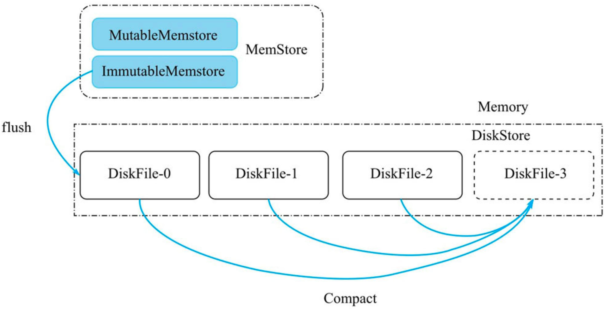
##Memstore
Mutable Memstore
Immutable Memstore
##DiskStore
##DiskFile(有序)
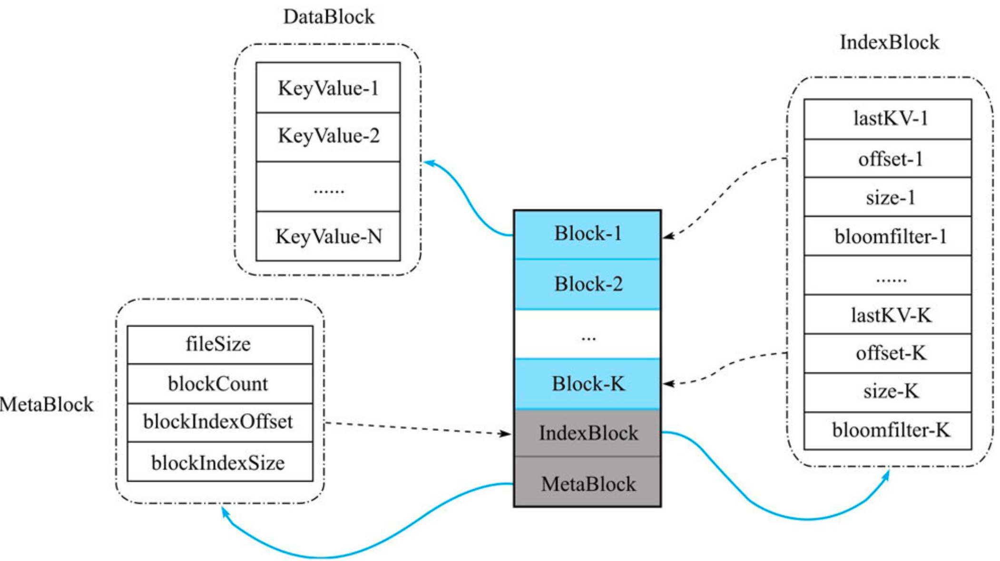
一个Memstore flush后生成一个DiskFile
###DataBlock
主要用来存储有序的KeyValue集合——KeyValue-1，KeyValue-2，…，KeyValue-N，这些KeyValue的大小顺序与其存储顺序严格一致。
另外，在MiniBase中，默认每一个Block约为64kB，当然用户也可以自己设置Block的大小。注意，一个DiskFile内可能有多个Block，
具体的Block数量取决于文件内存储的总KV数据量。
###IndexBlock
一个DiskFile内有且仅有一个IndexBlock。它主要存储多个DataBlock的索引数据，每个DataBlock的索引数据包含以下4个字段
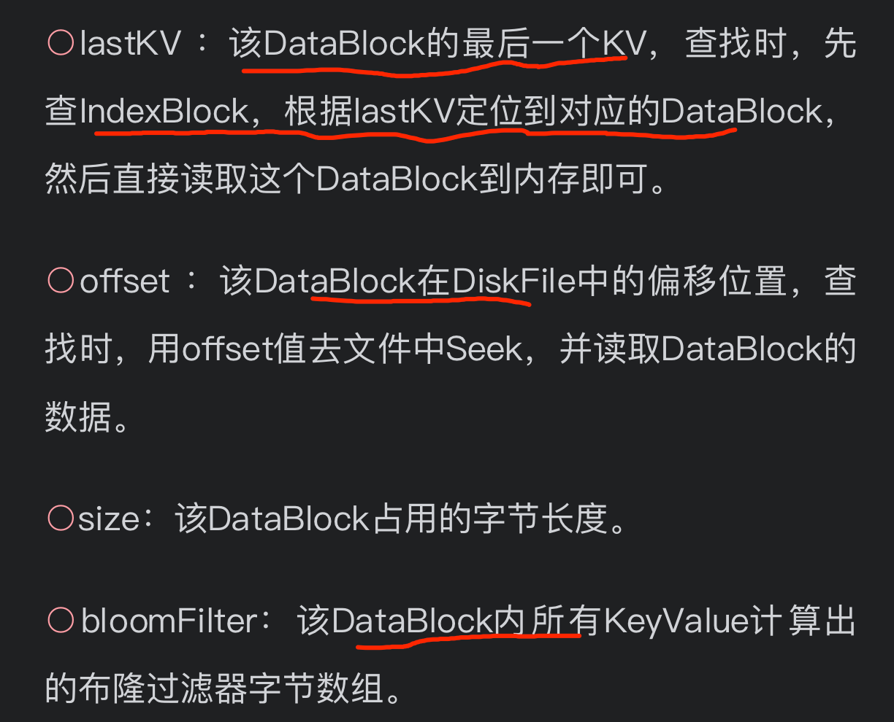
###MetaBlock
和IndexBlock一样，一个DiskFile中有且仅有一个MetaBlock；同时MetaBlock是定长的，因此可以直接通过定位diskf ile.f ilesize - len(MetaBlock)来读取MetaBlock，
而无需任何索引。主要用来保存DiskFile级别的元数据信息：
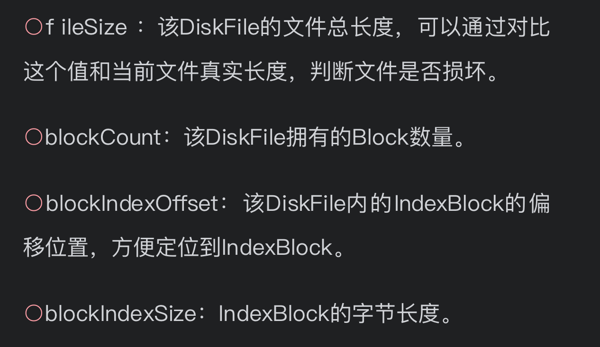
##Compaction
DiskFile数量超过一个阈值时，就把所有的DiskFile进行Compact，最终合并成一个DiskFile

#LSM应用
hbase跳表
es,FST
prometheus,倒排map


#布隆过滤器
正是由于布隆过滤器只需占用极小的空间，便可给出“可能存在”和“肯定不存在”的存在性判断，
因此可以提前过滤掉很多不必要的数据块，从而节省了大量的磁盘IO
[](https://weread.qq.com/web/reader/632326807192b335632d09ckc20321001cc20ad4d76f5ae)
