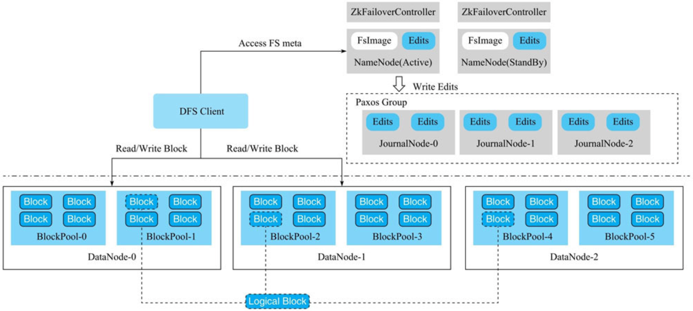

#拓扑

##NameNode(StandBy备机)
NameNode会把所有文件的元数据全部维护在内存中。因此，如果在HDFS中存放大量的小文件，则造成分配大量的Block，这样可能耗尽NameNode所有内存而导致OOM。
因此，HDFS并不适合存储大量的小文件。当然，后续的HDFS版本支持NameNode对元数据分片，解决了NameNode的扩展性问题。
##JournalNode(follow机器,paxos)
##ZkFailoverController
ZKFailoverController主要用来实现NameNode的自动切换
##DataNode
组成文件的所有Block都是存放在DataNode节点上的。一个逻辑上的Block会存放在N个不同的DataNode上
##Block
