# hbase是什么?(Hadoop Database,sorted map)
sparse, distributed, persistent multidimensional sorted map，HBase本质来看是一个Map
##多维
这个特性比较容易理解。HBase中的Map与普通Map最大的不同在于，key是一个复合数据结构，由多维元素构成，包括rowkey、column family、qualifier、type以及timestamp。
##稀疏(面向列簇存储)
在列族中，你可以指定任意多的列，在列数据为空的情 况下，是不会占用存储空间的
##排序
构成HBase的KV在同一个文件中都是有序的，但规则并不是仅仅按照rowkey排序，而是按照KV中的key进行排序——先比较rowkey，rowkey小的排在前面；
如果rowkey相同，再比较column，即column family:qualifier，column小的排在前面；如果column还相同，再比较时间戳timestamp，即版本信息，timestamp大的排在前面
##多版本
HBase表中的数据可以有多个版本值，默认情况下是根据版本号去区分，版本号就 是插入数据的时间戳
##分布式
构成HBase的所有Map并不集中在某台机器上，而是分布在整个集群中,HDFS作为其文件存储系统
HBase集群可以非常方便地实现集群容量扩展，主要包括数据存储节点扩展以及读写服务节点扩展。HBase底层数据存储依赖于HDFS系统，HDFS可以通过简单地增加DataNode实现扩展，
HBase读写服务节点也一样，可以通过简单的增加RegionServer节点实现计算层的扩展。
##高性能
LSM,mmap
HBase目前主要擅长于OLTP场景，数据写操作性能强劲，对于随机单点读以及小范围的扫描读，其性能也能够得到保证。
对于大范围的扫描读可以使用MapReduce提供的API，以便实现更高效的并行扫描
##支持过期
HBase支持TTL过期特性，用户只需要设置过期时间，超过TTL的数据就会被自动清理，不需要用户写程序手动删除。
##容量巨大
HBase的单表可以支持千亿行、百万列的数据规模，数据容量可以达到TB甚至PB级别。传统的关系型数据库，如Oracle和MySQL等，如果单表记录条数超过亿行，
读写性能都会急剧下降，在HBase中并不会出现这样的问题。
#逻辑拓扑
##table
表，一个表包含多行数据
##row
行，一行数据包含一个唯一标识rowkey、多个column以及对应的值。在HBase中，一张表中所有row都按照rowkey的字典序由小到大排序
##column family(列式存储,物理存储角度的概念)
column family在表创建的时候需要指定，用户不能随意增减，列簇对应region store,列簇具有列式存储
##column
一行具有多列,column family可以有0列,1列或者多列,列可能分布在多个列簇中,即多个store中
##cell
(rowkey:column family:column:timestamp:type,value)确定一个cell,最小单元,每个cell有timestamp属性,代表(rowkey,column)的版本
```asp
type表示Put/Delete这样的操作类型，timestamp代表这个cell的版本。这个结构在数据库中实际是以KV结构存储的，其中（row, column,timestamp, type）
是K，value字段对应KV结构的V
```
##timestamp(多版本)
(rowkey,column,timestamp)确定某个rowkey的某列column的某个版本
#集群&物理拓扑
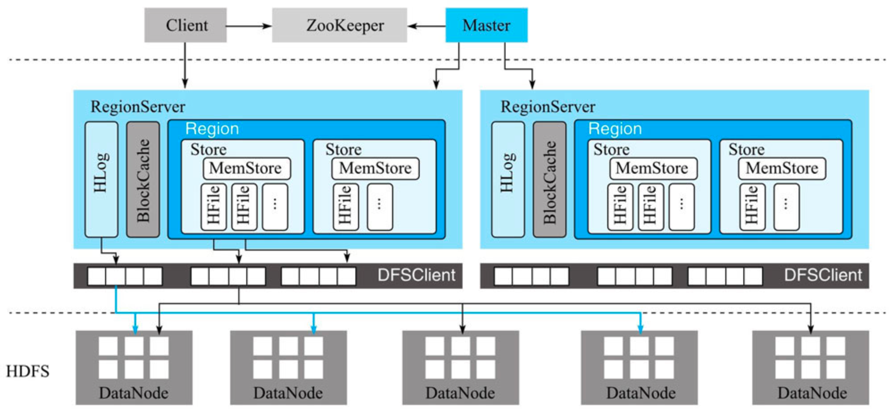
##Master
1.处理用户的各种管理请求，包括建表、修改表、权限操作、切分表、合并数据分片以及Compaction等
2.管理集群中所有RegionServer，包括RegionServer中Region的负载均衡、RegionServer的宕机恢复以及Region的迁移等
3.清理过期日志以及文件，Master会每隔一段时间检查HDFS中HLog是否过期、HFile是否已经被删除，并在过期之后将其删除
##ZooKeeper
1.master选举
2.RegionServer集合
3.元数据表hbase:meta所在的RegionServer地址
4.实现分布式表锁
[](https://weread.qq.com/web/reader/632326807192b335632d09ckc7432af0210c74d97b01b1c)
###meta 表所在机器
[](https://lihuimintu.github.io/2019/06/30/HBase-Meta/)
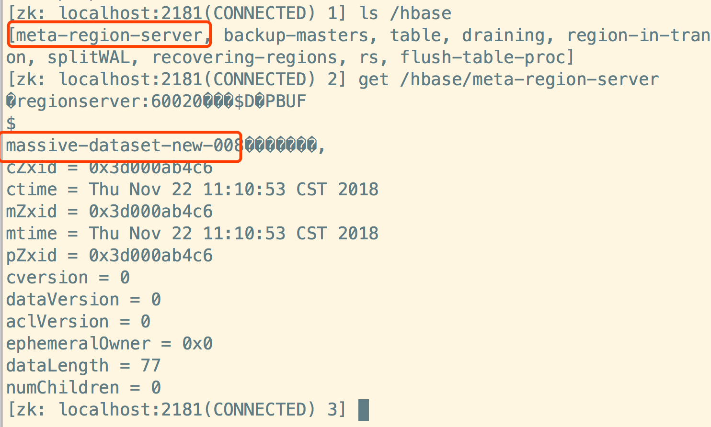
meta 表
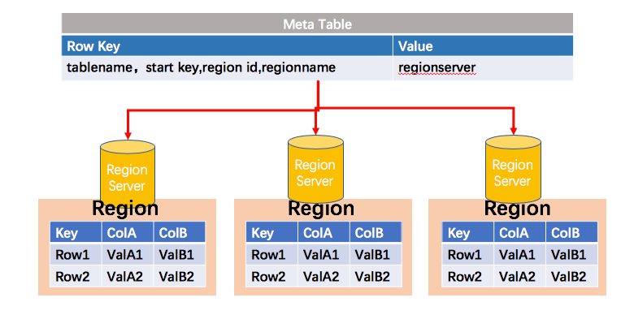
##RegionServer
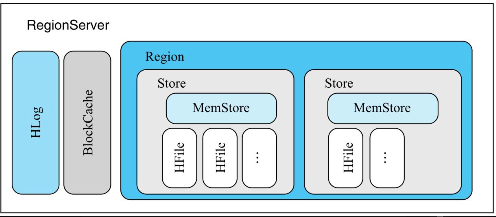
RegionServer主要用来响应用户的IO请求
###WAL(高可靠,主从同步,redis,mysql)
1.所有写入操作（写入、更新以及删除）的数据都先以追加形式写入HLog，再写入MemStore

2.HLog在HBase中有两个核心作用——其一，用于实现数据的高可靠性，HBase数据随机写入时，并非直接写入HFile数据文件，而是先写入缓存，再异步刷新落盘。
为了防止缓存数据丢失，数据写入缓存之前需要首先顺序写入HLog，这样，即使缓存数据丢失，仍然可以通过HLog日志恢复；

3.其二，用于实现HBase集群间主从复制，通过回放主集群推送过来的HLog日志实现主从复制
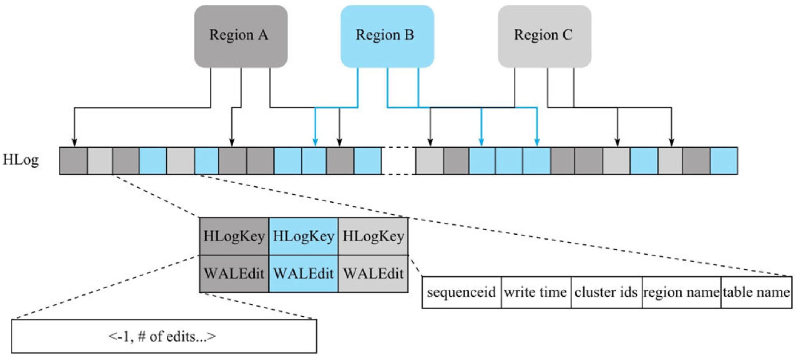
[](https://weread.qq.com/web/reader/632326807192b335632d09ck1ff325f02181ff1de7742fc)
```asp
1.每个RegionServer拥有一个或多个HLog（默认只有1个，1.1版本可以开启MultiWAL功能，允许多个HLog）。
每个HLog是多个Region共享的，图5-2中Region A、RegionB和Region C共享一个HLog文件。

2.HLog中，日志单元WALEntry（图中小方框）表示一次行级更新的最小追加单元，它由HLogKey和WALEdit两部分组成，
其中HLogKey由table name、region name以及sequenceid等字段构成。
```
####HLog生命周期
[](https://weread.qq.com/web/reader/632326807192b335632d09ck1ff325f02181ff1de7742fc)

HLog构建
HLog滚动
HLog失效
HLog删除
###BlockCache(64K,读缓存,RegionServer:BlockCache=1:1)
HBase系统中的读缓存。客户端从磁盘读取数据之后通常会将数据缓存到系统内存中，后续访问同一行数据可以直接从内存中获取而不需要访问磁盘
BlockCache是RegionServer级别的，一个RegionServer只有一个BlockCache，在RegionServer启动时完成BlockCache的初始化工作
####LRUBlockCache(缓存分层策略,full gc)
但随着数据从single-access区晋升到multi-access区或长时间停留在single-access区，对应的内存对象会从young区晋升到old区，
晋升到old区的Block被淘汰后会变为内存垃圾，最终由CMS回收（Conccurent Mark Sweep，一种标记清除算法），
显然这种算法会带来大量的内存碎片，碎片空间一直累计就会产生臭名昭著的Full GC
####BucketCache
BucketCache会在初始化的时候申请14种不同大小的Bucket，而且如果某一种Bucket空间不足，系统会从其他Bucket空间借用内存使用，因此不会出现内存使用率低的情况。
系统在LRUBlockCache中主要存储Index Block和BloomBlock，而将Data Block存储在BucketCache中
[](https://weread.qq.com/web/reader/632326807192b335632d09ck02e32f0021b02e74f10ece8)
###Region
数据表的一个分片，当数据表大小超过一定阈值就会“水平切分”，分裂为两个Region。Region是集群负载均衡的基本单位。通常一张表的Region会分布在整个集群的多台RegionServer上，
一个RegionServer上会管理多个Region，当然，这些Region一般来自不同的数据表
一个Region由多个Store组成，每个Store存放对应列簇的数据，比如一个表中有两个列簇，这个表的所有Region就都会包含两个Store。
###Store(store:列簇=1:1)
Store的个数取决于表中列簇（column family）的个数，多少个列簇就有多少个Store。HBase中，每个列簇的数据都集中存放在一起形成一个存储单元Store，
因此建议将具有相同IO特性的数据设置在同一个列簇中。
###MemStore(写缓存)
每个Store由一个MemStore和一个或多个HFile组成。MemStore称为写缓存，用户写入数据时首先会写到MemStore，当MemStore写满之后（缓存数据超过阈值，默认128M）
系统会异步地将数据f lush成一个HFile文件

HBase系统中一张表会被水平切分成多个Region，每个Region负责自己区域的数据读写请求。水平切分意味着每个Region会包含所有的列簇数据，
HBase将不同列簇的数据存储在不同的Store中，每个Store由一个MemStore和一系列HFile组成
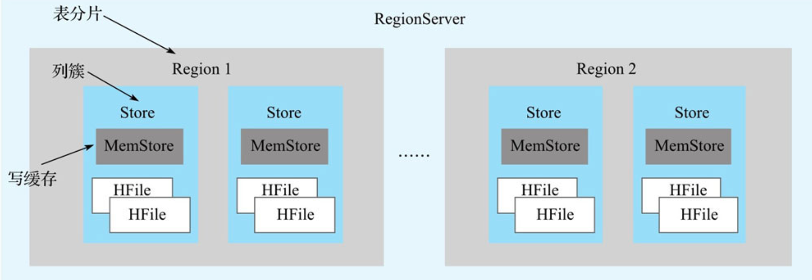
####MemStore的GC问题
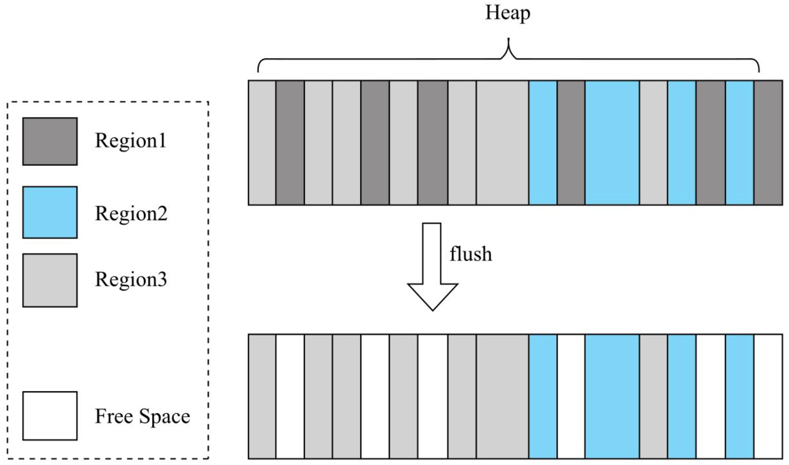
右边图为JVM中MemStore所占用的内存图，可见不同Region的数据在JVMHeap中是混合存储的，一旦深灰色条带表示的Region1的所有MemStore数据执行f lush操作，
这些深灰色条带所占内存就会被释放，变成白色条带。这些白色条带会继续为写入MemStore的数据分配空间，进而会分割成更小的条带。从JVM全局的视角来看，
随着MemStore中数据的不断写入并且f lush，整个JVM将会产生大量越来越小的内存条带，这些条带实际上就是内存碎片。随着内存碎片越来越小，
最后甚至分配不出来足够大的内存给写入的对象，此时就会触发JVM执行Full GC合并这些内存碎片。
####Chunk(降低full gc)
[](https://weread.qq.com/web/reader/632326807192b335632d09ck8e232ec02198e296a067180)
####Chunk Pool(降低young gc)
###HFile
HFile存放在HDFS上，是一种定制化格式的数据存储文件，方便用户进行数据读取
显然，随着数据不断写入，HFile文件会越来越多，当HFile文件数超过一定阈值之后系统将会执行Compact操作，将这些小文件通过一定策略合并成一个或多个大文件。
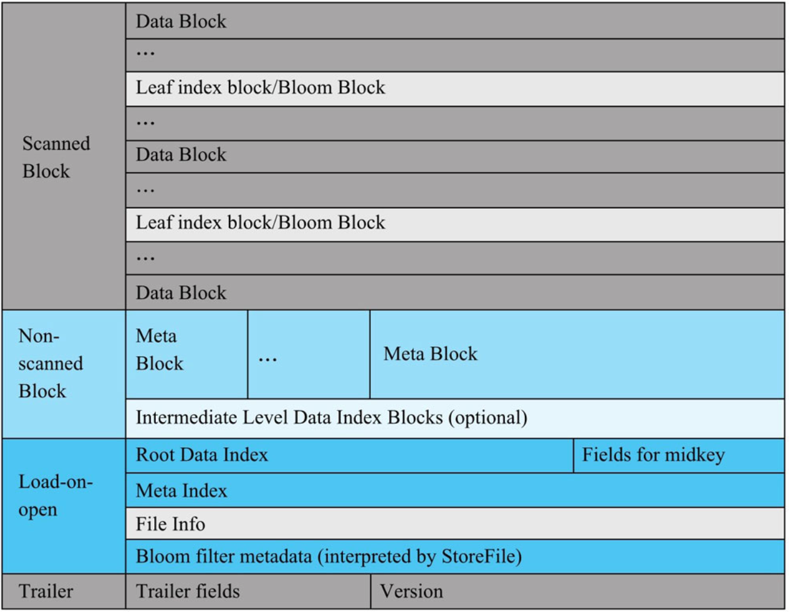
[](https://weread.qq.com/web/reader/632326807192b335632d09ck4e73277021a4e732ced3b55)
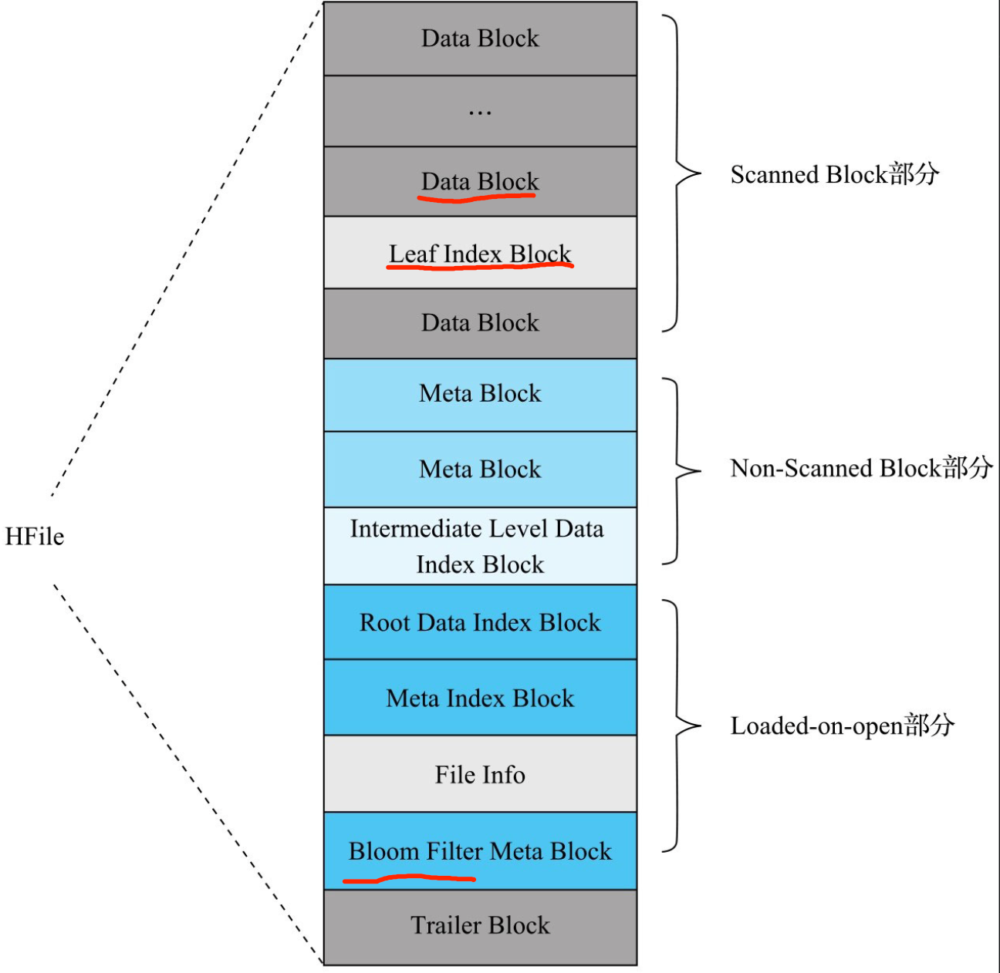
####data block(64K)
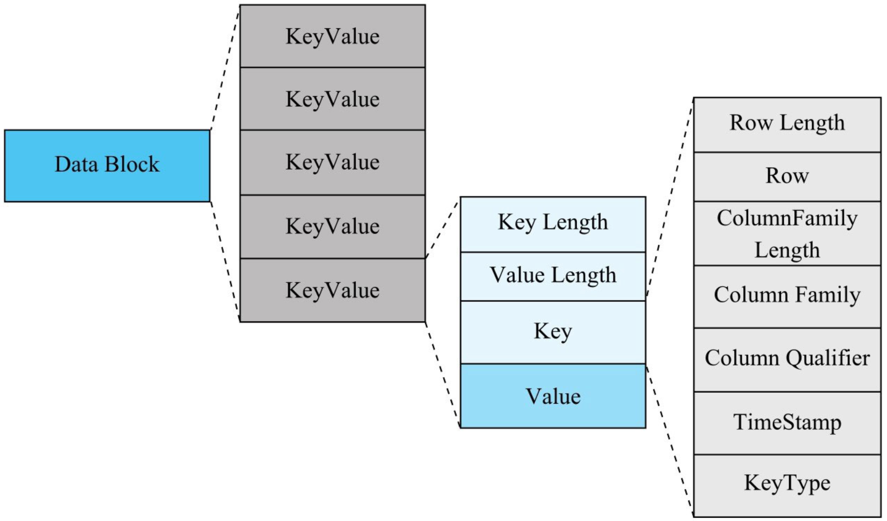
####index block
RootIndex Block表示索引数根节点,Root Index Block位于“ load-on-open”部分
Intermediate Index Block表示中间节点
Leaf Index Block表示叶子节点,Leaf Index Block位于“scanned block”部分
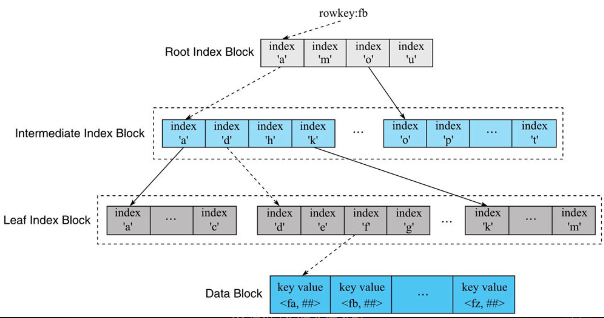
####bloom filter index block & bloom block
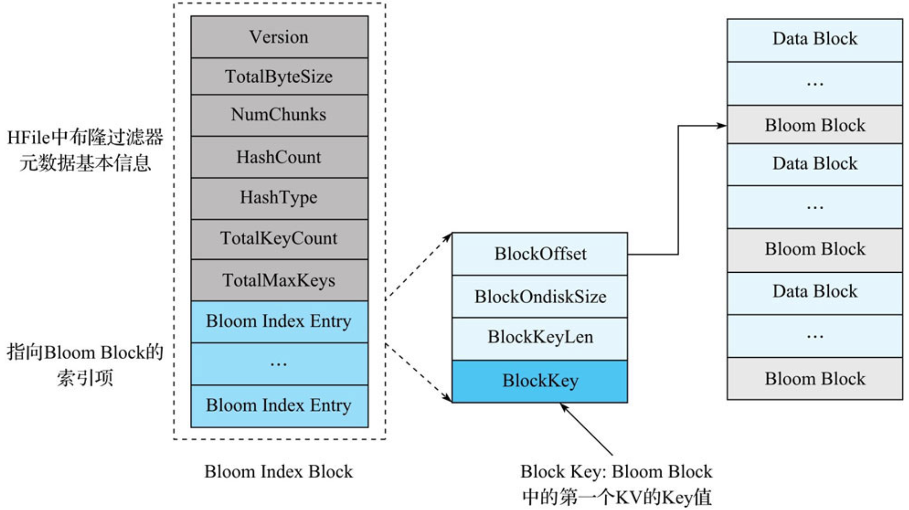
##HDFS(hbase hdfs计算存储分离)
HBase底层依赖HDFS组件存储实际数据，包括用户数据文件、HLog日志文件等最终都会写入HDFS落盘。
HBase本身并不存储文件，它只规定文件格式以及文件内容，实际文件存储由HDFS实现。
•HBase不提供机制保证存储数据的高可靠，数据的高可靠性由HDFS的多副本机制保证。
•HBase-HDFS体系是典型的计算存储分离架构。这种轻耦合架构的好处是，
一方面可以非常方便地使用其他存储替代HDFS作为HBase的存储方案；
另一方面对于云上服务来说，计算资源和存储资源可以独立扩容缩容，给云上用户带来了极大的便利。
##client
请求zookeeper，定位元数据表,通过元数据表定位目标数据所在RegionServer->请求RegionServer
