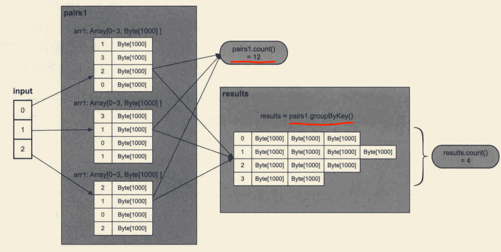

#拓扑
[大数据处理架构Apache Spark设计]
##master(resouceManager)
##work(nodeManager)
##Deriver(applicationMater)
##Executor(container)
##RDD(弹性分布式数据集)
##task(线程)
##算子(map,reduce)
##逻辑执行计划
DAG逻辑处理流程
##物理执行计划
计算任务
##中间缓存&中间磁盘文件&中间计算结果cache

#逻辑处理流程

##RDD(弹性分布式数据集)
###宽依赖(ShuffleDependency)
parent RDD分区 部分数据流入child RDD的某一个分区

###窄依赖(NarrowDependency)

parent RDD分区 一个/多个分区的数据流入child RDD的一个/多个分区

###依赖关系作用
NarrowDependency可以在同一个流水线执行,
ShuffleDependency需要进行shuffle
##数据操作
transform:filter,map,reduce
action:count,sum,max
##结果处理
driver
##分区
1.水平划分,block,常用输入数据的分区
2.hash划分,常用于shuffle

#物理执行计划
[大数据处理架构Apache Spark设计]
逻辑处理流程

##物理执行计划生成
1.根据action操作将应用划分为多个job，action:job=1:1

2.根据ShuffleDependency依赖关系将job划分为执行阶段stage,遇到NarrowDependency将parentRDD纳入

3.根据分区将各阶段划分为计算任务

##阶段拆分
根据ShuffleDependency拆分阶段
##pipeline优化
根据NarrowDependency合并中间过程

#shuffle机制(上下游数据传递)

##shuffle write
数据分区问题,
##shuffle read
##combine

##spill溢写
##sort
##中间数据存储
#数据缓存机制

#错误容忍机制
checkpoint
#exactly once
#内存管理机制
#spark stream
##mini batch
##continuous

