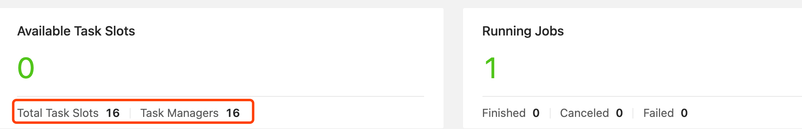
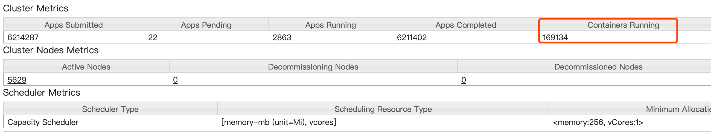

#启动参数
taskmanager.numberOfTaskSlots: 2//每个 TaskManager 中 slots 的数量
parallelism.default: 2//默认启动的slot 的数量
container.num ==  taskmanager.num ==  ( parallelism.default  /  taskmanager.numberOfTaskSlots )
container 为   3 ==  1 (AppMaster + JobManger) +  2 (parallelism.default / taskmanager.numberOfTaskSlots ) ->TaskManager数量


#yarn命令
bin/yarn-session.sh -n 2 -tm 800 -s 1 -d
```asp
-n 表示申请2个容器，这里指的就是多少个taskmanager 
-s 表示每个TaskManager的slots数量
-tm 表示每个TaskManager的内存大小
-d 表示以后台程序方式运行

上面的命令的意思是，同时向Yarn申请3个container
(即便只申请了两个，因为ApplicationMaster和Job Manager有一个额外的容器。一旦将Flink 部署到YARN群集中，它就会显示Job Manager的连接详细信息)
2 个 Container 启动 TaskManager -n 2，每个 TaskManager 拥有1个 Task Slot -s 1，并且向 每个 TaskManager 的 Container 申请 800M 的内存，以及一个ApplicationMaster--Job Manager
```
#核心配置
--checkpointing
--event-time
--backpressure
