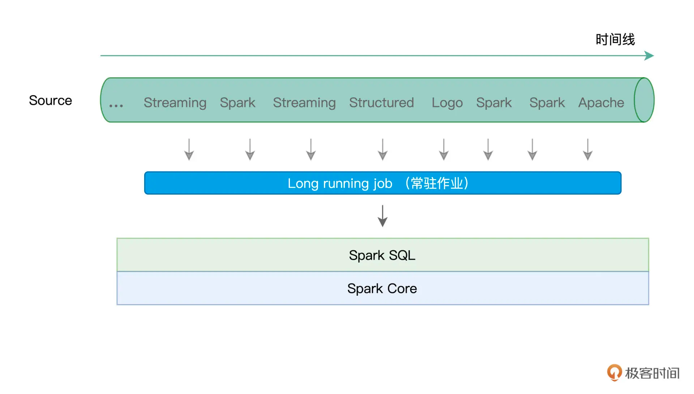
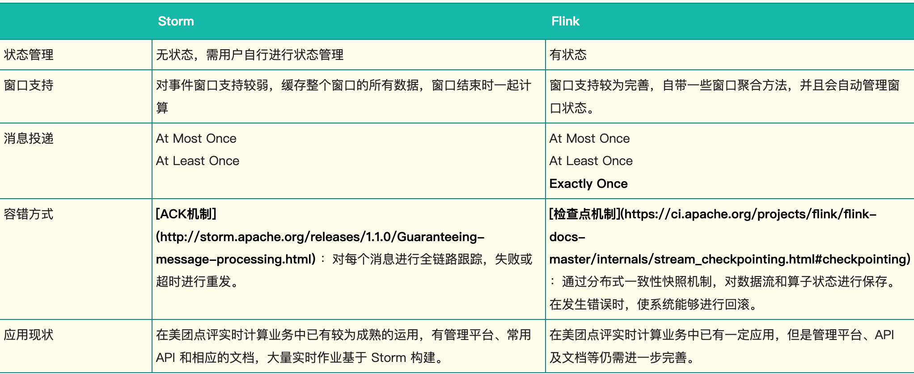

#定位
```asp
Apache Flink is a framework and distributed processing engine for stateful computations over unbounded and bounded data streams.
 Flink has been designed to run in all common cluster environments, perform computations at in-memory speed and at any scale
 
 对 Flink 而言，其所要处理的主要场景就是流数据，批数据只是流数据的一个极限特例而已，所以 Flink 也是一款真正的流批统一的计算引擎
```


#选型
1、同时支持高吞吐、低延迟、高性能
2、支持事件时间(Event Time)概念，结合Watermark处理乱序数据 
3、支持有状态计算，并且支持多种状态 内存、文件、RocksDB 
4、支持高度灵活的窗口(Window)操作 time、count、session 
5、基于轻量级分布式快照(CheckPoint)实现的容错 保证exactly-once语义 
6、基于JVM实现独立的内存管理
7、Save Points(保存点)

#spark stream vs flink
阿里Blink
[](https://time.geekbang.org/column/article/128538)
[](https://time.geekbang.org/column/article/99152)
[](https://time.geekbang.org/column/article/447514)
[](https://blog.51cto.com/u_15259710/3176637)
##微批 vs 事件


##window
Spark stream只支持基于时间的窗口操作，而Flink支持的窗口操作则非常灵活，不仅支持时间窗口，还支持基于数据本身的窗口，开发者可以自由定义想要的窗口操作
psi就有需要基于计数的窗口

##时间的操作
lateness,sideout，处理时间、事件时间、注入时间。同时也支持 watermark 机制
[](https://www.cnblogs.com/leon0/p/10796932.html)
##状态管理
[](https://developer.aliyun.com/article/669030)
。在流处理的框架里引入状态管理大大提升了系统的表达能力，让用户能够很方便地实现复杂的处理逻辑，是流处理在功能上的一个飞跃
##丰富的窗口聚合方法
richFunction
##keyedStream
##checkpoint
容错机制对于 Spark Streaming 任务，我们可以设置 checkpoint，然后假如发生故障
并重启，我们可以从上次 checkpoint 之处恢复，但是这个行为只能使得数据不丢失，可能 会重复处理，不能做到恰好一次处理语义。
Flink 则使用两阶段提交协议来解决这个问题
#flink vs storm

[](https://tech.meituan.com/2017/11/17/flink-benchmark.html)
[](https://www.infoq.cn/article/scb2*ofyrqt2o0byrpfq)
storm:
无状态，需用户自行进行状态管理
没有高级功能，如事件时间处理、聚合、窗口、会话、水印等
##状态管理	
##窗口支持	
##吞吐量

#批处理 vs 流
##Unbounded streams(无结束,需要顺序)
无界流 有定义流的开始，但没有定义流的结束,处理无界数据通常要求以特定顺序摄取事件，例如事件发生的顺序，以便能够推 断结果的完整性

##Bounded streams(批处理)
有界流 有定义流的开始，也有定义流的结束。有界流可以在摄取所有数据后再进行计算。有界流所有数
据可以被排序，所以并不需要有序摄取。有界流处理通常被称为批处理
