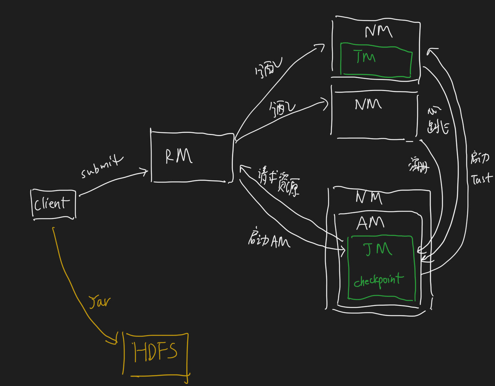
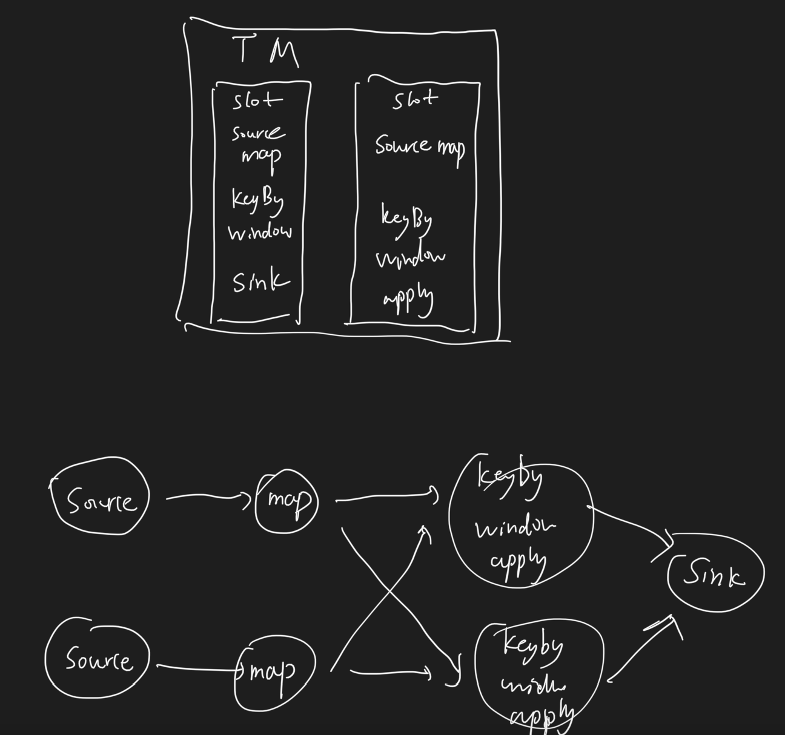
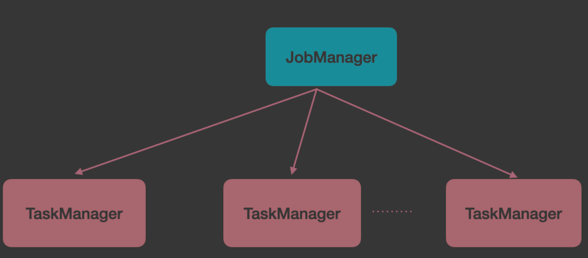
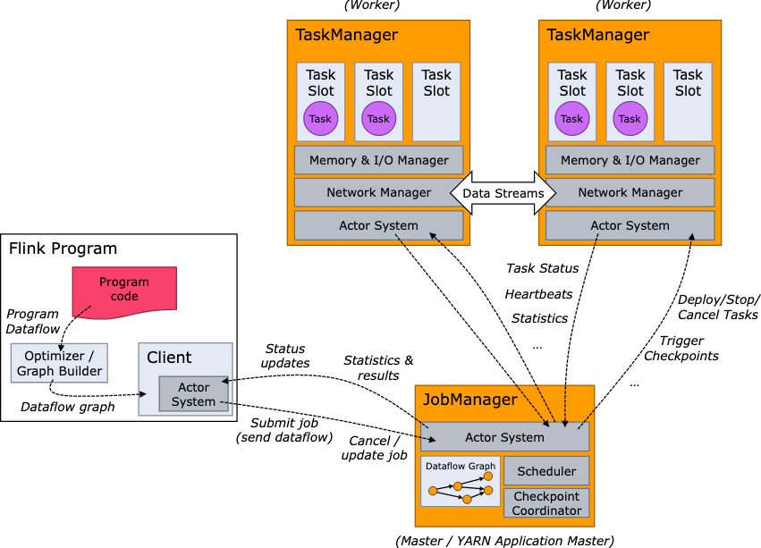
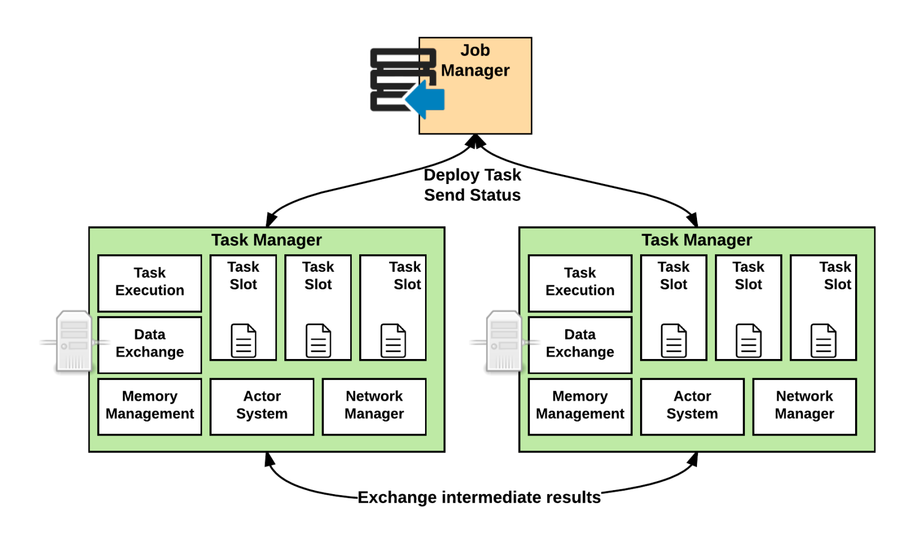
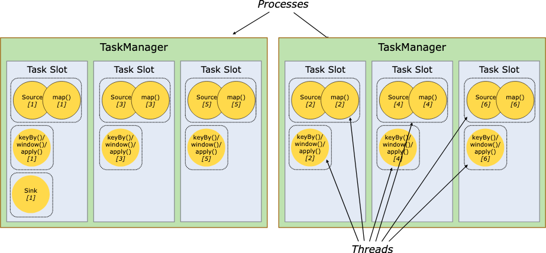
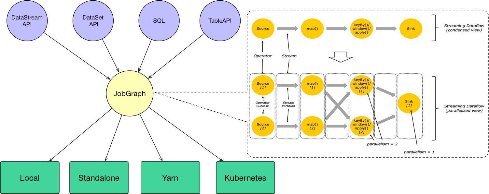
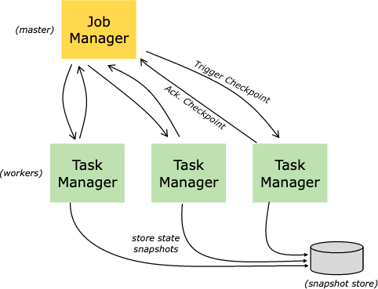
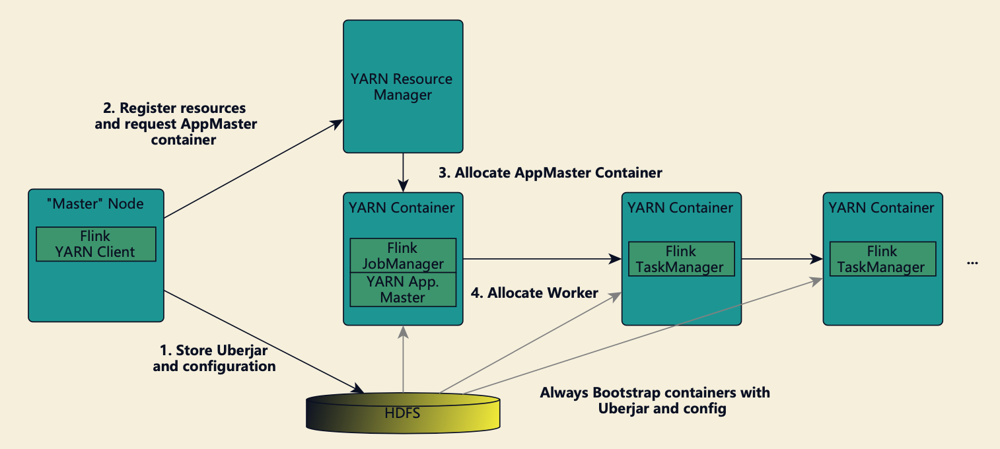
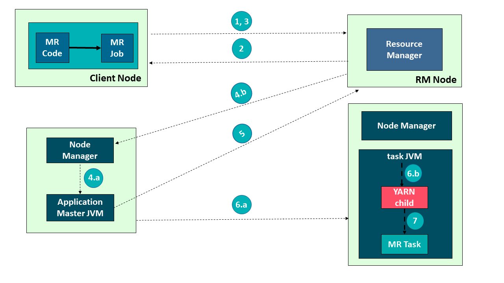

#临界知识


#角色


##JobManager处理器(Master) 
协调分布式执行，它们用来调度task，协调检查点(CheckPoint)，协调失败时恢复等
JobManager：JobManager 接受到用户的请求之后，会对任务进行调度，并且申请资源启动 TaskManager。

###资源调度
```asp
集群启动，TaskManager会将当前节点的资源信息注册给JobManager，所有TaskManager全部注 册完毕，集群启动成功，此时JobManager就掌握整个集群的资源情况 
client提交Application给JobManager，JobManager会根据集群中的资源情况，为当前的 Application分配TaskSlot资源
```
###任务调度
```asp
根据各个TaskManager节点上的资源分发task到TaskSlot中运行
Job执行过程中，JobManager会根据设置的触发策略触发checkpoint，通知TaskManager开始 checkpoint
任务执行完毕，JobManager会将Job执行的信息反馈给client，并且释放TaskManager资源
```
##TaskManager处理器
主要职责是从JobManager处接收任务, 并部署和启动任务, 接收上游的数据并处理
它负责一个具体 Task 的执行。TaskManager 向 JobManager 进行注册，当 TaskManager 接收到 JobManager 分配的任务之后，开始执行具体的任务

负责当前节点上的任务运行及当前节点上的资源管理，TaskManager资源通过TaskSlot进行了划 分，每个TaskSlot代表的是一份固定资源。
例如，具有三个 slots 的 TaskManager 会将其管理的 内存资源分成三等份给每个 slot。 划分资源意味着 subtask 之间不会竞争内存资源，
但是也意味 着它们只拥有固定的资源。注意这里并没有 CPU 隔离，当前 slots 之间只是划分任务的内存资源
负责TaskManager之间的数据交换
##task & subtask
Task 是一个阶段多个功能相同 SubTask 的集合，类似于 Spark 中的 TaskSet。 SubTask(子任务)
SubTask 是 Flink 中任务最小执行单元，是一个 Java 类的实例，这个 Java 类中有属性和 方法，完成具体的计算逻辑
比如一个执行操作map，分布式的场景下会在多个线程中同时执行，每个线程中执行的都 叫做一个SubTask
##任务槽和槽共享
每个TaskManager是一个JVM的进程, 可以在不同的线程中执行一个或多个子任务。
为了控制一个worker能接收多少个task。worker通过task slot来进行控制(一个worker至少有 一个task slot)

###任务槽
每个task slot表示TaskManager拥有资源的一个固定大小的子集。 一般来说:我们分配槽
的个数都是和CPU的核数相等,比如6核,那么就分配6个槽. Flink将进程的内存进行了划分到多个Slot中。假设一个TaskManager机器有3个slot，那么
每个slot占有1/3的内存(平分)。 内存被划分到不同的slot之后可以获得如下好处:
TaskManager最多能同时并发执行的任务是可以控制的，那就是3个，因为不能超过 slot的数量 slot有独占的内存空间，这样在一个TaskManager中可以运行多个不同的作业，作业 之间不受影响
As a rule-of-thumb, a good default number of task slots would be the number of CPU cores. With hyper-threading, each slot then takes 2 or more hardware thread contexts.

[](https://nightlies.apache.org/flink/flink-docs-release-1.4/concepts/runtime.html)
###槽共享
默认情况下，Flink允许子任务subtast(map[1] map[2] keyby[1] keyby[2] 共享插槽，即使 它们是不同任务的子任务，只要它们来自同一个作业。结果是一个槽可以保存作业的整个 管道
###并发度


#datastream(和java8 stream类似)


##Source
数据源，定义Flink从哪里加载数据，Flink 在流处理和批处理上的 source 大概有 4 类:
基 于本地集合的 source、
基于文件的 source、
基于网络套接字的 source、
自定义的 source。自定义的 source 常⻅的有 Apache kafka、RabbitMQ
##Transformation
数据转换的各种操作，也称之为算子，有 Map / FlatMap / Filter / KeyBy / Reduce /
Window等，可以将数据转换计算成你想要的数据
##Sink
接收器，Flink 将转换计算后的数据发送的地点 ，定义了结果数据的输出方向，Flink 常⻅ 的 Sink 大概有如下几类:
写入文件、打印出来、写入 socket 、自定义的 sink 。自定义 的 sink 常⻅的有 Apache kafka、RabbitMQ、MySQL、ElasticSearch、Apache Cassandra、HDFS等


#执行图拓扑&算子链优化
StreamGraph——原始逻辑执行计划
JobGraph——优化的逻辑执行计划（Web UI中看到的就是这个）
ExecutionGraph——物理执行计划
[z_05_flink_02_分层api_算子_分区策略_算子链_数据倾斜.md]
算子链接在一起,在相同的线程(slot)中执行,减少线程状态切换,
#State Backends(checkpoint)

```asp
The exact data structures in which the key/values indexes are stored depends on the chosen state backend. 
One state backend stores data in an in-memory hash map, another state backend uses RocksDB as the key/value store. 
In addition to defining the data structure that holds the state, the state backends also implement the logic to 
take a point-in-time snapshot of the key/value state and store that snapshot as part of a checkpoint.

```
#Savepoints
```asp
Savepoints are similar to these periodic checkpoints except that they are triggered by the user and don’t automatically 
expire when newer checkpoints are completed. Savepoints can be created from the command line or when cancelling a job via the REST API
```
[](https://nightlies.apache.org/flink/flink-docs-release-1.4/concepts/runtime.html)

#yarn集群

```asp
1. 每当创建一个新flink的yarn session的时候，客户端会首先检查要请求的资源(containers和 memory)是否可用。然后，将包含flink相关的jar包盒配置上传到HDFS
2. 客户端会向ResourceManager申请一个yarn container 用以启动ApplicationMaster。由于客户端 已经将配置和jar文件上传到HDFS，ApplicationMaster将会下载这些jar和配置，然后启动成功
3. JobManager和AM运行于同一个container
4. AM开始申请启动Flink TaskManager的containers，这些container会从HDFS上下载jar文件和已
修改的配置文件。一旦这些步骤完成，flink就可以接受任务了
```
##container & application
container,yarn集群最小资源,application应用任务一个main函数所在class
[](https://cloud.tencent.com/developer/news/451821)



##集群高可用
###zookeeper
3台jobmanager组成高可用
###公司项目
```asp
由于HA依赖较高版本Zookeeper，目前公司内部Flink暂未开启HA，但是开启了Yarn Application 自动重试；当JobManager发生异常后，
Yarn会自动重新拉起，Flink作业依然可以从之前的状态快速恢复。
```

