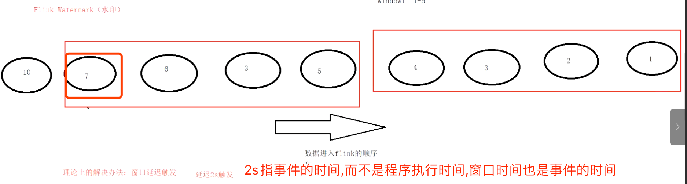
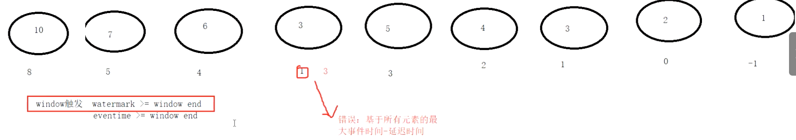
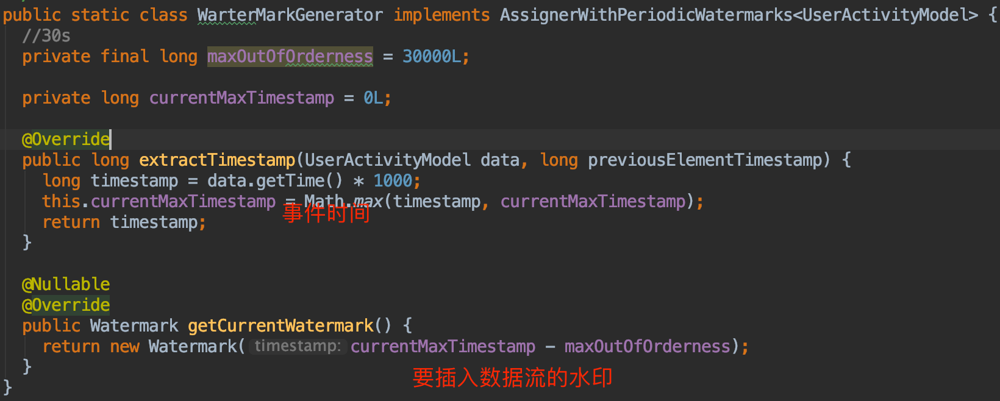
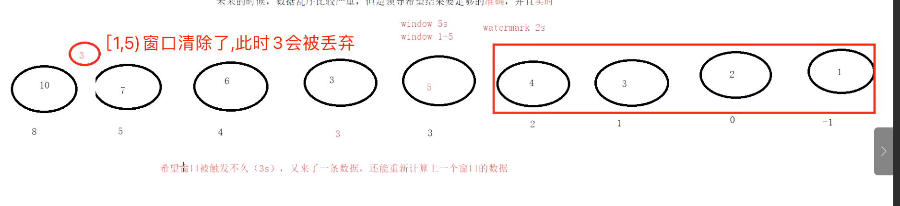
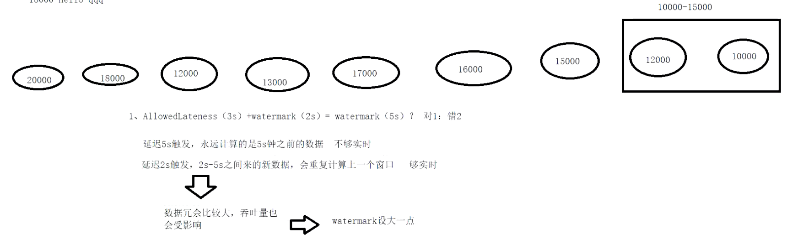

#窗口
##起始时间
程序启动时第一个事件时间往前退一段时间,考虑到乱序和延时
```asp
public static long getWindowStartWithOffset(long timestamp, long offset, long windowSize) {
    return timestamp - (timestamp - offset + windowSize) % windowSize;
}
```
##左闭右开
##窗口结束后延时到来的事件丢弃
#watermark水位线(避免延时)
延时x秒触发,x秒是事件的延时时间,而不是系统时间

水位线>=窗口结束时间,触发窗口计算

5,6,7这些事件也会包含在窗口[1,5)吗?还是缓存用于[5,10)?

每隔一段时间插入水印到数据流stream
##周期性
##间歇性
##为啥水印用事件最大值?

#AllowedLateness(迟到也计算)
迟到不严重 重新计算窗口内和迟到的所有数据,迟到严重输出到侧输出流

##watermark(2s)+AllowedLateness(3s),和watermark(5s)的区别？
不一样,watermark(2s)就会计算,只不过之后延时数据过来会重复计算,实时性能得到保证
watermark(5s)实时性不够

延时数据多时,AllowedLateness导致重复计算多,吞吐下降,trade off

#sideOutputLateData
watermark+AllowedLateness之后窗口清除,之后过来的延时数据会到达侧流
