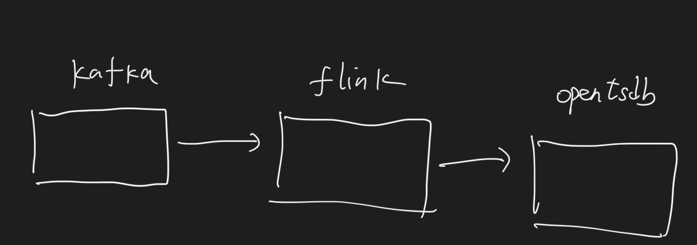

#flink是什么?为啥用它?
[z_05_flink_00_定位_选型_flink_spark.md]
warden监控系统,吞吐量大,实时性要求高
#如何排查flink 异常？task是否健康?
1.yarn ui查看task重启情况
2.yarn ui查看异常日志
3.yarn ui查看checkpoint状态
#flink积压/反压/offsetLag增大问题如何排查?
1.确认作业是否健康？
2.确认是从什么时候开始的积压？如果是突然存在的，查看上游流量是否存在徒增的情况；
3.作业task是否存在反压，sink不过来,上游流量太大

4.查看反压节点的流量流入是否存在数据倾斜，如果存在则尝试解决数据倾斜问题

5.如何确认反压节点？如果一个结点有反压，下游结点没有反压，并且下游结点不是最后一个结点，那么该结点一般是反压结点；
  如果一个结点有反压，流出结点没有反压但该结点是最后一个sink结点，那么反压结点是该结点还是下游结点需要具体分析；
#如何确认自己的并发是否合理？
1.查看Flink作业的相关指标，确认作业的处理能力
2.查看上游消息的产生速度。
3.通过两者的速度差， 则可以确认需要扩充的并行数量，得出需要设置的并发数
#flink数据倾斜问题
1.排查问题,看反压,yarn ui看task接收到的字节流量,看上游打入流量
2.一类是kafka多个队列本身数据不均匀,一类是业务逻辑的数据keyby不均匀
3.第一类调整kafka队列和消费者占比
4.第二类,预聚合+rebalance,增量+全量

```asp
DataStream<List<TsdbDataModel>> aggregateDataStream = dataStream
            .keyBy(new GenerateKey())
            .window(TumblingEventTimeWindows.of(Time.seconds(step.getSecond())))
            .allowedLateness(Time.minutes(10))
            .aggregate(new CountAgg(), new WindowResultFunction(step));//增量加全量
```
#flink exactly-once的保证
问题：Flink中exactly-once语义是如何实现的，状态是如何存储的？

解答：Flink依靠checkpoint机制来实现exactly-once语义，如果要实现端到端的exactly-once，还需要外部source和sink满足一定的条件。
状态的存储通过状态后端来管理，Flink中可以配置不同的状态后端。

```asp
问题：如果下级存储不支持事务，Flink 怎么保证 exactly-once？

解答：整体端到端的exactly-once对sink要求比较高，具体实现主要有幂等写入和事务性写入两种方式。幂等写入的场景依赖于业务逻辑，更常见的是用事务性写入。
而事务性写入又有预写日志（WAL）和两阶段提交（2PC）两种方式。

如果外部系统不支持事务，那么可以用预写日志的方式，把结果数据先当成状态保存，然后在收到 checkpoint 完成的通知时，一次性写入 sink 系统。
```
#flink 状态恢复checkpoint
[z_05_flink_01_核心功能_有状态计算_失败恢复_精确一次语义_checkpoint.md]
#公司项目
##任务配置
###jobmanager HA
zookeeper+3 jobmanager
###资源
cpu,48核
内存,126 GB
job,2G,放单点用了zookeeper
并发度,64,16个tm,每个8G,每个4个slot
###JVM 垃圾回收器
PS_Scavenge	
PS_MarkSweep	
###时间
水印20s
延时配置60s
窗口=1小时
步长=1小时
###checkpoint
checkpoint=10min
checkpoint间隔=10min
checkpoint超时=20min
checkpoint重试=3次(防抖动)
重启恢复uid=name
最近开始的地方消费latest
stateBackend=rocksdb
###常用算子
使用的keyed state:Keyed State,mapstate
分区rescale,rebalance
##哪些任务?
##业务监控为啥自己用flink统计?
用户贷款失败可能重试,多次重试影响成功率统计,需要对同一个用户去重
##线上业务数据为0的告警排查
我们的业务告警系统由kafka+flink+opentsdb组成

研发同事反馈说收到飞书告警,grafana查不到数据
1.grafana查看消息积压严重
2.yarn ui查看日志,发现sink任务返回500,超时
3.询问opentsdb中台研发,他们opentsdb服务负载过大,抖动导致
4.flink job加prometheus延时打点
5.监控系统设置的checkpoint 5min才超时,没有配置重试
