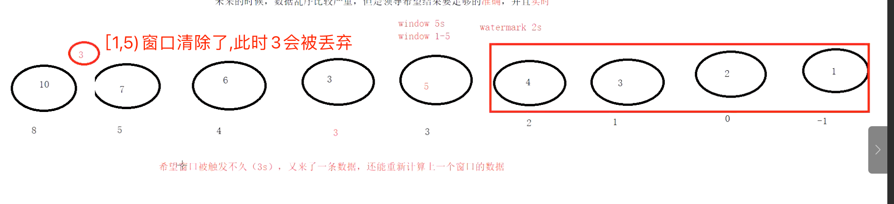
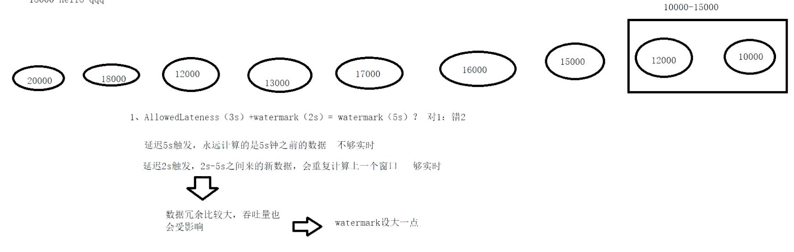

#窗口
[](https://flink.apache.org/zh/flink-applications.html)
##起始时间 & 窗口时间对齐
程序启动时第一个事件时间往前退一段时间,考虑到乱序和延时
```asp
public static long getWindowStartWithOffset(long timestamp, long offset, long windowSize) {
    return timestamp - (timestamp - offset + windowSize) % windowSize;
}
```
2022.01.06.23.10 - (2022.01.06.23.10 - 0h + 1h) % 1h = 2022.01.06.23.10 - 10 = 2022.01.06.23.00
##左闭右开
##窗口结束后延时到来的事件丢弃
##步长,窗口,offset

size,slide,offset
[](https://nightlies.apache.org/flink/flink-docs-release-1.14/zh/docs/dev/datastream/operators/windows/#tumbling-windows)
##窗口类型

##空的时间窗口不会输出结果 

#watermark水位线(避免延时)
[](https://nightlies.apache.org/flink/flink-docs-release-1.14/zh/docs/learn-flink/streaming_analytics/)
延时x秒触发,x秒是事件的延时时间,而不是系统时间

水位线>=窗口结束时间,触发窗口计算

5,6,7这些事件也会包含在窗口[1,5)吗?还是缓存用于[5,10)?缓存用于[5,10)

每隔一段时间插入水印到数据流stream,水印单调递增
##周期性
##间歇性
##为啥水印用事件最大值?

#AllowedLateness(迟到也计算)
```asp
我们可以把 watermarks 的边界时间配置的相对较短，从而冒着在输入了解不完全的情况下产生结果的风险-即可能会很快产生错误结果。或者，你可以等待更长的时间，并利用对输入流的更全面的了解来产生结果。

当然也可以实施混合解决方案，先快速产生初步结果，然后在处理其他（最新）数据时向这些结果提供更新。对于有一些对延迟的容忍程度很低，但是又对结果有很严格的要求的场景下，或许是一个福音
```
迟到不严重 重新计算窗口内和迟到的所有数据,迟到严重输出到侧输出流

##watermark(2s)+AllowedLateness(3s),和watermark(5s)的区别？
不一样,watermark(2s)就会计算,只不过之后延时数据过来会重复计算,实时性能得到保证
watermark(5s)实时性不够

延时数据多时,AllowedLateness导致重复计算多,吞吐下降,trade off

#sideOutputLateData
watermark+AllowedLateness之后窗口清除,之后过来的延时数据会到达侧流

