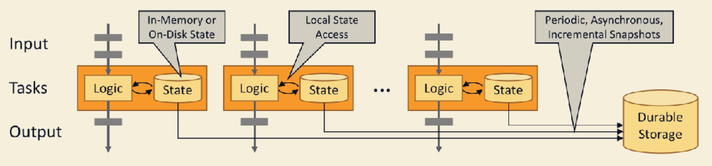
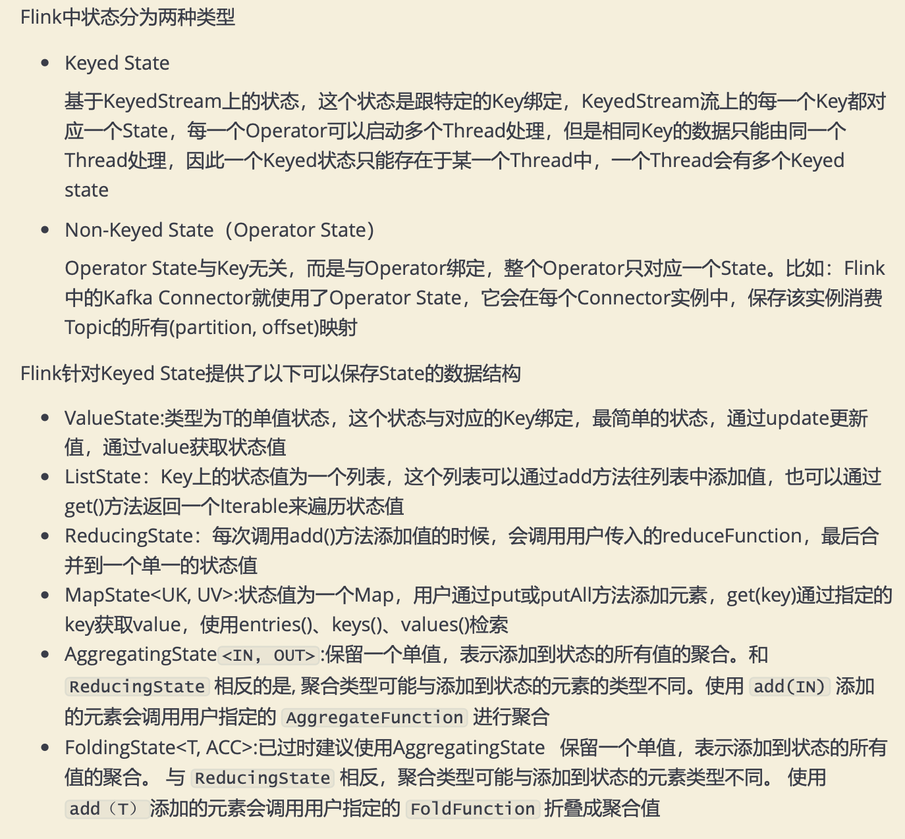
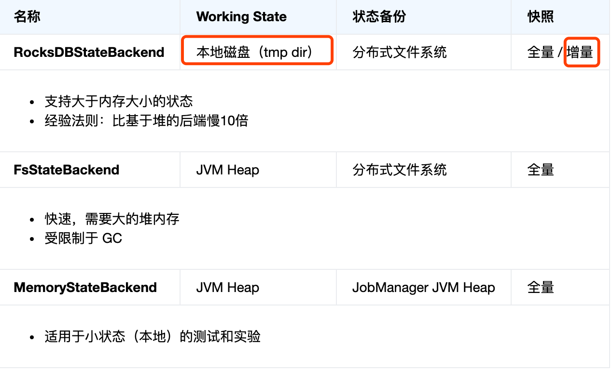
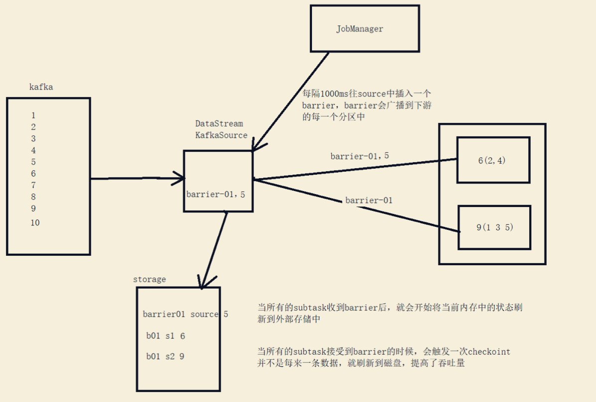
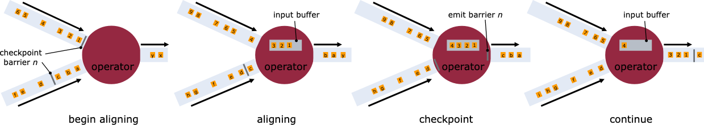
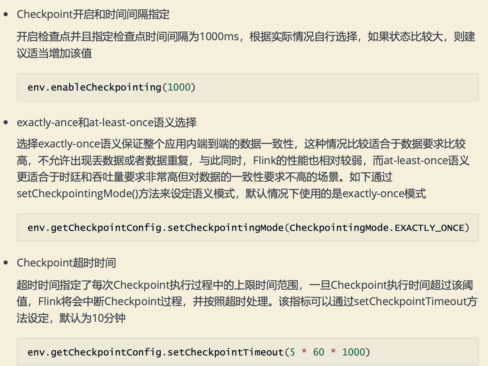
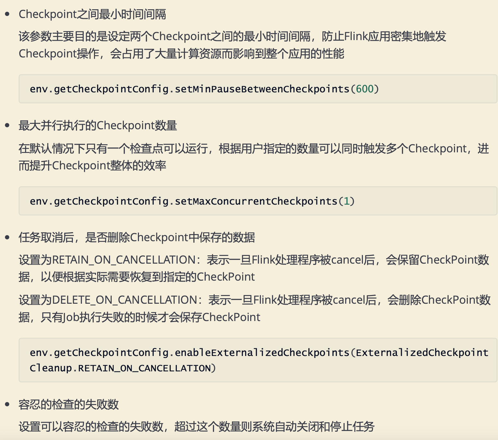

#状态计算(stateful computations)

##有状态的计算
```asp
每次进行数据计算的时候基于之前数据的计算结果(状态)做计算，并且每次计算结果
都会保存到存储介质中，计算关联上下文context 基于有状态的计算不需要将历史数据重新计算，提高了计算效率
```
##无状态的计算
```asp
每次进行数据计算只是考虑当前数据，不会使用之前数据的计算结果
```
#状态管理
```asp
本地性: Flink 状态是存储在使用它的机器本地的，并且可以以内存访问速度来获取
持久性: Flink 状态是容错的，例如，它可以自动按一定的时间间隔产生 checkpoint，并且在任务失败后进行恢复
纵向可扩展性: Flink 状态可以存储在集成的 RocksDB 实例中，这种方式下可以通过增加本地磁盘来扩展空间
横向可扩展性: Flink 状态可以随着集群的扩缩容重新分布
可查询性: Flink 状态可以通过使用 状态查询 API 从外部进行查询。
```

##Flink State
```asp
Flink是一个有状态的流式计算引擎，所以会将中间计算结果(状态)进行保存，默认保存到TaskManager 的堆内存中，但是当task挂掉，
那么这个task所对应的状态都会被清空，造成了数据丢失，无法保证结 果的正确性，哪怕想要得到正确结果，所有数据都要重新计算一遍，效率很低。
想要保证At -least- once和Exactly-once，需要把数据状态持久化到更安全的存储介质中，Flink提供了堆内内存、堆外内 存、HDFS、RocksDB等存储介质
```
##MemoryStateBackend
##FsStateBackend
##RocksDBStateBackend
#容错机制checkpoint
Flink中基于异步轻量级的分布式快照技术提供了Checkpoint容错机制，分布式快照可以将同一时间点 Task/Operator的状态数据全局统一快照处理，
包括上面提到的用户自定义使用的Keyed State和 Operator State，当未来程序出现问题，可以基于保存的快照容错

开启检查点并且指定检查点时间间隔为1000ms，根据实际情况自行选择，如果状态比较大，则建议适当增加该值
##状态快照
状态持久化与恢复

所有这些 state backends 都能够异步执行快照，这意味着它们可以在不妨碍正在进行的流处理的情况下执行快照

快照 – 是 Flink 作业状态全局一致镜像的通用术语。快照包括指向每个数据源的指针（例如，到文件或 Kafka 分区的偏移量）
以及每个作业的有状态运算符的状态副本，该状态副本是处理了 sources 偏移位置之前所有的事件后而生成的状态。

##checkpoint 快照
Checkpoint – 一种由 Flink 自动执行的快照，其目的是能够从故障中恢复。Checkpoints 可以是增量的，并为快速恢复进行了优化。
 --checkpoint


```asp
1、算子只要一接收到某个输入流的 barrier n，它就不能继续处理此数据流后续的数据，直到该算子接收到其余流的 barrier n。否则会将属于 snapshot n 的数据和 snapshot n+1的搞混

　　2、barrier n 所属的数据流先不处理，从这些数据流中接收到的数据被放入接收缓存

　　3、当从最后一个流中提取到 barrier n 时，该算子会发射出所有等待向后发送的数据，然后发射snapshot n对应的barrier n

　　4、经过以上步骤，算子恢复所有输入流数据的处理，优先处理输入缓存中的数据
```
##快照工作原理(栅栏barrier)
默认情况Flink不开启检查点，用户需要在程序中通过调用方法配置和开启检查点，另外还可以调整其他 相关参数
[](https://www.jianshu.com/p/4d31d6cddc99)
[](https://rann.cc/2017/10/15/flink-checkpoint.html#Barrier%E6%98%AF%E4%BB%80%E4%B9%88)
```asp
Flink会在输入的数据集上间隔性地生成checkpoint barrier，通过栅栏(barrier)将间隔时间段内的数 据划分到相应的checkpoint中。当程序出现异常时，
Operator就能够从上一次快照中恢复所有算子之 前的状态，从而保证数据的一致性。例如在KafkaConsumer算子中维护offset状态，当系统出现问题无 法
从Kafka中消费数据时，可以将offset记录在状态中，当任务重新恢复时就能够从指定的偏移量开始消 费数据。
```
##checkpoint配置


##SavePoint
```asp
Savepoints 是检查点的一种特殊实现，底层实现其实也是使用Checkpoints的机制。Savepoints是用户 以手工命令的方式触发Checkpoint,并将结果持久化到指定的存储路径中，
其主要目的是帮助用户在升 级和维护集群过程中保存系统中的状态数据，避免因为停机运维或者升级应用等正常终止应用的操作而 导致系统无法恢复到原有的计算状态的情况，
从而无法实现从端到端的 Excatly-Once 语义保证


为了能够在作业的不同版本之间以及Flink的不同版本之间顺利升级，强烈推荐程序员通过手动给算子赋 予ID，这些ID将用于确定每一个算子的状态范围。
如果不手动给各算子指定ID，则会由Flink自动给每个 算子生成一个ID。而这些自动生成的ID依赖于程序的结构，并且对代码的更改是很敏感的。
因此，强烈 建议用户手动设置ID
```
#精确一次（exactly once）
[](https://zhuanlan.zhihu.com/p/266620519)
##至少一次
##端到端精确一次
##两阶段提交
[](https://developer.51cto.com/article/643945.html)

#失败恢复
##失败
```asp
由于 TaskManager 提供的 TaskSlots 资源不够用，Job 的所有任务都不能成功转为 RUNNING 状态，直到有新的 TaskManager 可用。在此之前，该 Job 将经历一个取消和重新提交 不断循环的过程。

与此同时，数据生成器 (data generator) 一直不断地往 input topic 中生成 ClickEvent 事件，在生产环境中也经常出现这种 Job 挂掉但源头还在不断产生数据的情况
```
##恢复
```asp
JobManager 就会将处于 SCHEDULED 状态的所有任务调度到该 TaskManager 的可用 TaskSlots 中运行，
此时所有的任务将会从失败前最近一次成功的 checkpoint 进行恢复， 一旦恢复成功，它们的状态将转变为 RUNNING
由于我们使用的是 FlinkKafkaProducer “至少一次"模式，因此你可能会看到一些记录重复输出多次
```
##升级与扩容
[](https://nightlies.apache.org/flink/flink-docs-release-1.14/zh/docs/try-flink/flink-operations-playground/#%E8%8E%B7%E5%8F%96%E6%89%80%E6%9C%89%E8%BF%90%E8%A1%8C%E4%B8%AD%E7%9A%84-job)
```asp
升级 Flink 作业一般都需要两步：第一，使用 Savepoint 优雅地停止 Flink Job。 Savepoint 是整个应用程序状态的一次快照（类似于 checkpoint ），
该快照是在一个明确定义的、全局一致的时间点生成的。第二，从 Savepoint 恢复启动待升级的 Flink Job。 在此，“升级”包含如下几种含义：

配置升级（比如 Job 并行度修改）
Job 拓扑升级（比如添加或者删除算子）
Job 的用户自定义函数升级
```
