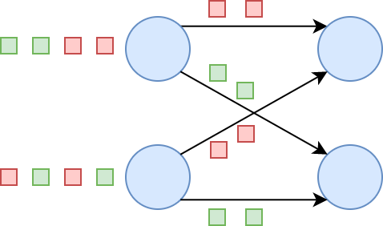
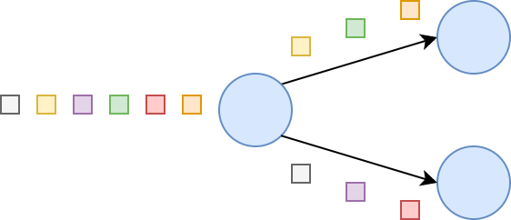
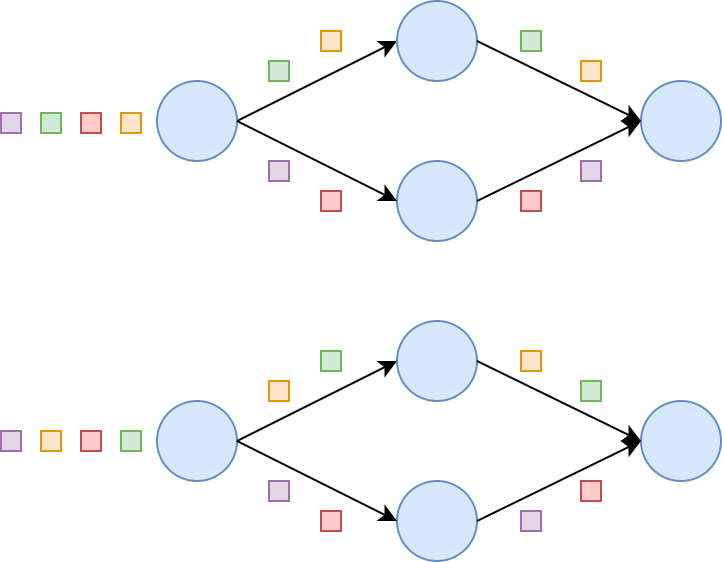
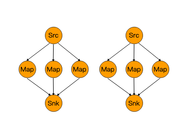
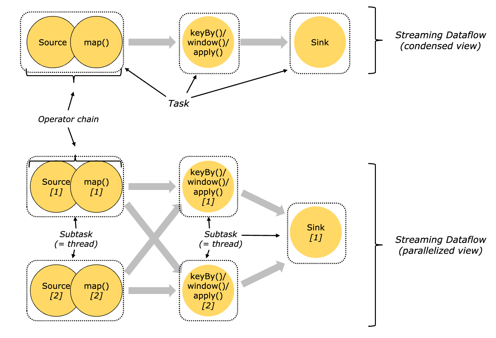

#算子
[源码分析](https://github.com/mickey0524/flink-streaming-source-analysis/tree/master/docs)
#核心转换
[](https://nightlies.apache.org/flink/flink-docs-master/zh/docs/dev/datastream/operators/overview/)
##Map,DataStream → DataStream
```asp
DataStream<Integer> dataStream = //...
dataStream.map(new MapFunction<Integer, Integer>() {
    @Override
    public Integer map(Integer value) throws Exception {
        return 2 * value;
    }
});
```
##FlatMap,DataStream → DataStream
```asp
dataStream.flatMap(new FlatMapFunction<String, String>() {
    @Override
    public void flatMap(String value, Collector<String> out)
        throws Exception {
        for(String word: value.split(" ")){
            out.collect(word);
        }
    }
});
```
##filter,DataStream → DataStream 
##KeyBy,DataStream → KeyedStream,类似es term,分桶
在逻辑上将流划分为不相交的分区。具有相同 key 的记录都分配到同一个分区。在内部， keyBy() 是通过哈希分区实现的。有多种指定 key 的方式
KeyedStream是通过 DataStream 执行 keyBy 操作转换而来，KeyedStream 常用的转换包括 reduce 和 aggregate
WindowedStream代表了根据key分组，并且基于WindowAssigner切分窗口的数据流。所以WindowedStream都是从KeyedStream衍生而来的。而在WindowedStream上进行任何transformation也都将转变回DataStream

在key分组的流上进行窗口切分是比较常用的场景，也能够很好地并行化（不同的key上的窗口聚合可以分配到不同的task去处理）
```asp
final StreamExecutionEnvironment env = StreamExecutionEnvironment.getExecutionEnvironment();
String[] strings = new String[]{"i", "love", "flink"};

DataStream<String> dataStream = env.fromElements(strings);
dataStream.keyBy(new KeySelector<String, Byte>() {
    @Override
    public Byte getKey(String value) throws Exception {
        return 0;
    }
}).reduce(new ReduceFunction<String>() {
    @Override
    public String reduce(String value1, String value2) throws Exception {
        return value1 + " " + value2;
    }
}).printToErr();
```
```asp
partitioned: 分区,分桶位,
any given key, every stream element for that key is in the same partition
This guarantees that all messages for a key are processed by the same worker instance. Only keyed streams can use key-partitioned state and timers.
```
##Reduce,KeyedStream → DataStream 
##Window,KeyedStream → WindowedStream
可以在已经分区的 KeyedStreams 上定义 Window。Window 根据某些特征（例如，最近 5 秒内到达的数据）对每个 key Stream 中的数据进行分组
##WindowAll,DataStream → AllWindowedStream
AllWindowedStream 的实现是基于 WindowedStream 的（Flink 1.1.x 开始）。Flink 不推荐使用AllWindowedStream，因为在普通流上进行窗口操作，
就势必需要将所有分区的流都汇集到单个的Task中，而这个单个的Task很显然就会成为整个Job的瓶颈
```asp
dataStream
  .windowAll(TumblingEventTimeWindows.of(Time.seconds(5)));
```
##Window Apply,WindowedStream → DataStream
AllWindowedStream → DataStream
```asp
windowedStream.apply(new WindowFunction<Tuple2<String,Integer>, Integer, Tuple, Window>() {
    public void apply (Tuple tuple,
            Window window,
            Iterable<Tuple2<String, Integer>> values,
            Collector<Integer> out) throws Exception {
        int sum = 0;
        for (value t: values) {
            sum += t.f1;
        }
        out.collect (new Integer(sum));
    }
});

// 在 non-keyed 窗口流上应用 AllWindowFunction
allWindowedStream.apply (new AllWindowFunction<Tuple2<String,Integer>, Integer, Window>() {
    public void apply (Window window,
            Iterable<Tuple2<String, Integer>> values,
            Collector<Integer> out) throws Exception {
        int sum = 0;
        for (value t: values) {
            sum += t.f1;
        }
        out.collect (new Integer(sum));
    }
});
```
##Union,DataStream* → DataStream
dataStream.union(otherStream1, otherStream2, ...);
##Window Join
```asp
ataStream.join(otherStream)
    .where(<key selector>).equalTo(<key selector>)
    .window(TumblingEventTimeWindows.of(Time.seconds(3)))
    .apply (new JoinFunction () {...});
```
##Connect
##Iterate
#物理分区策略
[](http://smartsi.club/physical-partitioning-in-apache-flink.html)
##keyby
使用 keyBy 函数指定分组 key，将具有相同 key 的元素发送到相同的下游算子实例上：

##自定义分区
Flink 也提供以下方法让用户根据需要在数据转换完成后对数据分区进行更细粒度的配置。

##RebalancePartitioner(全局均摊,可能通过网络均摊,数据倾斜)

```asp
@Internal
public class RebalancePartitioner<T> extends StreamPartitioner<T> {
	private static final long serialVersionUID = 1L;

	private int nextChannelToSendTo;

	@Override
	public void setup(int numberOfChannels) {
		super.setup(numberOfChannels);

		nextChannelToSendTo = ThreadLocalRandom.current().nextInt(numberOfChannels);
	}

	@Override
	public int selectChannel(SerializationDelegate<StreamRecord<T>> record) {
		nextChannelToSendTo = (nextChannelToSendTo + 1) % numberOfChannels;
		return nextChannelToSendTo;
	}

	@Override
	public SubtaskStateMapper getDownstreamSubtaskStateMapper() {
		return SubtaskStateMapper.ROUND_ROBIN;
	}

	public StreamPartitioner<T> copy() {
		return this;
	}

	@Override
	public String toString() {
		return "REBALANCE";
	}
}
```
##Rescaling(本地均摊)

将元素以 Round-robin 轮询的方式分发到下游算子,当算子的并行度不是彼此的倍数时，一个或多个下游算子将从上游算子获取到不同数量的输入。                            

```asp
dataStream.rescale();
```
```asp
基于上下游算子的并行度，将元素循环的分配到下游算子的某几个实例上。如果想使上游算子的每个并行实例均匀分散到下游算子的某几个实例来达到负载均衡，
但又不希望使用 rebalance 这种方式达到整体的负载均衡，那么 Rescale 这种方式很有用。这种方式仅需要本地数据传输，不需要通过网络传输数据，
具体取决于我们的配置，例如，TaskManager的 Slot 数
```
##广播
```asp
dataStream.broadcast();
```
#算子链(operator chain)和资源组(slots,每个slot一个线程)
map()是一个算子,filter是一个算子,reduce是一个算子,算子链就是算子集合,用于将多个算子绑定在一起在同一个线程一起执行,避免不必要的线程切换
所有chain在一起的sub-task都会在同一个线程（即TaskManager的slot）中执行，能够减少不必要的数据交换、序列化和上下文切换，从而提高作业的执行效率

DataStream 转换操作后才能被调用，因为它们只对前一次数据转换生效。例如，可以 someStream.map(...).startNewChain() 这样调用，而不能 someStream.startNewChain() 这样。
##创建新链
someStream.filter(...).map(...).startNewChain().map(...);
算子优化，基于当前算子创建一个新的算子链。后面两个 map 将被链接起来，而 filter 和第一个 map 不会链接在一起,
##禁止链接
someStream.map(...).disableChaining();
##配置 Slot 共享组
someStream.filter(...).slotSharingGroup("name");
#RichFunction
#ProcessFunction
#数据流
##keyState

##状态更新和存储
[](https://github.com/mickey0524/flink-streaming-source-analysis/blob/master/docs/flink-keyed-stream-transformation.md)
```asp
public class StreamGroupedReduce<IN> extends AbstractUdfStreamOperator<IN, ReduceFunction<IN>>
		implements OneInputStreamOperator<IN, IN> {
	private static final String STATE_NAME = "_op_state";

	private transient ValueState<IN> values;  // 存储当前 KeyedStream 处理的当前状态

	private TypeSerializer<IN> serializer;

	public StreamGroupedReduce(ReduceFunction<IN> reducer, TypeSerializer<IN> serializer) {
		super(reducer);
		this.serializer = serializer;
	}

	@Override
	public void open() throws Exception {
		super.open();
		ValueStateDescriptor<IN> stateId = new ValueStateDescriptor<>(STATE_NAME, serializer);
		values = getPartitionedState(stateId);
	}

	@Override
	// reduce 的中间输出也会被 collect
	public void processElement(StreamRecord<IN> element) throws Exception {
		IN value = element.getValue();
		IN currentValue = values.value();

		if (currentValue != null) {
			IN reduced = userFunction.reduce(currentValue, value);
			values.update(reduced);
			output.collect(element.replace(reduced));
		} else {
			values.update(value);
			output.collect(element.replace(value));
		}
	}
}
```

