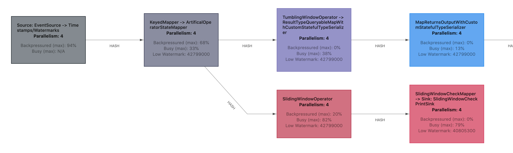

[](https://flink.apache.org/zh/flink-operations.html)
#检查点的一致性
Flink的故障恢复机制是通过建立分布式应用服务状态一致性检查点实现的，当有故障产生时，应用服务会重启后，再重新加载上一次成功备份的状态检查点信息。
结合可重放的数据源，该特性可保证精确一次（exactly-once）的状态一致性。
Flink采用异步及增量的方式构建检查点服务
#集成多种集群管理服务
Flink已与多种集群管理服务紧密集成，如 Hadoop YARN, Mesos, 以及 Kubernetes。当集群中某个流程任务失败后，一个新的流程服务会自动启动并替代它继续执行
Flink内置了为解决单点故障问题的高可用性服务模块，此模块是基于Apache ZooKeeper 技术实现的，Apache ZooKeeper是一种可靠的、交互式的、分布式协调服务组件
#checkpoint监控
#反压backpressure监控
```asp
如果你看到一个 task 发生 反压警告（例如： High），意味着它生产数据的速率比下游 task 消费数据的速率要快。 在工作流中数据记录是从上游向下游流动的（例如：从 Source 到 Sink）。反压沿着相反的方向传播，沿着数据流向上游传播。

以一个简单的 Source -> Sink job 为例。如果看到 Source 发生了警告，意味着 Sink 消费数据的速率比 Source 生产数据的速率要慢。 Sink 正在向上游的 Source 算子产生反压
```
[](https://nightlies.apache.org/flink/flink-docs-release-1.14/zh/docs/ops/monitoring/back_pressure/#monitoring-back-pressure)

#flink yarn队列内存cpu爆满
