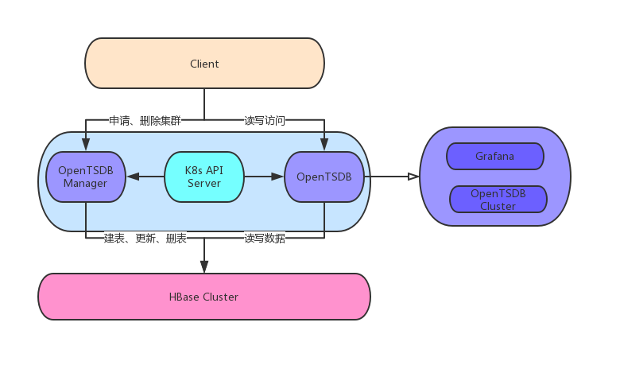

#选型,opentsdb vs influxDB vs prometheus
db-engines,[](https://db-engines.com/en/ranking_categories)
##opentsdb基于hbase
400W/S
```
数据是时序的，带有时间戳
数据一般是结构化
写多读少，更新、删除操作极少
用户往往关注一段时间趋势，而不会进行点查
数据是有保留期限的（TTL）
数据查询往往基于时间段和一组设备的
写入流量平稳、可预测
写入数据流量巨大，每秒数据写入请求几千到百万不等
```


##influxDB分为单机开源版，和商业版本
#技术难点

```asp
高并发、高吞吐的写入能力
如何支持每秒百万甚至千万级别的数据点写入

数据多维度的查询、高效聚合
如何在大数据量的基础上将满足查询条件的原始数据查询、聚合出来，部分数据可能还不在内存中


低成本存储
如何降低海量时序数据的存储成本，通过压缩、设置TTL，还是结合异构存储、云端存储来降低存储成本
```
#opentsdb问题
##毛刺
