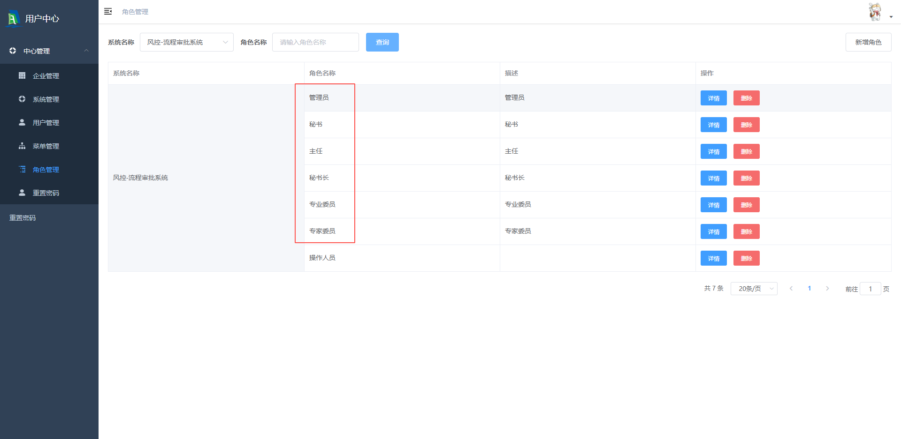
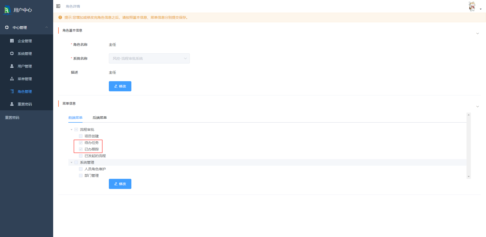
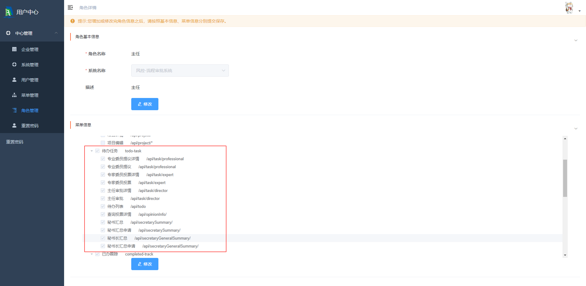
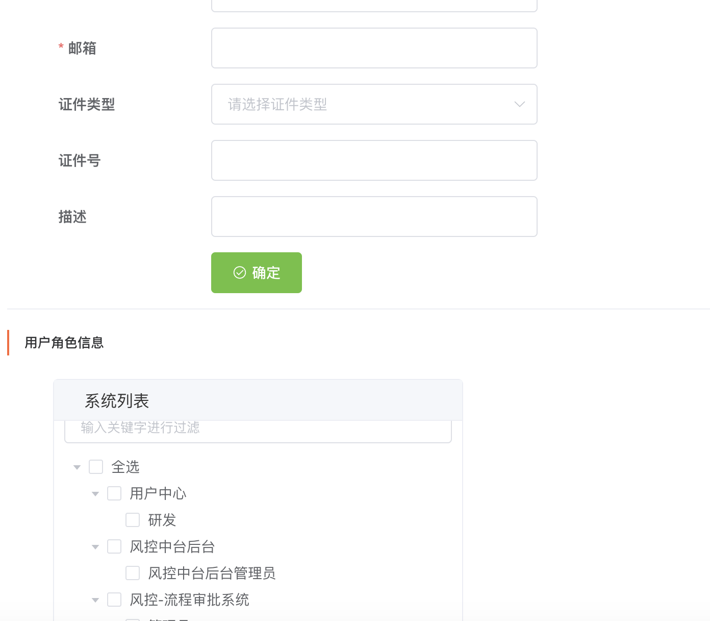
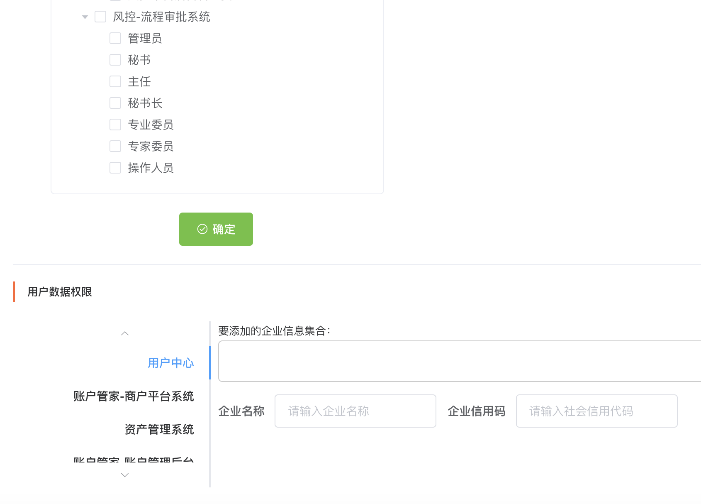
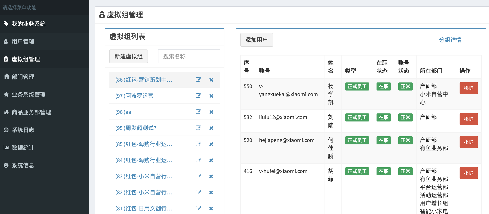
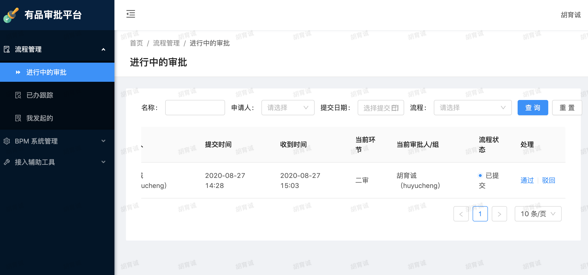

# 1.用户中心
## 用户管理
###1.角色
维度:所属系统,角色id,资源菜单

###2.用户
维度:所属角色,用户数据权限(系统&企业)

# 2.风控中间平台
## 用户权限管理
用户数据:风控中间平台不存储用户信息
验证用户登录权限:uc
获取用户信息:session获取
更改用户信息:http请求用户中心
用户资源目录:uc
用户列表:从用户中心获取风控中间平台的用户列表

## 用户流程权限管理
用户工作流程权限更改:通过风控中间平台编辑保存用户的审批角色,并同步给工作流服务器
工作流用户:将用户信息(email,用户名)通过rpc同步到工作流服务器
工作流用户组:风控中间平台对用户角色(角色id,角色名)进行增删改查,通过rpc同步到工作流服务器

## 工作流后台服务
使用单独的工作流服务器.风控中间平台通过dubbo对工作流系统进行操作
工作流部署管理:只支持一个工作流,内嵌到工作流项目中
工作流部署版本:每次部署都会生成新版本

# 3.有品upc
## 用户权限管理
### 1.角色
维度:所属系统,角色id,资源菜单
### 2.用户
维度:所属角色,所属部门
### 3.虚拟组
维度:虚拟组id,用户集合

# 4.有品bpm工作流平台
## 用户流程权限管理
工作流用户数据:定时全量同步upc用户数据到工作流数据库./5min
工作流用户组数据:定时全量同步upc虚拟组数据到工作流数据库.并更新用户和用户组关系/5min

## 工作流管理平台:
绘制ui app:使用upc账号登录,http://st.bpm.be.youpin.srv/flowable-modeler/index.html
部署平台ui app:使用upc账号登录,http://st.bpm.be.youpin.srv/flowable-admin/index.html
工作流审批ui app:http://st.bpm.be.youpin.srv/#/flows/list

# 5.中台工作流平台(计划)
## 用户资源权限
使用uc权限管理
## 用户工作流审批权限
用户:使用uc用户数据库
用户组:使用uc角色数据库
## 业务平台
## 公共工作流平台
### 每个集群使用私有的工作流服务,业务平台通过rpc对工作流进行操作
### 每个集群使有私有的工作流管理平台,部署工作流需要登录每个集群的平台

