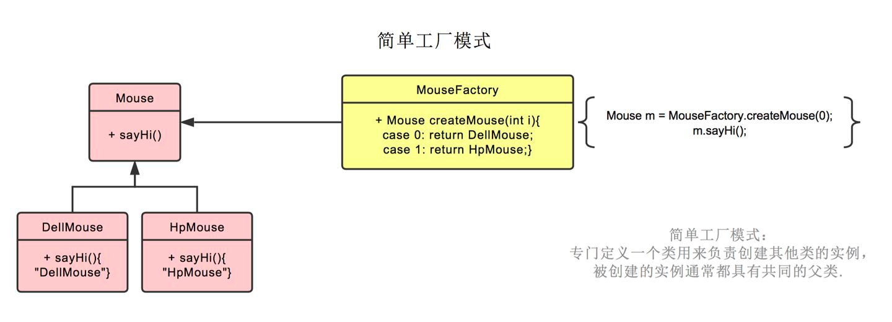
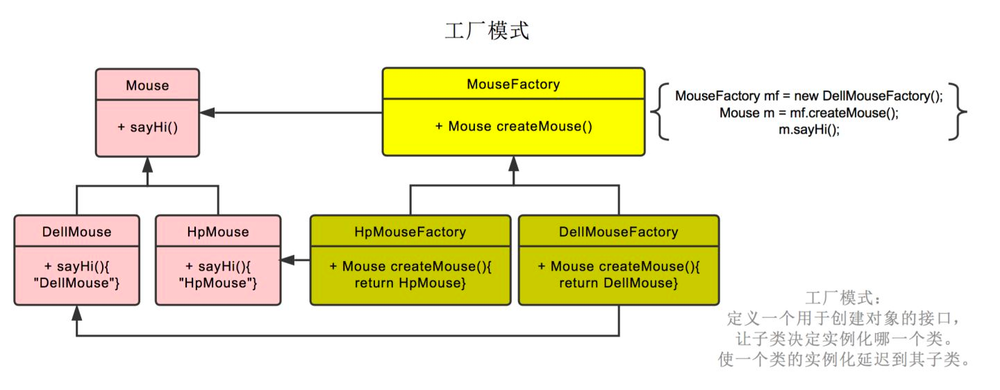
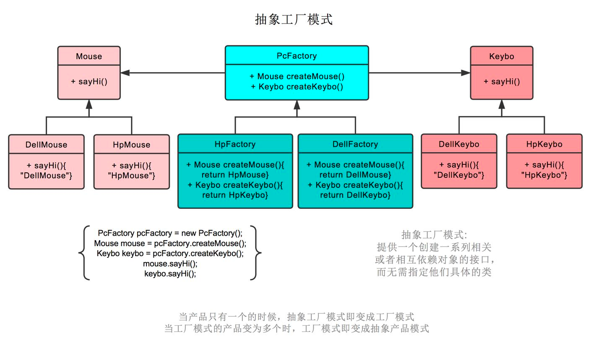

#临界知识
产品+工厂两个维度的优化
#简单工厂模式

#工厂模式
抽象工厂类

#抽象工厂模式

在只有一个产品族的情况下，抽象工厂模式实际上退化到工厂方法模式
抽象工厂的优点：抽象工厂模式除了具有工厂方法模式的优点外，最主要的优点就是可以在类的内部对产品族进行约束。所谓的产品族，一般或多或少的都存在一定的关联，抽象工厂模式就可以在类内部对产品族的关联关系进行定义和描述，而不必专门引入一个新的类来进行管理。
 抽象工厂的缺点：产品族的扩展将是一件十分费力的事情，假如产品族中需要增加一个新的产品，则几乎所有的工厂类都需要进行修改。所以使用抽象工厂模式时，对产品等级结构的划分是非常重要的。

