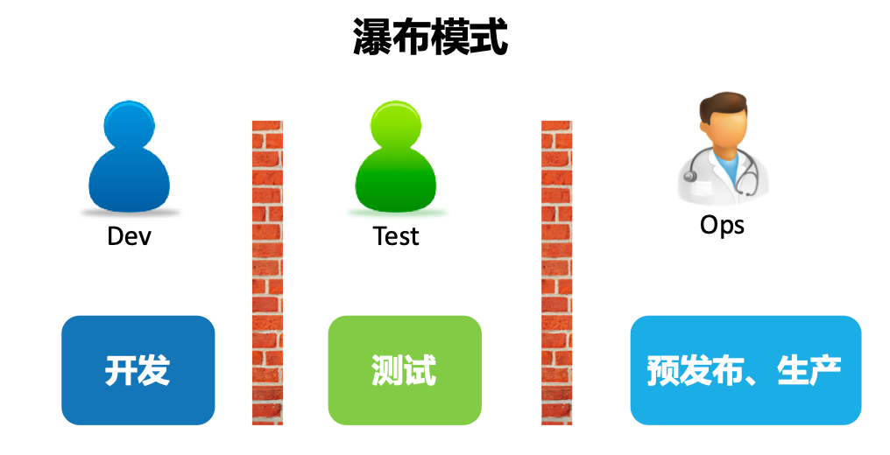
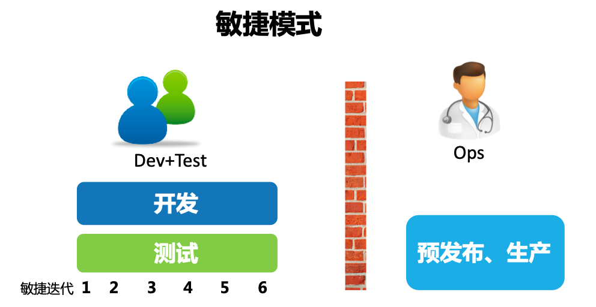
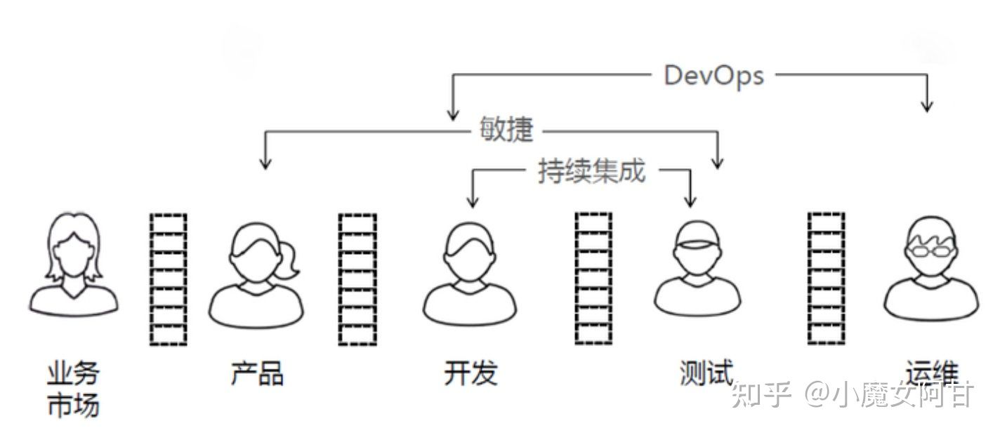
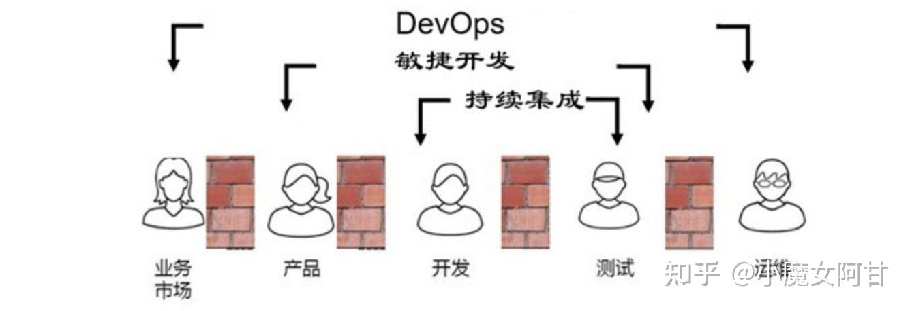
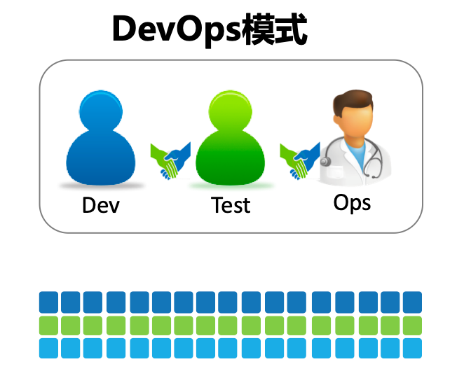
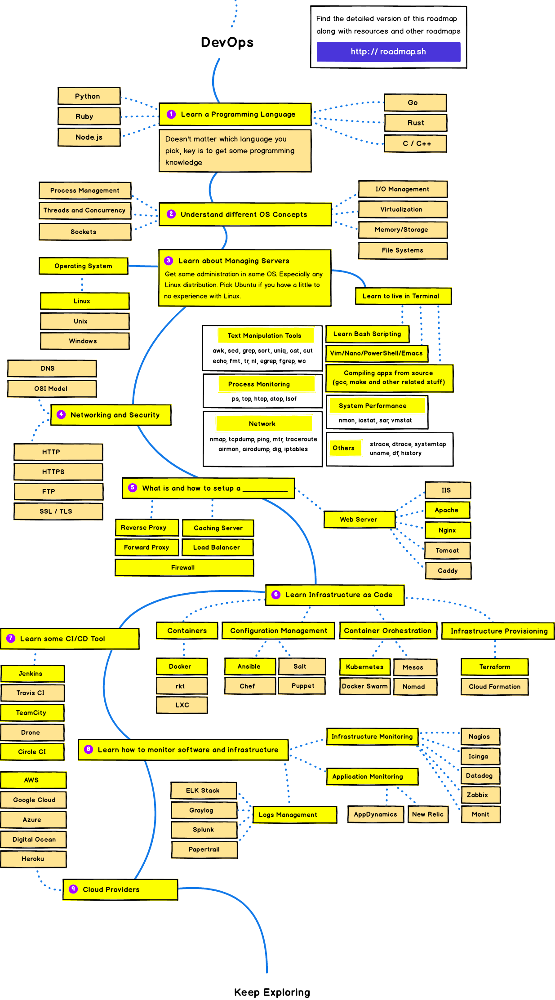
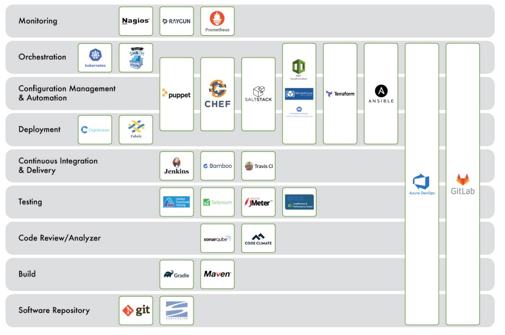
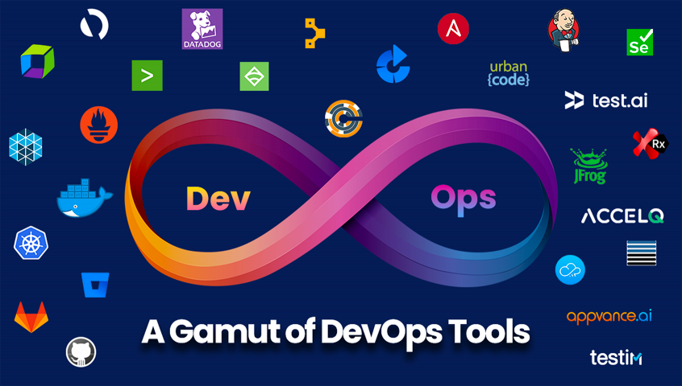

#临界知识
流程线性开发部署模式到网状互通模式
开发人员,测试人员,运维人员,安全合规,业务人员,提供各自的自动化工具,互相参与协作
devops核心:automation,自动化,
#开发模式

##瀑布式开发模式

##敏捷开发

将测试工作从研发末端的一个独立环节注入整个开发活动中
##DevOps 模式
DevOps = 敏捷开发 + 持续集成 + 自动化测试 + 持续发布 

度量开发团队效率的途径就是看开发完成了多少需求
运维团队而言，他们的考核指标却是系统的稳定性、可用性和安全性。

在敏捷开发的模式下，沟通协作成本和多工序质检成本对软件工程的阻碍性高于职责分工带来的促进性。故采用这种垂直整合的方式，
虽失去了分工带来的效能提升，但减少了沟通协作和多工序质检（运维的上线标准，测试的提测标准）的成本。

DevOps 就是大家统一搞一套标准，谁都认识谁都认可；标准统一了，事情就好办了，理清楚实际的业务场景，针对性的开发出各种工具平台来提升持续交付整个流程上的效率问题；

evOps是各团队(已不单指开发与运维)一起紧密协作工作，以更快更好的构建、测试、发布软件交付价值为目标。DevOps发展过程中渐渐形成了DevOps文化和方法论，
同时各种工具平台不断发展和出现，有了方法论和工具，接下来就是实践，大家又在实践过程中不断完善发展方法论和工具

#DevOps落地工具

##JIRA/TB/飞书
项目管理
##gitlab
代码管理
##gitlab ci
持续集成CI
##gitlab cd
持续交付CD
##Prometheus
系统监控
##日志管理
ELK
